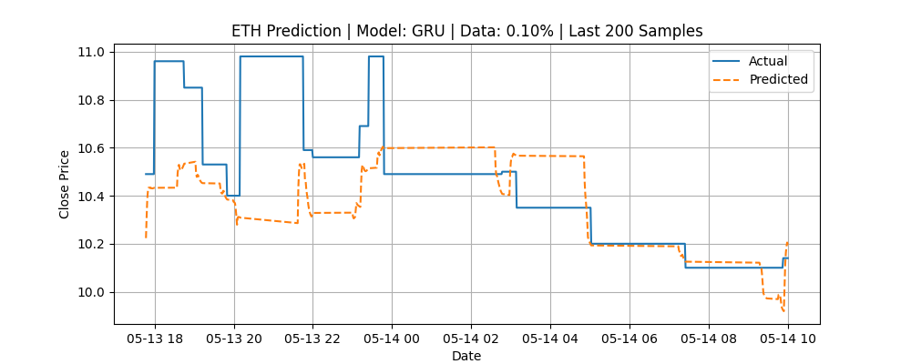

# Full Analysis Report for Data Percentage: 0.10%

This report summarizes all experiments conducted for this specific data percentage.

**Assets Tested:** btc, eth

**Epochs per Experiment:** 10

**Stop Loss Setting:** 0.003

---


## Asset: BTC


### Model: GRU

**Stop Loss:** 0.300%

**Duration:** 20.47 seconds

##### Console Output:
```
Loading data for asset: btc
Subsetting data...
Total data values in intersection: 6283462
Number of data points to use: 6283
Start of subset: 2012-01-31 10:45:00+00:00
End of subset: 2012-03-27 18:37:00+00:00
Data subset shape: (6283, 44), (6283,)
Normalizing features...
Creating sequences...
Total sequences: 6253
Splitting data into training and testing sets...
Train size: (5002, 30, 40), Test size: (1251, 30, 40)
Building model...
Training model...
Epoch 1/10

  1/157 [..............................] - ETA: 8:54 - loss: 31.4870
  9/157 [>.............................] - ETA: 1s - loss: 23.6060  
 16/157 [==>...........................] - ETA: 1s - loss: 17.0495
 24/157 [===>..........................] - ETA: 0s - loss: 11.8553
 32/157 [=====>........................] - ETA: 0s - loss: 9.0863 
 40/157 [======>.......................] - ETA: 0s - loss: 7.4093
 48/157 [========>.....................] - ETA: 0s - loss: 6.2237
 56/157 [=========>....................] - ETA: 0s - loss: 5.3745
 64/157 [===========>..................] - ETA: 0s - loss: 4.7319
 72/157 [============>.................] - ETA: 0s - loss: 4.2311
 79/157 [==============>...............] - ETA: 0s - loss: 3.8729
 86/157 [===============>..............] - ETA: 0s - loss: 3.5734
 94/157 [================>.............] - ETA: 0s - loss: 3.2853
102/157 [==================>...........] - ETA: 0s - loss: 3.0441
110/157 [====================>.........] - ETA: 0s - loss: 2.8377
118/157 [=====================>........] - ETA: 0s - loss: 2.6623
125/157 [======================>.......] - ETA: 0s - loss: 2.5257
132/157 [========================>.....] - ETA: 0s - loss: 2.4020
139/157 [=========================>....] - ETA: 0s - loss: 2.2904
146/157 [==========================>...] - ETA: 0s - loss: 2.1884
153/157 [============================>.] - ETA: 0s - loss: 2.0979
Epoch 1: val_loss improved from inf to 0.02307, saving model to models\gru_btc_model_0_1pct.h5

157/157 [==============================] - 5s 10ms/step - loss: 2.0565 - val_loss: 0.0231
Epoch 2/10

  1/157 [..............................] - ETA: 1s - loss: 0.1543
  9/157 [>.............................] - ETA: 1s - loss: 0.1702
 17/157 [==>...........................] - ETA: 0s - loss: 0.1702
 25/157 [===>..........................] - ETA: 0s - loss: 0.1681
 32/157 [=====>........................] - ETA: 0s - loss: 0.1678
 39/157 [======>.......................] - ETA: 0s - loss: 0.1696
 46/157 [=======>......................] - ETA: 0s - loss: 0.1693
 53/157 [=========>....................] - ETA: 0s - loss: 0.1696
 60/157 [==========>...................] - ETA: 0s - loss: 0.1678
 67/157 [===========>..................] - ETA: 0s - loss: 0.1687
 74/157 [=============>................] - ETA: 0s - loss: 0.1675
 81/157 [==============>...............] - ETA: 0s - loss: 0.1679
 88/157 [===============>..............] - ETA: 0s - loss: 0.1686
 96/157 [=================>............] - ETA: 0s - loss: 0.1679
104/157 [==================>...........] - ETA: 0s - loss: 0.1666
111/157 [====================>.........] - ETA: 0s - loss: 0.1681
119/157 [=====================>........] - ETA: 0s - loss: 0.1675
127/157 [=======================>......] - ETA: 0s - loss: 0.1687
134/157 [========================>.....] - ETA: 0s - loss: 0.1695
141/157 [=========================>....] - ETA: 0s - loss: 0.1701
148/157 [===========================>..] - ETA: 0s - loss: 0.1689
155/157 [============================>.] - ETA: 0s - loss: 0.1682
Epoch 2: val_loss improved from 0.02307 to 0.01865, saving model to models\gru_btc_model_0_1pct.h5

157/157 [==============================] - 1s 9ms/step - loss: 0.1680 - val_loss: 0.0187
Epoch 3/10

  1/157 [..............................] - ETA: 1s - loss: 0.1500
  8/157 [>.............................] - ETA: 1s - loss: 0.1689
 15/157 [=>............................] - ETA: 1s - loss: 0.1560
 22/157 [===>..........................] - ETA: 1s - loss: 0.1604
 29/157 [====>.........................] - ETA: 0s - loss: 0.1538
 36/157 [=====>........................] - ETA: 0s - loss: 0.1506
 44/157 [=======>......................] - ETA: 0s - loss: 0.1510
 51/157 [========>.....................] - ETA: 0s - loss: 0.1511
 58/157 [==========>...................] - ETA: 0s - loss: 0.1515
 65/157 [===========>..................] - ETA: 0s - loss: 0.1495
 73/157 [============>.................] - ETA: 0s - loss: 0.1481
 80/157 [==============>...............] - ETA: 0s - loss: 0.1494
 87/157 [===============>..............] - ETA: 0s - loss: 0.1471
 95/157 [=================>............] - ETA: 0s - loss: 0.1465
103/157 [==================>...........] - ETA: 0s - loss: 0.1477
111/157 [====================>.........] - ETA: 0s - loss: 0.1486
119/157 [=====================>........] - ETA: 0s - loss: 0.1481
126/157 [=======================>......] - ETA: 0s - loss: 0.1472
134/157 [========================>.....] - ETA: 0s - loss: 0.1462
142/157 [==========================>...] - ETA: 0s - loss: 0.1465
149/157 [===========================>..] - ETA: 0s - loss: 0.1463
157/157 [==============================] - ETA: 0s - loss: 0.1464
Epoch 3: val_loss improved from 0.01865 to 0.00632, saving model to models\gru_btc_model_0_1pct.h5

157/157 [==============================] - 1s 9ms/step - loss: 0.1464 - val_loss: 0.0063
Epoch 4/10

  1/157 [..............................] - ETA: 0s - loss: 0.1410
  8/157 [>.............................] - ETA: 1s - loss: 0.1416
 15/157 [=>............................] - ETA: 1s - loss: 0.1438
 22/157 [===>..........................] - ETA: 0s - loss: 0.1367
 29/157 [====>.........................] - ETA: 0s - loss: 0.1334
 36/157 [=====>........................] - ETA: 0s - loss: 0.1331
 43/157 [=======>......................] - ETA: 0s - loss: 0.1317
 51/157 [========>.....................] - ETA: 0s - loss: 0.1351
 60/157 [==========>...................] - ETA: 0s - loss: 0.1332
 67/157 [===========>..................] - ETA: 0s - loss: 0.1356
 75/157 [=============>................] - ETA: 0s - loss: 0.1371
 82/157 [==============>...............] - ETA: 0s - loss: 0.1389
 89/157 [================>.............] - ETA: 0s - loss: 0.1383
 97/157 [=================>............] - ETA: 0s - loss: 0.1386
105/157 [===================>..........] - ETA: 0s - loss: 0.1383
112/157 [====================>.........] - ETA: 0s - loss: 0.1384
119/157 [=====================>........] - ETA: 0s - loss: 0.1375
126/157 [=======================>......] - ETA: 0s - loss: 0.1377
134/157 [========================>.....] - ETA: 0s - loss: 0.1371
141/157 [=========================>....] - ETA: 0s - loss: 0.1381
149/157 [===========================>..] - ETA: 0s - loss: 0.1369
157/157 [==============================] - ETA: 0s - loss: 0.1365
Epoch 4: val_loss improved from 0.00632 to 0.00590, saving model to models\gru_btc_model_0_1pct.h5

157/157 [==============================] - 1s 8ms/step - loss: 0.1365 - val_loss: 0.0059
Epoch 5/10

  1/157 [..............................] - ETA: 1s - loss: 0.1108
  9/157 [>.............................] - ETA: 1s - loss: 0.1224
 16/157 [==>...........................] - ETA: 0s - loss: 0.1191
 24/157 [===>..........................] - ETA: 0s - loss: 0.1228
 32/157 [=====>........................] - ETA: 0s - loss: 0.1239
 40/157 [======>.......................] - ETA: 0s - loss: 0.1241
 48/157 [========>.....................] - ETA: 0s - loss: 0.1247
 55/157 [=========>....................] - ETA: 0s - loss: 0.1254
 63/157 [===========>..................] - ETA: 0s - loss: 0.1243
 70/157 [============>.................] - ETA: 0s - loss: 0.1267
 78/157 [=============>................] - ETA: 0s - loss: 0.1280
 86/157 [===============>..............] - ETA: 0s - loss: 0.1275
 93/157 [================>.............] - ETA: 0s - loss: 0.1285
101/157 [==================>...........] - ETA: 0s - loss: 0.1310
108/157 [===================>..........] - ETA: 0s - loss: 0.1310
115/157 [====================>.........] - ETA: 0s - loss: 0.1306
122/157 [======================>.......] - ETA: 0s - loss: 0.1301
129/157 [=======================>......] - ETA: 0s - loss: 0.1313
136/157 [========================>.....] - ETA: 0s - loss: 0.1325
143/157 [==========================>...] - ETA: 0s - loss: 0.1317
150/157 [===========================>..] - ETA: 0s - loss: 0.1317
157/157 [==============================] - ETA: 0s - loss: 0.1327
Epoch 5: val_loss did not improve from 0.00590

157/157 [==============================] - 1s 8ms/step - loss: 0.1327 - val_loss: 0.0160
Epoch 6/10

  1/157 [..............................] - ETA: 0s - loss: 0.1658
  8/157 [>.............................] - ETA: 1s - loss: 0.1354
 16/157 [==>...........................] - ETA: 0s - loss: 0.1313
 24/157 [===>..........................] - ETA: 0s - loss: 0.1269
 31/157 [====>.........................] - ETA: 0s - loss: 0.1324
 38/157 [======>.......................] - ETA: 0s - loss: 0.1306
 45/157 [=======>......................] - ETA: 0s - loss: 0.1301
 52/157 [========>.....................] - ETA: 0s - loss: 0.1301
 60/157 [==========>...................] - ETA: 0s - loss: 0.1328
 67/157 [===========>..................] - ETA: 0s - loss: 0.1340
 74/157 [=============>................] - ETA: 0s - loss: 0.1324
 81/157 [==============>...............] - ETA: 0s - loss: 0.1323
 89/157 [================>.............] - ETA: 0s - loss: 0.1307
 96/157 [=================>............] - ETA: 0s - loss: 0.1300
104/157 [==================>...........] - ETA: 0s - loss: 0.1294
111/157 [====================>.........] - ETA: 0s - loss: 0.1295
118/157 [=====================>........] - ETA: 0s - loss: 0.1298
126/157 [=======================>......] - ETA: 0s - loss: 0.1285
133/157 [========================>.....] - ETA: 0s - loss: 0.1284
140/157 [=========================>....] - ETA: 0s - loss: 0.1283
147/157 [===========================>..] - ETA: 0s - loss: 0.1289
154/157 [============================>.] - ETA: 0s - loss: 0.1289
Epoch 6: val_loss did not improve from 0.00590

157/157 [==============================] - 1s 8ms/step - loss: 0.1283 - val_loss: 0.0088
Epoch 7/10

  1/157 [..............................] - ETA: 1s - loss: 0.1560
  8/157 [>.............................] - ETA: 1s - loss: 0.1330
 15/157 [=>............................] - ETA: 1s - loss: 0.1270
 23/157 [===>..........................] - ETA: 0s - loss: 0.1248
 30/157 [====>.........................] - ETA: 0s - loss: 0.1262
 38/157 [======>.......................] - ETA: 0s - loss: 0.1266
 46/157 [=======>......................] - ETA: 0s - loss: 0.1259
 54/157 [=========>....................] - ETA: 0s - loss: 0.1252
 62/157 [==========>...................] - ETA: 0s - loss: 0.1242
 69/157 [============>.................] - ETA: 0s - loss: 0.1213
 77/157 [=============>................] - ETA: 0s - loss: 0.1218
 85/157 [===============>..............] - ETA: 0s - loss: 0.1222
 92/157 [================>.............] - ETA: 0s - loss: 0.1231
 99/157 [=================>............] - ETA: 0s - loss: 0.1222
106/157 [===================>..........] - ETA: 0s - loss: 0.1220
114/157 [====================>.........] - ETA: 0s - loss: 0.1214
121/157 [======================>.......] - ETA: 0s - loss: 0.1206
128/157 [=======================>......] - ETA: 0s - loss: 0.1207
136/157 [========================>.....] - ETA: 0s - loss: 0.1208
144/157 [==========================>...] - ETA: 0s - loss: 0.1224
151/157 [===========================>..] - ETA: 0s - loss: 0.1223
Epoch 7: val_loss did not improve from 0.00590

157/157 [==============================] - 1s 8ms/step - loss: 0.1236 - val_loss: 0.0110
Epoch 8/10

  1/157 [..............................] - ETA: 1s - loss: 0.1240
  9/157 [>.............................] - ETA: 1s - loss: 0.1180
 16/157 [==>...........................] - ETA: 1s - loss: 0.1236
 24/157 [===>..........................] - ETA: 0s - loss: 0.1241
 32/157 [=====>........................] - ETA: 0s - loss: 0.1300
 40/157 [======>.......................] - ETA: 0s - loss: 0.1271
 47/157 [=======>......................] - ETA: 0s - loss: 0.1277
 55/157 [=========>....................] - ETA: 0s - loss: 0.1297
 63/157 [===========>..................] - ETA: 0s - loss: 0.1261
 70/157 [============>.................] - ETA: 0s - loss: 0.1233
 77/157 [=============>................] - ETA: 0s - loss: 0.1225
 84/157 [===============>..............] - ETA: 0s - loss: 0.1224
 91/157 [================>.............] - ETA: 0s - loss: 0.1241
 99/157 [=================>............] - ETA: 0s - loss: 0.1243
106/157 [===================>..........] - ETA: 0s - loss: 0.1226
113/157 [====================>.........] - ETA: 0s - loss: 0.1222
121/157 [======================>.......] - ETA: 0s - loss: 0.1206
129/157 [=======================>......] - ETA: 0s - loss: 0.1200
136/157 [========================>.....] - ETA: 0s - loss: 0.1205
144/157 [==========================>...] - ETA: 0s - loss: 0.1200
152/157 [============================>.] - ETA: 0s - loss: 0.1225
Epoch 8: val_loss did not improve from 0.00590

157/157 [==============================] - 1s 8ms/step - loss: 0.1225 - val_loss: 0.0062
Epoch 9/10

  1/157 [..............................] - ETA: 0s - loss: 0.0521
  8/157 [>.............................] - ETA: 1s - loss: 0.1185
 15/157 [=>............................] - ETA: 1s - loss: 0.1117
 22/157 [===>..........................] - ETA: 1s - loss: 0.1194
 30/157 [====>.........................] - ETA: 0s - loss: 0.1212
 37/157 [======>.......................] - ETA: 0s - loss: 0.1192
 44/157 [=======>......................] - ETA: 0s - loss: 0.1169
 51/157 [========>.....................] - ETA: 0s - loss: 0.1185
 58/157 [==========>...................] - ETA: 0s - loss: 0.1194
 66/157 [===========>..................] - ETA: 0s - loss: 0.1220
 73/157 [============>.................] - ETA: 0s - loss: 0.1253
 80/157 [==============>...............] - ETA: 0s - loss: 0.1255
 88/157 [===============>..............] - ETA: 0s - loss: 0.1265
 96/157 [=================>............] - ETA: 0s - loss: 0.1249
103/157 [==================>...........] - ETA: 0s - loss: 0.1239
111/157 [====================>.........] - ETA: 0s - loss: 0.1230
118/157 [=====================>........] - ETA: 0s - loss: 0.1231
125/157 [======================>.......] - ETA: 0s - loss: 0.1214
132/157 [========================>.....] - ETA: 0s - loss: 0.1217
139/157 [=========================>....] - ETA: 0s - loss: 0.1218
146/157 [==========================>...] - ETA: 0s - loss: 0.1216
154/157 [============================>.] - ETA: 0s - loss: 0.1217
Epoch 9: val_loss improved from 0.00590 to 0.00424, saving model to models\gru_btc_model_0_1pct.h5

157/157 [==============================] - 1s 8ms/step - loss: 0.1216 - val_loss: 0.0042
Epoch 10/10

  1/157 [..............................] - ETA: 1s - loss: 0.0907
  8/157 [>.............................] - ETA: 1s - loss: 0.1109
 15/157 [=>............................] - ETA: 1s - loss: 0.1023
 22/157 [===>..........................] - ETA: 0s - loss: 0.1100
 29/157 [====>.........................] - ETA: 0s - loss: 0.1127
 37/157 [======>.......................] - ETA: 0s - loss: 0.1171
 44/157 [=======>......................] - ETA: 0s - loss: 0.1162
 51/157 [========>.....................] - ETA: 0s - loss: 0.1171
 58/157 [==========>...................] - ETA: 0s - loss: 0.1195
 66/157 [===========>..................] - ETA: 0s - loss: 0.1194
 74/157 [=============>................] - ETA: 0s - loss: 0.1235
 82/157 [==============>...............] - ETA: 0s - loss: 0.1237
 89/157 [================>.............] - ETA: 0s - loss: 0.1246
 96/157 [=================>............] - ETA: 0s - loss: 0.1225
103/157 [==================>...........] - ETA: 0s - loss: 0.1231
110/157 [====================>.........] - ETA: 0s - loss: 0.1255
117/157 [=====================>........] - ETA: 0s - loss: 0.1239
124/157 [======================>.......] - ETA: 0s - loss: 0.1233
131/157 [========================>.....] - ETA: 0s - loss: 0.1235
138/157 [=========================>....] - ETA: 0s - loss: 0.1229
145/157 [==========================>...] - ETA: 0s - loss: 0.1225
153/157 [============================>.] - ETA: 0s - loss: 0.1223
Epoch 10: val_loss improved from 0.00424 to 0.00335, saving model to models\gru_btc_model_0_1pct.h5

157/157 [==============================] - 1s 8ms/step - loss: 0.1219 - val_loss: 0.0033
Plotting training loss...
Loss curve saved to: plots\loss_curve_gru_btc_0_1pct.png
Generating predictions on test set...

 1/40 [..............................] - ETA: 9s
19/40 [=============>................] - ETA: 0s
36/40 [==========================>...] - ETA: 0s
40/40 [==============================] - 0s 3ms/step
Predictions shape: (1251, 1)
Plotting predictions and saving comparison CSV...
Prediction plot saved to: plots\prediction_plot_gru_btc_0_1pct.png
Comparison CSV saved to: model-result-data\gru_btc_0_1pct_comparison.csv
Printing evaluation metrics...
0.1% | acc 0.0616  prec 0.0388  rec 0.3840  f1 0.0705  mse 0.0033  rmse 0.0579  mae 0.0401
Saving model and scaler...
Model saved to: models\gru_btc_model_0_1pct.h5
Scaler saved to: models\gru_btc_scaler_0_1pct.pkl
Training and prediction complete.
Signal distribution:
Signal
-1    649
 1    602
Name: count, dtype: int64
Setting up Backtest object...
Running backtest engine...
Found 602 +1 signals and 649 -1 signals in the data.
Start                                     0.0
End                                    1250.0
Duration                               1250.0
Exposure Time [%]                    85.29177
Equity Final [$]                  100109.7533
Equity Peak [$]                  104653.76826
Return [%]                            0.10975
Buy & Hold Return [%]               -11.33829
Return (Ann.) [%]                         0.0
Volatility (Ann.) [%]                     NaN
Sharpe Ratio                              NaN
Sortino Ratio                             NaN
Calmar Ratio                              0.0
Alpha [%]                             9.00433
Beta                                  0.78447
Max. Drawdown [%]                    -8.12074
Avg. Drawdown [%]                    -4.28229
Max. Drawdown Duration                  488.0
Avg. Drawdown Duration              166.28571
# Trades                                112.0
Win Rate [%]                         33.03571
Best Trade [%]                        5.50847
Worst Trade [%]                      -4.62777
Avg. Trade [%]                        0.00098
Max. Trade Duration                      43.0
Avg. Trade Duration                   9.08929
Profit Factor                         1.03046
Expectancy [%]                        0.01861
SQN                                   0.00549
Kelly Criterion                      -0.18501
_strategy                 MLStrategy(stop_...
_equity_curve                        Equit...
_trades                         Size  Entr...
dtype: object

Trade Details:
Number of trades:       112
Number of closed trades:112
Number of open trades:  0
Saving backtest plot to HTML...
Backtest stats saved to: results\gru_btc_0_1pct_0_3stloss\backtest_stats.csv
Full pipeline complete.

```
##### Training Loss Plot:


##### Prediction Plot:


##### Metrics CSV:
[View CSV](../../model-result-data/btc_gru_0_1pct_metrics.csv)

##### Backtest Interactive Chart:
<iframe src="../../results/gru_btc_0_1pct_0_3stloss/backtest_plot.html" width="100%" height="600px" frameborder="0"></iframe>
If the iframe does not display, please [click here to view the HTML](../../results/gru_btc_0_1pct_0_3stloss/backtest_plot.html).

##### Backtest Stats:
[View CSV](../../results/gru_btc_0_1pct_0_3stloss/backtest_stats.csv)

##### Saved Model and Scaler:
- **Model:** [View Model](../../models/gru_btc_model_0_1pct.h5)
- **Scaler:** [View Scaler](../../models/gru_btc_scaler_0_1pct.pkl)


---


### Model: CNN

**Stop Loss:** 0.300%

**Duration:** 10.98 seconds

##### Console Output:
```
Loading data for asset: btc
Subsetting data...
Total data values in intersection: 6283462
Number of data points to use: 6283
Start of subset: 2012-01-31 10:45:00+00:00
End of subset: 2012-03-27 18:37:00+00:00
Data subset shape: (6283, 44), (6283,)
Normalizing features...
Creating sequences...
Total sequences: 6253
Splitting data into training and testing sets...
Train size: (5002, 30, 40), Test size: (1251, 30, 40)
Building model...
Training model...
Epoch 1/10

  1/157 [..............................] - ETA: 4:43 - loss: 33.0061
 18/157 [==>...........................] - ETA: 0s - loss: 6.8793   
 35/157 [=====>........................] - ETA: 0s - loss: 3.8577
 52/157 [========>.....................] - ETA: 0s - loss: 2.6747
 69/157 [============>.................] - ETA: 0s - loss: 2.0547
 86/157 [===============>..............] - ETA: 0s - loss: 1.6735
104/157 [==================>...........] - ETA: 0s - loss: 1.4105
119/157 [=====================>........] - ETA: 0s - loss: 1.2476
138/157 [=========================>....] - ETA: 0s - loss: 1.0914
152/157 [============================>.] - ETA: 0s - loss: 1.0030
Epoch 1: val_loss improved from inf to 0.01909, saving model to models\cnn_btc_model_0_1pct.h5

157/157 [==============================] - 3s 4ms/step - loss: 0.9779 - val_loss: 0.0191
Epoch 2/10

  1/157 [..............................] - ETA: 0s - loss: 0.0941
 19/157 [==>...........................] - ETA: 0s - loss: 0.1363
 37/157 [======>.......................] - ETA: 0s - loss: 0.1175
 55/157 [=========>....................] - ETA: 0s - loss: 0.1153
 72/157 [============>.................] - ETA: 0s - loss: 0.1121
 90/157 [================>.............] - ETA: 0s - loss: 0.1094
108/157 [===================>..........] - ETA: 0s - loss: 0.1075
126/157 [=======================>......] - ETA: 0s - loss: 0.1040
144/157 [==========================>...] - ETA: 0s - loss: 0.1025
Epoch 2: val_loss did not improve from 0.01909

157/157 [==============================] - 1s 4ms/step - loss: 0.1017 - val_loss: 0.0210
Epoch 3/10

  1/157 [..............................] - ETA: 0s - loss: 0.1008
 18/157 [==>...........................] - ETA: 0s - loss: 0.0823
 33/157 [=====>........................] - ETA: 0s - loss: 0.0974
 49/157 [========>.....................] - ETA: 0s - loss: 0.1034
 63/157 [===========>..................] - ETA: 0s - loss: 0.1014
 75/157 [=============>................] - ETA: 0s - loss: 0.0998
 83/157 [==============>...............] - ETA: 0s - loss: 0.1004
 91/157 [================>.............] - ETA: 0s - loss: 0.0984
106/157 [===================>..........] - ETA: 0s - loss: 0.0968
119/157 [=====================>........] - ETA: 0s - loss: 0.0944
133/157 [========================>.....] - ETA: 0s - loss: 0.0934
146/157 [==========================>...] - ETA: 0s - loss: 0.0914
Epoch 3: val_loss improved from 0.01909 to 0.01034, saving model to models\cnn_btc_model_0_1pct.h5

157/157 [==============================] - 1s 5ms/step - loss: 0.0898 - val_loss: 0.0103
Epoch 4/10

  1/157 [..............................] - ETA: 0s - loss: 0.0537
 13/157 [=>............................] - ETA: 0s - loss: 0.0725
 23/157 [===>..........................] - ETA: 0s - loss: 0.0741
 27/157 [====>.........................] - ETA: 0s - loss: 0.0724
 32/157 [=====>........................] - ETA: 0s - loss: 0.0705
 38/157 [======>.......................] - ETA: 1s - loss: 0.0722
 43/157 [=======>......................] - ETA: 1s - loss: 0.0714
 50/157 [========>.....................] - ETA: 1s - loss: 0.0696
 63/157 [===========>..................] - ETA: 0s - loss: 0.0724
 81/157 [==============>...............] - ETA: 0s - loss: 0.0750
 98/157 [=================>............] - ETA: 0s - loss: 0.0745
115/157 [====================>.........] - ETA: 0s - loss: 0.0724
133/157 [========================>.....] - ETA: 0s - loss: 0.0722
148/157 [===========================>..] - ETA: 0s - loss: 0.0723
Epoch 4: val_loss did not improve from 0.01034

157/157 [==============================] - 1s 6ms/step - loss: 0.0741 - val_loss: 0.0233
Epoch 5/10

  1/157 [..............................] - ETA: 0s - loss: 0.0602
 18/157 [==>...........................] - ETA: 0s - loss: 0.0694
 35/157 [=====>........................] - ETA: 0s - loss: 0.0681
 53/157 [=========>....................] - ETA: 0s - loss: 0.0669
 64/157 [===========>..................] - ETA: 0s - loss: 0.0658
 77/157 [=============>................] - ETA: 0s - loss: 0.0633
 85/157 [===============>..............] - ETA: 0s - loss: 0.0633
 97/157 [=================>............] - ETA: 0s - loss: 0.0636
109/157 [===================>..........] - ETA: 0s - loss: 0.0645
118/157 [=====================>........] - ETA: 0s - loss: 0.0651
130/157 [=======================>......] - ETA: 0s - loss: 0.0649
138/157 [=========================>....] - ETA: 0s - loss: 0.0647
152/157 [============================>.] - ETA: 0s - loss: 0.0638
Epoch 5: val_loss did not improve from 0.01034

157/157 [==============================] - 1s 5ms/step - loss: 0.0658 - val_loss: 0.0334
Epoch 6/10

  1/157 [..............................] - ETA: 1s - loss: 0.1157
 13/157 [=>............................] - ETA: 0s - loss: 0.0811
 31/157 [====>.........................] - ETA: 0s - loss: 0.0690
 47/157 [=======>......................] - ETA: 0s - loss: 0.0643
 65/157 [===========>..................] - ETA: 0s - loss: 0.0628
 81/157 [==============>...............] - ETA: 0s - loss: 0.0615
 95/157 [=================>............] - ETA: 0s - loss: 0.0610
111/157 [====================>.........] - ETA: 0s - loss: 0.0626
127/157 [=======================>......] - ETA: 0s - loss: 0.0647
135/157 [========================>.....] - ETA: 0s - loss: 0.0652
153/157 [============================>.] - ETA: 0s - loss: 0.0659
Epoch 6: val_loss did not improve from 0.01034

157/157 [==============================] - 1s 4ms/step - loss: 0.0659 - val_loss: 0.0230
Epoch 7/10

  1/157 [..............................] - ETA: 0s - loss: 0.0673
 18/157 [==>...........................] - ETA: 0s - loss: 0.0692
 36/157 [=====>........................] - ETA: 0s - loss: 0.0616
 51/157 [========>.....................] - ETA: 0s - loss: 0.0592
 68/157 [===========>..................] - ETA: 0s - loss: 0.0577
 85/157 [===============>..............] - ETA: 0s - loss: 0.0571
102/157 [==================>...........] - ETA: 0s - loss: 0.0563
120/157 [=====================>........] - ETA: 0s - loss: 0.0549
138/157 [=========================>....] - ETA: 0s - loss: 0.0575
155/157 [============================>.] - ETA: 0s - loss: 0.0582
Epoch 7: val_loss did not improve from 0.01034

157/157 [==============================] - 1s 4ms/step - loss: 0.0584 - val_loss: 0.0338
Epoch 8/10

  1/157 [..............................] - ETA: 0s - loss: 0.0762
 18/157 [==>...........................] - ETA: 0s - loss: 0.0637
 37/157 [======>.......................] - ETA: 0s - loss: 0.0597
 54/157 [=========>....................] - ETA: 0s - loss: 0.0607
 71/157 [============>.................] - ETA: 0s - loss: 0.0597
 88/157 [===============>..............] - ETA: 0s - loss: 0.0586
105/157 [===================>..........] - ETA: 0s - loss: 0.0594
122/157 [======================>.......] - ETA: 0s - loss: 0.0579
140/157 [=========================>....] - ETA: 0s - loss: 0.0588
155/157 [============================>.] - ETA: 0s - loss: 0.0586
Epoch 8: val_loss improved from 0.01034 to 0.00980, saving model to models\cnn_btc_model_0_1pct.h5

157/157 [==============================] - 1s 4ms/step - loss: 0.0586 - val_loss: 0.0098
Epoch 9/10

  1/157 [..............................] - ETA: 0s - loss: 0.0454
  5/157 [..............................] - ETA: 1s - loss: 0.0395
 14/157 [=>............................] - ETA: 1s - loss: 0.0508
 18/157 [==>...........................] - ETA: 1s - loss: 0.0521
 27/157 [====>.........................] - ETA: 1s - loss: 0.0554
 39/157 [======>.......................] - ETA: 1s - loss: 0.0538
 51/157 [========>.....................] - ETA: 0s - loss: 0.0540
 66/157 [===========>..................] - ETA: 0s - loss: 0.0560
 77/157 [=============>................] - ETA: 0s - loss: 0.0579
 92/157 [================>.............] - ETA: 0s - loss: 0.0578
104/157 [==================>...........] - ETA: 0s - loss: 0.0576
115/157 [====================>.........] - ETA: 0s - loss: 0.0570
118/157 [=====================>........] - ETA: 0s - loss: 0.0571
132/157 [========================>.....] - ETA: 0s - loss: 0.0561
149/157 [===========================>..] - ETA: 0s - loss: 0.0554
Epoch 9: val_loss did not improve from 0.00980

157/157 [==============================] - 1s 6ms/step - loss: 0.0548 - val_loss: 0.0124
Epoch 10/10

  1/157 [..............................] - ETA: 0s - loss: 0.0453
 18/157 [==>...........................] - ETA: 0s - loss: 0.0567
 36/157 [=====>........................] - ETA: 0s - loss: 0.0526
 54/157 [=========>....................] - ETA: 0s - loss: 0.0533
 72/157 [============>.................] - ETA: 0s - loss: 0.0520
 88/157 [===============>..............] - ETA: 0s - loss: 0.0515
106/157 [===================>..........] - ETA: 0s - loss: 0.0528
123/157 [======================>.......] - ETA: 0s - loss: 0.0524
141/157 [=========================>....] - ETA: 0s - loss: 0.0526
Epoch 10: val_loss improved from 0.00980 to 0.00847, saving model to models\cnn_btc_model_0_1pct.h5

157/157 [==============================] - 1s 4ms/step - loss: 0.0518 - val_loss: 0.0085
Plotting training loss...
Loss curve saved to: plots\loss_curve_cnn_btc_0_1pct.png
Generating predictions on test set...

 1/40 [..............................] - ETA: 1s
20/40 [==============>...............] - ETA: 0s
38/40 [===========================>..] - ETA: 0s
40/40 [==============================] - 0s 3ms/step
Predictions shape: (1251, 1)
Plotting predictions and saving comparison CSV...
Prediction plot saved to: plots\prediction_plot_cnn_btc_0_1pct.png
Comparison CSV saved to: model-result-data\cnn_btc_0_1pct_comparison.csv
Printing evaluation metrics...
0.1% | acc 0.0576  prec 0.0380  rec 0.3678  f1 0.0688  mse 0.0085  rmse 0.0920  mae 0.0712
Saving model and scaler...
Model saved to: models\cnn_btc_model_0_1pct.h5
Scaler saved to: models\cnn_btc_scaler_0_1pct.pkl
Training and prediction complete.
Signal distribution:
Signal
 1    937
-1    314
Name: count, dtype: int64
Setting up Backtest object...
Running backtest engine...
Found 937 +1 signals and 314 -1 signals in the data.
Start                                     0.0
End                                    1250.0
Duration                               1250.0
Exposure Time [%]                    94.72422
Equity Final [$]                  106998.3033
Equity Peak [$]                   107222.6133
Return [%]                             6.9983
Buy & Hold Return [%]               -11.33829
Return (Ann.) [%]                         0.0
Volatility (Ann.) [%]                     NaN
Sharpe Ratio                              NaN
Sortino Ratio                             NaN
Calmar Ratio                              0.0
Alpha [%]                            16.45764
Beta                                  0.83428
Max. Drawdown [%]                    -9.20278
Avg. Drawdown [%]                    -3.15694
Max. Drawdown Duration                  414.0
Avg. Drawdown Duration                144.625
# Trades                                105.0
Win Rate [%]                         33.33333
Best Trade [%]                         6.3745
Worst Trade [%]                      -4.62777
Avg. Trade [%]                        0.05642
Max. Trade Duration                      60.0
Avg. Trade Duration                  10.88571
Profit Factor                         1.12594
Expectancy [%]                        0.07557
SQN                                   0.29845
Kelly Criterion                      -0.16264
_strategy                 MLStrategy(stop_...
_equity_curve                        Equit...
_trades                         Size  Entr...
dtype: object

Trade Details:
Number of trades:       105
Number of closed trades:105
Number of open trades:  0
Saving backtest plot to HTML...
Backtest stats saved to: results\cnn_btc_0_1pct_0_3stloss\backtest_stats.csv
Full pipeline complete.

```
##### Training Loss Plot:


##### Prediction Plot:


##### Metrics CSV:
[View CSV](../../model-result-data/btc_cnn_0_1pct_metrics.csv)

##### Backtest Interactive Chart:
<iframe src="../../results/cnn_btc_0_1pct_0_3stloss/backtest_plot.html" width="100%" height="600px" frameborder="0"></iframe>
If the iframe does not display, please [click here to view the HTML](../../results/cnn_btc_0_1pct_0_3stloss/backtest_plot.html).

##### Backtest Stats:
[View CSV](../../results/cnn_btc_0_1pct_0_3stloss/backtest_stats.csv)

##### Saved Model and Scaler:
- **Model:** [View Model](../../models/cnn_btc_model_0_1pct.h5)
- **Scaler:** [View Scaler](../../models/cnn_btc_scaler_0_1pct.pkl)


---


### Model: TRANSFORMER

**Stop Loss:** 0.300%

**Duration:** 15.18 seconds

##### Console Output:
```
Loading data for asset: btc
Subsetting data...
Total data values in intersection: 6283462
Number of data points to use: 6283
Start of subset: 2012-01-31 10:45:00+00:00
End of subset: 2012-03-27 18:37:00+00:00
Data subset shape: (6283, 44), (6283,)
Normalizing features...
Creating sequences...
Total sequences: 6253
Splitting data into training and testing sets...
Train size: (5002, 30, 40), Test size: (1251, 30, 40)
Building model...
Building Transformer model with input shape: (30, 40)
Training model...
Epoch 1/10

  1/157 [..............................] - ETA: 1:22 - loss: 23.9390
 10/157 [>.............................] - ETA: 0s - loss: 12.6036  
 20/157 [==>...........................] - ETA: 0s - loss: 7.1190 
 29/157 [====>.........................] - ETA: 0s - loss: 5.0436
 39/157 [======>.......................] - ETA: 0s - loss: 3.8223
 48/157 [========>.....................] - ETA: 0s - loss: 3.1439
 58/157 [==========>...................] - ETA: 0s - loss: 2.6231
 67/157 [===========>..................] - ETA: 0s - loss: 2.2836
 76/157 [=============>................] - ETA: 0s - loss: 2.0228
 85/157 [===============>..............] - ETA: 0s - loss: 1.8164
 94/157 [================>.............] - ETA: 0s - loss: 1.6466
103/157 [==================>...........] - ETA: 0s - loss: 1.5066
111/157 [====================>.........] - ETA: 0s - loss: 1.4016
119/157 [=====================>........] - ETA: 0s - loss: 1.3114
128/157 [=======================>......] - ETA: 0s - loss: 1.2219
137/157 [=========================>....] - ETA: 0s - loss: 1.1454
147/157 [===========================>..] - ETA: 0s - loss: 1.0702
156/157 [============================>.] - ETA: 0s - loss: 1.0111
Epoch 1: val_loss improved from inf to 0.31121, saving model to models\transformer_btc_model_0_1pct.h5

157/157 [==============================] - 2s 8ms/step - loss: 1.0091 - val_loss: 0.3112
Epoch 2/10

  1/157 [..............................] - ETA: 1s - loss: 0.0472
 10/157 [>.............................] - ETA: 0s - loss: 0.0366
 19/157 [==>...........................] - ETA: 0s - loss: 0.0368
 27/157 [====>.........................] - ETA: 0s - loss: 0.0355
 36/157 [=====>........................] - ETA: 0s - loss: 0.0355
 45/157 [=======>......................] - ETA: 0s - loss: 0.0350
 54/157 [=========>....................] - ETA: 0s - loss: 0.0388
 63/157 [===========>..................] - ETA: 0s - loss: 0.0405
 72/157 [============>.................] - ETA: 0s - loss: 0.0400
 80/157 [==============>...............] - ETA: 0s - loss: 0.0391
 88/157 [===============>..............] - ETA: 0s - loss: 0.0384
 97/157 [=================>............] - ETA: 0s - loss: 0.0383
106/157 [===================>..........] - ETA: 0s - loss: 0.0378
114/157 [====================>.........] - ETA: 0s - loss: 0.0371
123/157 [======================>.......] - ETA: 0s - loss: 0.0375
132/157 [========================>.....] - ETA: 0s - loss: 0.0370
141/157 [=========================>....] - ETA: 0s - loss: 0.0377
149/157 [===========================>..] - ETA: 0s - loss: 0.0381
Epoch 2: val_loss improved from 0.31121 to 0.27982, saving model to models\transformer_btc_model_0_1pct.h5

157/157 [==============================] - 1s 7ms/step - loss: 0.0381 - val_loss: 0.2798
Epoch 3/10

  1/157 [..............................] - ETA: 1s - loss: 0.0453
 10/157 [>.............................] - ETA: 0s - loss: 0.0287
 19/157 [==>...........................] - ETA: 0s - loss: 0.0293
 29/157 [====>.........................] - ETA: 0s - loss: 0.0335
 38/157 [======>.......................] - ETA: 0s - loss: 0.0330
 47/157 [=======>......................] - ETA: 0s - loss: 0.0329
 57/157 [=========>....................] - ETA: 0s - loss: 0.0320
 66/157 [===========>..................] - ETA: 0s - loss: 0.0340
 75/157 [=============>................] - ETA: 0s - loss: 0.0344
 84/157 [===============>..............] - ETA: 0s - loss: 0.0340
 93/157 [================>.............] - ETA: 0s - loss: 0.0350
102/157 [==================>...........] - ETA: 0s - loss: 0.0344
111/157 [====================>.........] - ETA: 0s - loss: 0.0343
121/157 [======================>.......] - ETA: 0s - loss: 0.0349
130/157 [=======================>......] - ETA: 0s - loss: 0.0349
139/157 [=========================>....] - ETA: 0s - loss: 0.0347
148/157 [===========================>..] - ETA: 0s - loss: 0.0345
157/157 [==============================] - ETA: 0s - loss: 0.0341
Epoch 3: val_loss improved from 0.27982 to 0.22092, saving model to models\transformer_btc_model_0_1pct.h5

157/157 [==============================] - 1s 7ms/step - loss: 0.0341 - val_loss: 0.2209
Epoch 4/10

  1/157 [..............................] - ETA: 0s - loss: 0.0134
 10/157 [>.............................] - ETA: 0s - loss: 0.0257
 19/157 [==>...........................] - ETA: 0s - loss: 0.0317
 28/157 [====>.........................] - ETA: 0s - loss: 0.0356
 37/157 [======>.......................] - ETA: 0s - loss: 0.0321
 46/157 [=======>......................] - ETA: 0s - loss: 0.0316
 54/157 [=========>....................] - ETA: 0s - loss: 0.0310
 63/157 [===========>..................] - ETA: 0s - loss: 0.0297
 72/157 [============>.................] - ETA: 0s - loss: 0.0299
 82/157 [==============>...............] - ETA: 0s - loss: 0.0300
 91/157 [================>.............] - ETA: 0s - loss: 0.0294
100/157 [==================>...........] - ETA: 0s - loss: 0.0288
109/157 [===================>..........] - ETA: 0s - loss: 0.0309
118/157 [=====================>........] - ETA: 0s - loss: 0.0307
127/157 [=======================>......] - ETA: 0s - loss: 0.0299
136/157 [========================>.....] - ETA: 0s - loss: 0.0295
145/157 [==========================>...] - ETA: 0s - loss: 0.0296
154/157 [============================>.] - ETA: 0s - loss: 0.0289
Epoch 4: val_loss improved from 0.22092 to 0.16118, saving model to models\transformer_btc_model_0_1pct.h5

157/157 [==============================] - 1s 7ms/step - loss: 0.0296 - val_loss: 0.1612
Epoch 5/10

  1/157 [..............................] - ETA: 0s - loss: 0.0234
 11/157 [=>............................] - ETA: 0s - loss: 0.0273
 21/157 [===>..........................] - ETA: 0s - loss: 0.0266
 30/157 [====>.........................] - ETA: 0s - loss: 0.0248
 39/157 [======>.......................] - ETA: 0s - loss: 0.0238
 48/157 [========>.....................] - ETA: 0s - loss: 0.0227
 57/157 [=========>....................] - ETA: 0s - loss: 0.0226
 66/157 [===========>..................] - ETA: 0s - loss: 0.0224
 75/157 [=============>................] - ETA: 0s - loss: 0.0240
 84/157 [===============>..............] - ETA: 0s - loss: 0.0232
 92/157 [================>.............] - ETA: 0s - loss: 0.0232
100/157 [==================>...........] - ETA: 0s - loss: 0.0230
108/157 [===================>..........] - ETA: 0s - loss: 0.0226
117/157 [=====================>........] - ETA: 0s - loss: 0.0221
124/157 [======================>.......] - ETA: 0s - loss: 0.0221
132/157 [========================>.....] - ETA: 0s - loss: 0.0230
140/157 [=========================>....] - ETA: 0s - loss: 0.0238
146/157 [==========================>...] - ETA: 0s - loss: 0.0235
151/157 [===========================>..] - ETA: 0s - loss: 0.0233
Epoch 5: val_loss did not improve from 0.16118

157/157 [==============================] - 1s 8ms/step - loss: 0.0241 - val_loss: 0.1660
Epoch 6/10

  1/157 [..............................] - ETA: 7s - loss: 0.0108
  9/157 [>.............................] - ETA: 1s - loss: 0.0182
 16/157 [==>...........................] - ETA: 1s - loss: 0.0170
 22/157 [===>..........................] - ETA: 1s - loss: 0.0173
 26/157 [===>..........................] - ETA: 1s - loss: 0.0185
 32/157 [=====>........................] - ETA: 1s - loss: 0.0181
 39/157 [======>.......................] - ETA: 1s - loss: 0.0184
 46/157 [=======>......................] - ETA: 1s - loss: 0.0191
 50/157 [========>.....................] - ETA: 1s - loss: 0.0187
 57/157 [=========>....................] - ETA: 0s - loss: 0.0188
 64/157 [===========>..................] - ETA: 0s - loss: 0.0187
 70/157 [============>.................] - ETA: 0s - loss: 0.0211
 77/157 [=============>................] - ETA: 0s - loss: 0.0229
 85/157 [===============>..............] - ETA: 0s - loss: 0.0228
 94/157 [================>.............] - ETA: 0s - loss: 0.0224
102/157 [==================>...........] - ETA: 0s - loss: 0.0228
103/157 [==================>...........] - ETA: 0s - loss: 0.0227
105/157 [===================>..........] - ETA: 0s - loss: 0.0225
113/157 [====================>.........] - ETA: 0s - loss: 0.0224
123/157 [======================>.......] - ETA: 0s - loss: 0.0230
131/157 [========================>.....] - ETA: 0s - loss: 0.0231
136/157 [========================>.....] - ETA: 0s - loss: 0.0228
144/157 [==========================>...] - ETA: 0s - loss: 0.0225
153/157 [============================>.] - ETA: 0s - loss: 0.0221
156/157 [============================>.] - ETA: 0s - loss: 0.0219
Epoch 6: val_loss improved from 0.16118 to 0.13826, saving model to models\transformer_btc_model_0_1pct.h5

157/157 [==============================] - 2s 14ms/step - loss: 0.0219 - val_loss: 0.1383
Epoch 7/10

  1/157 [..............................] - ETA: 0s - loss: 0.0280
 10/157 [>.............................] - ETA: 0s - loss: 0.0181
 13/157 [=>............................] - ETA: 1s - loss: 0.0174
 18/157 [==>...........................] - ETA: 1s - loss: 0.0160
 21/157 [===>..........................] - ETA: 1s - loss: 0.0160
 25/157 [===>..........................] - ETA: 1s - loss: 0.0167
 29/157 [====>.........................] - ETA: 1s - loss: 0.0201
 34/157 [=====>........................] - ETA: 1s - loss: 0.0192
 38/157 [======>.......................] - ETA: 1s - loss: 0.0190
 44/157 [=======>......................] - ETA: 1s - loss: 0.0192
 51/157 [========>.....................] - ETA: 1s - loss: 0.0196
 60/157 [==========>...................] - ETA: 0s - loss: 0.0204
 69/157 [============>.................] - ETA: 0s - loss: 0.0200
 75/157 [=============>................] - ETA: 0s - loss: 0.0198
 81/157 [==============>...............] - ETA: 0s - loss: 0.0195
 88/157 [===============>..............] - ETA: 0s - loss: 0.0194
 96/157 [=================>............] - ETA: 0s - loss: 0.0192
105/157 [===================>..........] - ETA: 0s - loss: 0.0195
114/157 [====================>.........] - ETA: 0s - loss: 0.0196
123/157 [======================>.......] - ETA: 0s - loss: 0.0198
131/157 [========================>.....] - ETA: 0s - loss: 0.0196
140/157 [=========================>....] - ETA: 0s - loss: 0.0205
149/157 [===========================>..] - ETA: 0s - loss: 0.0203
Epoch 7: val_loss did not improve from 0.13826

157/157 [==============================] - 1s 9ms/step - loss: 0.0203 - val_loss: 0.2096
Epoch 8/10

  1/157 [..............................] - ETA: 0s - loss: 0.0203
 10/157 [>.............................] - ETA: 1s - loss: 0.0261
 18/157 [==>...........................] - ETA: 0s - loss: 0.0221
 27/157 [====>.........................] - ETA: 0s - loss: 0.0205
 35/157 [=====>........................] - ETA: 0s - loss: 0.0195
 44/157 [=======>......................] - ETA: 0s - loss: 0.0190
 50/157 [========>.....................] - ETA: 0s - loss: 0.0193
 59/157 [==========>...................] - ETA: 0s - loss: 0.0193
 62/157 [==========>...................] - ETA: 0s - loss: 0.0192
 71/157 [============>.................] - ETA: 0s - loss: 0.0186
 81/157 [==============>...............] - ETA: 0s - loss: 0.0184
 90/157 [================>.............] - ETA: 0s - loss: 0.0185
 99/157 [=================>............] - ETA: 0s - loss: 0.0194
108/157 [===================>..........] - ETA: 0s - loss: 0.0198
117/157 [=====================>........] - ETA: 0s - loss: 0.0197
126/157 [=======================>......] - ETA: 0s - loss: 0.0195
134/157 [========================>.....] - ETA: 0s - loss: 0.0192
143/157 [==========================>...] - ETA: 0s - loss: 0.0188
152/157 [============================>.] - ETA: 0s - loss: 0.0190
Epoch 8: val_loss did not improve from 0.13826

157/157 [==============================] - 1s 7ms/step - loss: 0.0189 - val_loss: 0.1848
Epoch 9/10

  1/157 [..............................] - ETA: 0s - loss: 0.0144
  9/157 [>.............................] - ETA: 0s - loss: 0.0166
 18/157 [==>...........................] - ETA: 0s - loss: 0.0174
 26/157 [===>..........................] - ETA: 0s - loss: 0.0196
 32/157 [=====>........................] - ETA: 0s - loss: 0.0185
 40/157 [======>.......................] - ETA: 0s - loss: 0.0180
 49/157 [========>.....................] - ETA: 0s - loss: 0.0193
 57/157 [=========>....................] - ETA: 0s - loss: 0.0188
 66/157 [===========>..................] - ETA: 0s - loss: 0.0187
 74/157 [=============>................] - ETA: 0s - loss: 0.0191
 82/157 [==============>...............] - ETA: 0s - loss: 0.0188
 90/157 [================>.............] - ETA: 0s - loss: 0.0183
 99/157 [=================>............] - ETA: 0s - loss: 0.0183
107/157 [===================>..........] - ETA: 0s - loss: 0.0182
115/157 [====================>.........] - ETA: 0s - loss: 0.0186
124/157 [======================>.......] - ETA: 0s - loss: 0.0188
133/157 [========================>.....] - ETA: 0s - loss: 0.0186
143/157 [==========================>...] - ETA: 0s - loss: 0.0181
151/157 [===========================>..] - ETA: 0s - loss: 0.0179
Epoch 9: val_loss did not improve from 0.13826

157/157 [==============================] - 1s 7ms/step - loss: 0.0178 - val_loss: 0.1776
Epoch 10/10

  1/157 [..............................] - ETA: 0s - loss: 0.0120
  9/157 [>.............................] - ETA: 1s - loss: 0.0151
 17/157 [==>...........................] - ETA: 0s - loss: 0.0148
 25/157 [===>..........................] - ETA: 0s - loss: 0.0152
 34/157 [=====>........................] - ETA: 0s - loss: 0.0183
 43/157 [=======>......................] - ETA: 0s - loss: 0.0184
 53/157 [=========>....................] - ETA: 0s - loss: 0.0182
 62/157 [==========>...................] - ETA: 0s - loss: 0.0177
 71/157 [============>.................] - ETA: 0s - loss: 0.0173
 81/157 [==============>...............] - ETA: 0s - loss: 0.0180
 90/157 [================>.............] - ETA: 0s - loss: 0.0173
 99/157 [=================>............] - ETA: 0s - loss: 0.0168
108/157 [===================>..........] - ETA: 0s - loss: 0.0176
117/157 [=====================>........] - ETA: 0s - loss: 0.0181
126/157 [=======================>......] - ETA: 0s - loss: 0.0178
135/157 [========================>.....] - ETA: 0s - loss: 0.0178
143/157 [==========================>...] - ETA: 0s - loss: 0.0176
151/157 [===========================>..] - ETA: 0s - loss: 0.0178
Epoch 10: val_loss improved from 0.13826 to 0.12233, saving model to models\transformer_btc_model_0_1pct.h5

157/157 [==============================] - 1s 7ms/step - loss: 0.0179 - val_loss: 0.1223
Plotting training loss...
Loss curve saved to: plots\loss_curve_transformer_btc_0_1pct.png
Generating predictions on test set...

 1/40 [..............................] - ETA: 2s
30/40 [=====================>........] - ETA: 0s
40/40 [==============================] - 0s 2ms/step
Predictions shape: (1251, 1)
Plotting predictions and saving comparison CSV...
Prediction plot saved to: plots\prediction_plot_transformer_btc_0_1pct.png
Comparison CSV saved to: model-result-data\transformer_btc_0_1pct_comparison.csv
Printing evaluation metrics...
0.1% | acc 0.0520  prec 0.0330  rec 0.3291  f1 0.0600  mse 0.1223  rmse 0.3498  mae 0.3128
Saving model and scaler...
Model saved to: models\transformer_btc_model_0_1pct.h5
Scaler saved to: models\transformer_btc_scaler_0_1pct.pkl
Training and prediction complete.
Signal distribution:
Signal
 1    1246
-1       5
Name: count, dtype: int64
Setting up Backtest object...
Running backtest engine...
Found 1246 +1 signals and 5 -1 signals in the data.
Start                                     0.0
End                                    1250.0
Duration                               1250.0
Exposure Time [%]                    78.25739
Equity Final [$]                  91106.43812
Equity Peak [$]                  101496.88368
Return [%]                           -8.89356
Buy & Hold Return [%]               -11.33829
Return (Ann.) [%]                         0.0
Volatility (Ann.) [%]                     NaN
Sharpe Ratio                              NaN
Sortino Ratio                             NaN
Calmar Ratio                              0.0
Alpha [%]                             2.33826
Beta                                  0.99061
Max. Drawdown [%]                   -14.56519
Avg. Drawdown [%]                    -4.53796
Max. Drawdown Duration                  825.0
Avg. Drawdown Duration              193.83333
# Trades                                 37.0
Win Rate [%]                         13.51351
Best Trade [%]                        5.50847
Worst Trade [%]                      -4.62777
Avg. Trade [%]                       -0.38457
Max. Trade Duration                     147.0
Avg. Trade Duration                  25.72973
Profit Factor                         0.59794
Expectancy [%]                        -0.3618
SQN                                  -1.09932
Kelly Criterion                      -0.14357
_strategy                 MLStrategy(stop_...
_equity_curve                         Equi...
_trades                        Size  Entry...
dtype: object

Trade Details:
Number of trades:       37
Number of closed trades:37
Number of open trades:  0
Saving backtest plot to HTML...
Backtest stats saved to: results\transformer_btc_0_1pct_0_3stloss\backtest_stats.csv
Full pipeline complete.

```
##### Training Loss Plot:


##### Prediction Plot:


##### Metrics CSV:
[View CSV](../../model-result-data/btc_transformer_0_1pct_metrics.csv)

##### Backtest Interactive Chart:
<iframe src="../../results/transformer_btc_0_1pct_0_3stloss/backtest_plot.html" width="100%" height="600px" frameborder="0"></iframe>
If the iframe does not display, please [click here to view the HTML](../../results/transformer_btc_0_1pct_0_3stloss/backtest_plot.html).

##### Backtest Stats:
[View CSV](../../results/transformer_btc_0_1pct_0_3stloss/backtest_stats.csv)

##### Saved Model and Scaler:
- **Model:** [View Model](../../models/transformer_btc_model_0_1pct.h5)
- **Scaler:** [View Scaler](../../models/transformer_btc_scaler_0_1pct.pkl)


---


### Model: RNN

**Stop Loss:** 0.300%

**Duration:** 43.55 seconds

##### Console Output:
```
Loading data for asset: btc
Subsetting data...
Total data values in intersection: 6283462
Number of data points to use: 6283
Start of subset: 2012-01-31 10:45:00+00:00
End of subset: 2012-03-27 18:37:00+00:00
Data subset shape: (6283, 44), (6283,)
Normalizing features...
Creating sequences...
Total sequences: 6253
Splitting data into training and testing sets...
Train size: (5002, 30, 40), Test size: (1251, 30, 40)
Building model...
Building RNN model with input shape: (30, 40)
Training model...
Epoch 1/10

  1/157 [..............................] - ETA: 1:23 - loss: 29.1859
  3/157 [..............................] - ETA: 4s - loss: 24.8198  
  5/157 [..............................] - ETA: 4s - loss: 20.4614
  8/157 [>.............................] - ETA: 3s - loss: 16.0403
 11/157 [=>............................] - ETA: 3s - loss: 12.7276
 14/157 [=>............................] - ETA: 3s - loss: 10.4172
 16/157 [==>...........................] - ETA: 3s - loss: 9.2472 
 19/157 [==>...........................] - ETA: 3s - loss: 7.8750
 21/157 [===>..........................] - ETA: 3s - loss: 7.1682
 24/157 [===>..........................] - ETA: 3s - loss: 6.3350
 26/157 [===>..........................] - ETA: 3s - loss: 5.8966
 29/157 [====>.........................] - ETA: 3s - loss: 5.3667
 31/157 [====>.........................] - ETA: 3s - loss: 5.0711
 34/157 [=====>........................] - ETA: 3s - loss: 4.7040
 36/157 [=====>........................] - ETA: 3s - loss: 4.4817
 39/157 [======>.......................] - ETA: 2s - loss: 4.1898
 42/157 [=======>......................] - ETA: 2s - loss: 3.9281
 44/157 [=======>......................] - ETA: 2s - loss: 3.7800
 47/157 [=======>......................] - ETA: 2s - loss: 3.5606
 49/157 [========>.....................] - ETA: 2s - loss: 3.4335
 52/157 [========>.....................] - ETA: 2s - loss: 3.2614
 54/157 [=========>....................] - ETA: 2s - loss: 3.1548
 57/157 [=========>....................] - ETA: 2s - loss: 3.0157
 60/157 [==========>...................] - ETA: 2s - loss: 2.8797
 62/157 [==========>...................] - ETA: 2s - loss: 2.7959
 64/157 [===========>..................] - ETA: 2s - loss: 2.7184
 66/157 [===========>..................] - ETA: 2s - loss: 2.6466
 69/157 [============>.................] - ETA: 2s - loss: 2.5462
 72/157 [============>.................] - ETA: 2s - loss: 2.4581
 75/157 [=============>................] - ETA: 2s - loss: 2.3726
 78/157 [=============>................] - ETA: 1s - loss: 2.2946
 81/157 [==============>...............] - ETA: 1s - loss: 2.2219
 84/157 [===============>..............] - ETA: 1s - loss: 2.1531
 87/157 [===============>..............] - ETA: 1s - loss: 2.0881
 90/157 [================>.............] - ETA: 1s - loss: 2.0288
 93/157 [================>.............] - ETA: 1s - loss: 1.9753
 96/157 [=================>............] - ETA: 1s - loss: 1.9212
 99/157 [=================>............] - ETA: 1s - loss: 1.8732
102/157 [==================>...........] - ETA: 1s - loss: 1.8253
105/157 [===================>..........] - ETA: 1s - loss: 1.7796
108/157 [===================>..........] - ETA: 1s - loss: 1.7368
111/157 [====================>.........] - ETA: 1s - loss: 1.6967
114/157 [====================>.........] - ETA: 1s - loss: 1.6608
117/157 [=====================>........] - ETA: 0s - loss: 1.6274
120/157 [=====================>........] - ETA: 0s - loss: 1.5950
122/157 [======================>.......] - ETA: 0s - loss: 1.5730
125/157 [======================>.......] - ETA: 0s - loss: 1.5416
128/157 [=======================>......] - ETA: 0s - loss: 1.5135
131/157 [========================>.....] - ETA: 0s - loss: 1.4853
134/157 [========================>.....] - ETA: 0s - loss: 1.4582
137/157 [=========================>....] - ETA: 0s - loss: 1.4328
140/157 [=========================>....] - ETA: 0s - loss: 1.4085
143/157 [==========================>...] - ETA: 0s - loss: 1.3861
146/157 [==========================>...] - ETA: 0s - loss: 1.3638
149/157 [===========================>..] - ETA: 0s - loss: 1.3413
152/157 [============================>.] - ETA: 0s - loss: 1.3198
155/157 [============================>.] - ETA: 0s - loss: 1.2990
Epoch 1: val_loss improved from inf to 0.01595, saving model to models\rnn_btc_model_0_1pct.h5

157/157 [==============================] - 5s 27ms/step - loss: 1.2899 - val_loss: 0.0159
Epoch 2/10

  1/157 [..............................] - ETA: 3s - loss: 0.3043
  4/157 [..............................] - ETA: 3s - loss: 0.2481
  7/157 [>.............................] - ETA: 3s - loss: 0.2418
 10/157 [>.............................] - ETA: 3s - loss: 0.2452
 13/157 [=>............................] - ETA: 3s - loss: 0.2433
 16/157 [==>...........................] - ETA: 3s - loss: 0.2505
 19/157 [==>...........................] - ETA: 3s - loss: 0.2482
 22/157 [===>..........................] - ETA: 3s - loss: 0.2457
 25/157 [===>..........................] - ETA: 3s - loss: 0.2512
 28/157 [====>.........................] - ETA: 2s - loss: 0.2456
 31/157 [====>.........................] - ETA: 2s - loss: 0.2480
 34/157 [=====>........................] - ETA: 2s - loss: 0.2497
 37/157 [======>.......................] - ETA: 2s - loss: 0.2468
 40/157 [======>.......................] - ETA: 2s - loss: 0.2436
 43/157 [=======>......................] - ETA: 2s - loss: 0.2443
 46/157 [=======>......................] - ETA: 2s - loss: 0.2402
 49/157 [========>.....................] - ETA: 2s - loss: 0.2434
 52/157 [========>.....................] - ETA: 2s - loss: 0.2403
 55/157 [=========>....................] - ETA: 2s - loss: 0.2405
 58/157 [==========>...................] - ETA: 2s - loss: 0.2413
 61/157 [==========>...................] - ETA: 2s - loss: 0.2382
 64/157 [===========>..................] - ETA: 2s - loss: 0.2362
 67/157 [===========>..................] - ETA: 2s - loss: 0.2358
 70/157 [============>.................] - ETA: 2s - loss: 0.2334
 73/157 [============>.................] - ETA: 1s - loss: 0.2328
 76/157 [=============>................] - ETA: 1s - loss: 0.2322
 79/157 [==============>...............] - ETA: 1s - loss: 0.2330
 82/157 [==============>...............] - ETA: 1s - loss: 0.2308
 85/157 [===============>..............] - ETA: 1s - loss: 0.2335
 88/157 [===============>..............] - ETA: 1s - loss: 0.2307
 91/157 [================>.............] - ETA: 1s - loss: 0.2309
 94/157 [================>.............] - ETA: 1s - loss: 0.2311
 97/157 [=================>............] - ETA: 1s - loss: 0.2311
100/157 [==================>...........] - ETA: 1s - loss: 0.2295
103/157 [==================>...........] - ETA: 1s - loss: 0.2300
106/157 [===================>..........] - ETA: 1s - loss: 0.2307
109/157 [===================>..........] - ETA: 1s - loss: 0.2317
112/157 [====================>.........] - ETA: 1s - loss: 0.2310
115/157 [====================>.........] - ETA: 0s - loss: 0.2297
118/157 [=====================>........] - ETA: 0s - loss: 0.2296
121/157 [======================>.......] - ETA: 0s - loss: 0.2294
124/157 [======================>.......] - ETA: 0s - loss: 0.2283
127/157 [=======================>......] - ETA: 0s - loss: 0.2273
130/157 [=======================>......] - ETA: 0s - loss: 0.2256
133/157 [========================>.....] - ETA: 0s - loss: 0.2252
136/157 [========================>.....] - ETA: 0s - loss: 0.2271
139/157 [=========================>....] - ETA: 0s - loss: 0.2268
142/157 [==========================>...] - ETA: 0s - loss: 0.2269
145/157 [==========================>...] - ETA: 0s - loss: 0.2260
147/157 [===========================>..] - ETA: 0s - loss: 0.2257
150/157 [===========================>..] - ETA: 0s - loss: 0.2246
153/157 [============================>.] - ETA: 0s - loss: 0.2243
156/157 [============================>.] - ETA: 0s - loss: 0.2251
Epoch 2: val_loss improved from 0.01595 to 0.01535, saving model to models\rnn_btc_model_0_1pct.h5

157/157 [==============================] - 4s 26ms/step - loss: 0.2252 - val_loss: 0.0153
Epoch 3/10

  1/157 [..............................] - ETA: 3s - loss: 0.2394
  4/157 [..............................] - ETA: 3s - loss: 0.2037
  7/157 [>.............................] - ETA: 3s - loss: 0.2003
 10/157 [>.............................] - ETA: 3s - loss: 0.2072
 13/157 [=>............................] - ETA: 3s - loss: 0.2096
 16/157 [==>...........................] - ETA: 3s - loss: 0.2009
 19/157 [==>...........................] - ETA: 3s - loss: 0.1978
 22/157 [===>..........................] - ETA: 3s - loss: 0.1971
 25/157 [===>..........................] - ETA: 2s - loss: 0.1941
 28/157 [====>.........................] - ETA: 2s - loss: 0.1926
 31/157 [====>.........................] - ETA: 2s - loss: 0.1973
 34/157 [=====>........................] - ETA: 2s - loss: 0.1951
 37/157 [======>.......................] - ETA: 2s - loss: 0.1928
 40/157 [======>.......................] - ETA: 2s - loss: 0.1905
 43/157 [=======>......................] - ETA: 2s - loss: 0.1904
 46/157 [=======>......................] - ETA: 2s - loss: 0.1908
 49/157 [========>.....................] - ETA: 2s - loss: 0.1917
 52/157 [========>.....................] - ETA: 2s - loss: 0.1917
 54/157 [=========>....................] - ETA: 2s - loss: 0.1925
 57/157 [=========>....................] - ETA: 2s - loss: 0.1917
 60/157 [==========>...................] - ETA: 2s - loss: 0.1929
 62/157 [==========>...................] - ETA: 2s - loss: 0.1935
 65/157 [===========>..................] - ETA: 2s - loss: 0.1922
 68/157 [===========>..................] - ETA: 2s - loss: 0.1927
 70/157 [============>.................] - ETA: 2s - loss: 0.1913
 72/157 [============>.................] - ETA: 1s - loss: 0.1912
 75/157 [=============>................] - ETA: 1s - loss: 0.1907
 77/157 [=============>................] - ETA: 1s - loss: 0.1894
 80/157 [==============>...............] - ETA: 1s - loss: 0.1886
 83/157 [==============>...............] - ETA: 1s - loss: 0.1880
 86/157 [===============>..............] - ETA: 1s - loss: 0.1877
 89/157 [================>.............] - ETA: 1s - loss: 0.1883
 92/157 [================>.............] - ETA: 1s - loss: 0.1898
 95/157 [=================>............] - ETA: 1s - loss: 0.1903
 98/157 [=================>............] - ETA: 1s - loss: 0.1905
101/157 [==================>...........] - ETA: 1s - loss: 0.1926
103/157 [==================>...........] - ETA: 1s - loss: 0.1931
106/157 [===================>..........] - ETA: 1s - loss: 0.1917
109/157 [===================>..........] - ETA: 1s - loss: 0.1916
112/157 [====================>.........] - ETA: 1s - loss: 0.1923
115/157 [====================>.........] - ETA: 0s - loss: 0.1928
118/157 [=====================>........] - ETA: 0s - loss: 0.1927
121/157 [======================>.......] - ETA: 0s - loss: 0.1928
124/157 [======================>.......] - ETA: 0s - loss: 0.1920
127/157 [=======================>......] - ETA: 0s - loss: 0.1911
130/157 [=======================>......] - ETA: 0s - loss: 0.1902
133/157 [========================>.....] - ETA: 0s - loss: 0.1904
136/157 [========================>.....] - ETA: 0s - loss: 0.1909
139/157 [=========================>....] - ETA: 0s - loss: 0.1911
142/157 [==========================>...] - ETA: 0s - loss: 0.1899
145/157 [==========================>...] - ETA: 0s - loss: 0.1893
148/157 [===========================>..] - ETA: 0s - loss: 0.1889
151/157 [===========================>..] - ETA: 0s - loss: 0.1888
154/157 [============================>.] - ETA: 0s - loss: 0.1896
157/157 [==============================] - ETA: 0s - loss: 0.1891
Epoch 3: val_loss improved from 0.01535 to 0.00945, saving model to models\rnn_btc_model_0_1pct.h5

157/157 [==============================] - 4s 26ms/step - loss: 0.1891 - val_loss: 0.0095
Epoch 4/10

  1/157 [..............................] - ETA: 3s - loss: 0.1516
  4/157 [..............................] - ETA: 3s - loss: 0.1710
  7/157 [>.............................] - ETA: 3s - loss: 0.1724
 10/157 [>.............................] - ETA: 3s - loss: 0.1718
 13/157 [=>............................] - ETA: 3s - loss: 0.1719
 16/157 [==>...........................] - ETA: 3s - loss: 0.1805
 19/157 [==>...........................] - ETA: 3s - loss: 0.1714
 22/157 [===>..........................] - ETA: 3s - loss: 0.1700
 25/157 [===>..........................] - ETA: 3s - loss: 0.1642
 28/157 [====>.........................] - ETA: 3s - loss: 0.1621
 31/157 [====>.........................] - ETA: 2s - loss: 0.1698
 34/157 [=====>........................] - ETA: 2s - loss: 0.1702
 37/157 [======>.......................] - ETA: 2s - loss: 0.1694
 40/157 [======>.......................] - ETA: 2s - loss: 0.1698
 43/157 [=======>......................] - ETA: 2s - loss: 0.1668
 46/157 [=======>......................] - ETA: 2s - loss: 0.1637
 49/157 [========>.....................] - ETA: 2s - loss: 0.1675
 52/157 [========>.....................] - ETA: 2s - loss: 0.1667
 55/157 [=========>....................] - ETA: 2s - loss: 0.1678
 58/157 [==========>...................] - ETA: 2s - loss: 0.1696
 61/157 [==========>...................] - ETA: 2s - loss: 0.1722
 64/157 [===========>..................] - ETA: 2s - loss: 0.1717
 67/157 [===========>..................] - ETA: 2s - loss: 0.1720
 70/157 [============>.................] - ETA: 2s - loss: 0.1707
 73/157 [============>.................] - ETA: 1s - loss: 0.1699
 76/157 [=============>................] - ETA: 1s - loss: 0.1700
 79/157 [==============>...............] - ETA: 1s - loss: 0.1695
 82/157 [==============>...............] - ETA: 1s - loss: 0.1702
 85/157 [===============>..............] - ETA: 1s - loss: 0.1688
 88/157 [===============>..............] - ETA: 1s - loss: 0.1701
 91/157 [================>.............] - ETA: 1s - loss: 0.1709
 94/157 [================>.............] - ETA: 1s - loss: 0.1702
 97/157 [=================>............] - ETA: 1s - loss: 0.1700
100/157 [==================>...........] - ETA: 1s - loss: 0.1702
103/157 [==================>...........] - ETA: 1s - loss: 0.1708
106/157 [===================>..........] - ETA: 1s - loss: 0.1705
108/157 [===================>..........] - ETA: 1s - loss: 0.1701
111/157 [====================>.........] - ETA: 1s - loss: 0.1701
114/157 [====================>.........] - ETA: 0s - loss: 0.1705
117/157 [=====================>........] - ETA: 0s - loss: 0.1704
120/157 [=====================>........] - ETA: 0s - loss: 0.1693
123/157 [======================>.......] - ETA: 0s - loss: 0.1683
126/157 [=======================>......] - ETA: 0s - loss: 0.1687
129/157 [=======================>......] - ETA: 0s - loss: 0.1686
132/157 [========================>.....] - ETA: 0s - loss: 0.1681
135/157 [========================>.....] - ETA: 0s - loss: 0.1679
138/157 [=========================>....] - ETA: 0s - loss: 0.1680
141/157 [=========================>....] - ETA: 0s - loss: 0.1680
144/157 [==========================>...] - ETA: 0s - loss: 0.1673
147/157 [===========================>..] - ETA: 0s - loss: 0.1672
150/157 [===========================>..] - ETA: 0s - loss: 0.1661
153/157 [============================>.] - ETA: 0s - loss: 0.1663
156/157 [============================>.] - ETA: 0s - loss: 0.1654
Epoch 4: val_loss improved from 0.00945 to 0.00587, saving model to models\rnn_btc_model_0_1pct.h5

157/157 [==============================] - 4s 24ms/step - loss: 0.1652 - val_loss: 0.0059
Epoch 5/10

  1/157 [..............................] - ETA: 3s - loss: 0.2927
  4/157 [..............................] - ETA: 3s - loss: 0.2169
  7/157 [>.............................] - ETA: 3s - loss: 0.1793
  9/157 [>.............................] - ETA: 3s - loss: 0.1717
 12/157 [=>............................] - ETA: 3s - loss: 0.1758
 15/157 [=>............................] - ETA: 3s - loss: 0.1904
 18/157 [==>...........................] - ETA: 3s - loss: 0.1828
 21/157 [===>..........................] - ETA: 3s - loss: 0.1819
 24/157 [===>..........................] - ETA: 3s - loss: 0.1822
 27/157 [====>.........................] - ETA: 3s - loss: 0.1834
 30/157 [====>.........................] - ETA: 3s - loss: 0.1822
 33/157 [=====>........................] - ETA: 2s - loss: 0.1777
 36/157 [=====>........................] - ETA: 2s - loss: 0.1737
 39/157 [======>.......................] - ETA: 2s - loss: 0.1753
 42/157 [=======>......................] - ETA: 2s - loss: 0.1751
 45/157 [=======>......................] - ETA: 2s - loss: 0.1711
 48/157 [========>.....................] - ETA: 2s - loss: 0.1722
 51/157 [========>.....................] - ETA: 2s - loss: 0.1698
 54/157 [=========>....................] - ETA: 2s - loss: 0.1707
 57/157 [=========>....................] - ETA: 2s - loss: 0.1680
 60/157 [==========>...................] - ETA: 2s - loss: 0.1647
 63/157 [===========>..................] - ETA: 2s - loss: 0.1632
 66/157 [===========>..................] - ETA: 2s - loss: 0.1623
 68/157 [===========>..................] - ETA: 2s - loss: 0.1618
 70/157 [============>.................] - ETA: 2s - loss: 0.1620
 73/157 [============>.................] - ETA: 1s - loss: 0.1619
 76/157 [=============>................] - ETA: 1s - loss: 0.1621
 79/157 [==============>...............] - ETA: 1s - loss: 0.1602
 82/157 [==============>...............] - ETA: 1s - loss: 0.1613
 85/157 [===============>..............] - ETA: 1s - loss: 0.1631
 88/157 [===============>..............] - ETA: 1s - loss: 0.1621
 91/157 [================>.............] - ETA: 1s - loss: 0.1612
 94/157 [================>.............] - ETA: 1s - loss: 0.1620
 97/157 [=================>............] - ETA: 1s - loss: 0.1626
100/157 [==================>...........] - ETA: 1s - loss: 0.1624
103/157 [==================>...........] - ETA: 1s - loss: 0.1620
106/157 [===================>..........] - ETA: 1s - loss: 0.1627
109/157 [===================>..........] - ETA: 1s - loss: 0.1618
112/157 [====================>.........] - ETA: 1s - loss: 0.1619
115/157 [====================>.........] - ETA: 0s - loss: 0.1621
118/157 [=====================>........] - ETA: 0s - loss: 0.1613
121/157 [======================>.......] - ETA: 0s - loss: 0.1612
124/157 [======================>.......] - ETA: 0s - loss: 0.1614
127/157 [=======================>......] - ETA: 0s - loss: 0.1613
130/157 [=======================>......] - ETA: 0s - loss: 0.1610
133/157 [========================>.....] - ETA: 0s - loss: 0.1602
136/157 [========================>.....] - ETA: 0s - loss: 0.1591
139/157 [=========================>....] - ETA: 0s - loss: 0.1587
142/157 [==========================>...] - ETA: 0s - loss: 0.1581
145/157 [==========================>...] - ETA: 0s - loss: 0.1569
148/157 [===========================>..] - ETA: 0s - loss: 0.1573
150/157 [===========================>..] - ETA: 0s - loss: 0.1572
152/157 [============================>.] - ETA: 0s - loss: 0.1572
155/157 [============================>.] - ETA: 0s - loss: 0.1574
Epoch 5: val_loss did not improve from 0.00587

157/157 [==============================] - 4s 26ms/step - loss: 0.1572 - val_loss: 0.0272
Epoch 6/10

  1/157 [..............................] - ETA: 3s - loss: 0.2073
  3/157 [..............................] - ETA: 3s - loss: 0.1877
  5/157 [..............................] - ETA: 3s - loss: 0.1793
  7/157 [>.............................] - ETA: 3s - loss: 0.1748
 10/157 [>.............................] - ETA: 3s - loss: 0.1720
 13/157 [=>............................] - ETA: 3s - loss: 0.1638
 16/157 [==>...........................] - ETA: 3s - loss: 0.1735
 19/157 [==>...........................] - ETA: 3s - loss: 0.1730
 22/157 [===>..........................] - ETA: 3s - loss: 0.1701
 24/157 [===>..........................] - ETA: 3s - loss: 0.1687
 26/157 [===>..........................] - ETA: 3s - loss: 0.1650
 29/157 [====>.........................] - ETA: 3s - loss: 0.1604
 32/157 [=====>........................] - ETA: 3s - loss: 0.1561
 35/157 [=====>........................] - ETA: 3s - loss: 0.1566
 38/157 [======>.......................] - ETA: 2s - loss: 0.1604
 40/157 [======>.......................] - ETA: 2s - loss: 0.1613
 42/157 [=======>......................] - ETA: 2s - loss: 0.1595
 45/157 [=======>......................] - ETA: 2s - loss: 0.1600
 47/157 [=======>......................] - ETA: 2s - loss: 0.1577
 50/157 [========>.....................] - ETA: 2s - loss: 0.1554
 53/157 [=========>....................] - ETA: 2s - loss: 0.1570
 56/157 [=========>....................] - ETA: 2s - loss: 0.1557
 58/157 [==========>...................] - ETA: 2s - loss: 0.1544
 60/157 [==========>...................] - ETA: 2s - loss: 0.1555
 62/157 [==========>...................] - ETA: 2s - loss: 0.1557
 65/157 [===========>..................] - ETA: 2s - loss: 0.1546
 68/157 [===========>..................] - ETA: 2s - loss: 0.1541
 71/157 [============>.................] - ETA: 2s - loss: 0.1537
 74/157 [=============>................] - ETA: 2s - loss: 0.1523
 77/157 [=============>................] - ETA: 1s - loss: 0.1517
 80/157 [==============>...............] - ETA: 1s - loss: 0.1513
 83/157 [==============>...............] - ETA: 1s - loss: 0.1515
 86/157 [===============>..............] - ETA: 1s - loss: 0.1508
 87/157 [===============>..............] - ETA: 2s - loss: 0.1507
 90/157 [================>.............] - ETA: 2s - loss: 0.1501
 93/157 [================>.............] - ETA: 1s - loss: 0.1499
 96/157 [=================>............] - ETA: 1s - loss: 0.1503
 99/157 [=================>............] - ETA: 1s - loss: 0.1505
101/157 [==================>...........] - ETA: 1s - loss: 0.1520
103/157 [==================>...........] - ETA: 1s - loss: 0.1516
106/157 [===================>..........] - ETA: 1s - loss: 0.1524
109/157 [===================>..........] - ETA: 1s - loss: 0.1527
111/157 [====================>.........] - ETA: 1s - loss: 0.1524
114/157 [====================>.........] - ETA: 1s - loss: 0.1529
117/157 [=====================>........] - ETA: 1s - loss: 0.1538
120/157 [=====================>........] - ETA: 1s - loss: 0.1532
123/157 [======================>.......] - ETA: 0s - loss: 0.1552
126/157 [=======================>......] - ETA: 0s - loss: 0.1547
129/157 [=======================>......] - ETA: 0s - loss: 0.1545
132/157 [========================>.....] - ETA: 0s - loss: 0.1548
135/157 [========================>.....] - ETA: 0s - loss: 0.1549
137/157 [=========================>....] - ETA: 0s - loss: 0.1564
140/157 [=========================>....] - ETA: 0s - loss: 0.1557
143/157 [==========================>...] - ETA: 0s - loss: 0.1556
146/157 [==========================>...] - ETA: 0s - loss: 0.1554
148/157 [===========================>..] - ETA: 0s - loss: 0.1562
151/157 [===========================>..] - ETA: 0s - loss: 0.1559
154/157 [============================>.] - ETA: 0s - loss: 0.1554
157/157 [==============================] - ETA: 0s - loss: 0.1549
Epoch 6: val_loss did not improve from 0.00587

157/157 [==============================] - 5s 30ms/step - loss: 0.1549 - val_loss: 0.0063
Epoch 7/10

  1/157 [..............................] - ETA: 3s - loss: 0.2407
  3/157 [..............................] - ETA: 4s - loss: 0.1837
  6/157 [>.............................] - ETA: 3s - loss: 0.1588
  8/157 [>.............................] - ETA: 3s - loss: 0.1618
 10/157 [>.............................] - ETA: 3s - loss: 0.1519
 13/157 [=>............................] - ETA: 3s - loss: 0.1504
 15/157 [=>............................] - ETA: 3s - loss: 0.1458
 17/157 [==>...........................] - ETA: 3s - loss: 0.1456
 19/157 [==>...........................] - ETA: 3s - loss: 0.1411
 22/157 [===>..........................] - ETA: 3s - loss: 0.1408
 25/157 [===>..........................] - ETA: 3s - loss: 0.1408
 28/157 [====>.........................] - ETA: 3s - loss: 0.1399
 31/157 [====>.........................] - ETA: 3s - loss: 0.1419
 34/157 [=====>........................] - ETA: 3s - loss: 0.1374
 36/157 [=====>........................] - ETA: 3s - loss: 0.1377
 38/157 [======>.......................] - ETA: 2s - loss: 0.1424
 40/157 [======>.......................] - ETA: 2s - loss: 0.1431
 42/157 [=======>......................] - ETA: 2s - loss: 0.1423
 45/157 [=======>......................] - ETA: 2s - loss: 0.1442
 48/157 [========>.....................] - ETA: 2s - loss: 0.1432
 51/157 [========>.....................] - ETA: 2s - loss: 0.1419
 54/157 [=========>....................] - ETA: 2s - loss: 0.1421
 57/157 [=========>....................] - ETA: 2s - loss: 0.1412
 60/157 [==========>...................] - ETA: 2s - loss: 0.1415
 63/157 [===========>..................] - ETA: 2s - loss: 0.1420
 66/157 [===========>..................] - ETA: 2s - loss: 0.1443
 69/157 [============>.................] - ETA: 2s - loss: 0.1442
 72/157 [============>.................] - ETA: 2s - loss: 0.1450
 75/157 [=============>................] - ETA: 2s - loss: 0.1432
 78/157 [=============>................] - ETA: 1s - loss: 0.1442
 81/157 [==============>...............] - ETA: 1s - loss: 0.1436
 84/157 [===============>..............] - ETA: 1s - loss: 0.1435
 87/157 [===============>..............] - ETA: 1s - loss: 0.1418
 89/157 [================>.............] - ETA: 1s - loss: 0.1412
 92/157 [================>.............] - ETA: 1s - loss: 0.1418
 94/157 [================>.............] - ETA: 1s - loss: 0.1424
 97/157 [=================>............] - ETA: 1s - loss: 0.1418
100/157 [==================>...........] - ETA: 1s - loss: 0.1407
103/157 [==================>...........] - ETA: 1s - loss: 0.1415
106/157 [===================>..........] - ETA: 1s - loss: 0.1411
109/157 [===================>..........] - ETA: 1s - loss: 0.1417
112/157 [====================>.........] - ETA: 1s - loss: 0.1403
115/157 [====================>.........] - ETA: 1s - loss: 0.1407
117/157 [=====================>........] - ETA: 0s - loss: 0.1409
120/157 [=====================>........] - ETA: 0s - loss: 0.1410
123/157 [======================>.......] - ETA: 0s - loss: 0.1424
126/157 [=======================>......] - ETA: 0s - loss: 0.1424
129/157 [=======================>......] - ETA: 0s - loss: 0.1425
132/157 [========================>.....] - ETA: 0s - loss: 0.1424
134/157 [========================>.....] - ETA: 0s - loss: 0.1420
137/157 [=========================>....] - ETA: 0s - loss: 0.1416
139/157 [=========================>....] - ETA: 0s - loss: 0.1416
142/157 [==========================>...] - ETA: 0s - loss: 0.1412
145/157 [==========================>...] - ETA: 0s - loss: 0.1410
147/157 [===========================>..] - ETA: 0s - loss: 0.1409
150/157 [===========================>..] - ETA: 0s - loss: 0.1408
153/157 [============================>.] - ETA: 0s - loss: 0.1410
156/157 [============================>.] - ETA: 0s - loss: 0.1405
Epoch 7: val_loss improved from 0.00587 to 0.00480, saving model to models\rnn_btc_model_0_1pct.h5

157/157 [==============================] - 4s 26ms/step - loss: 0.1407 - val_loss: 0.0048
Epoch 8/10

  1/157 [..............................] - ETA: 3s - loss: 0.1131
  4/157 [..............................] - ETA: 3s - loss: 0.1139
  7/157 [>.............................] - ETA: 3s - loss: 0.1199
 10/157 [>.............................] - ETA: 3s - loss: 0.1399
 13/157 [=>............................] - ETA: 3s - loss: 0.1505
 16/157 [==>...........................] - ETA: 3s - loss: 0.1431
 19/157 [==>...........................] - ETA: 3s - loss: 0.1408
 22/157 [===>..........................] - ETA: 3s - loss: 0.1376
 25/157 [===>..........................] - ETA: 3s - loss: 0.1388
 28/157 [====>.........................] - ETA: 2s - loss: 0.1393
 31/157 [====>.........................] - ETA: 2s - loss: 0.1372
 34/157 [=====>........................] - ETA: 2s - loss: 0.1429
 37/157 [======>.......................] - ETA: 2s - loss: 0.1400
 40/157 [======>.......................] - ETA: 2s - loss: 0.1395
 43/157 [=======>......................] - ETA: 2s - loss: 0.1379
 46/157 [=======>......................] - ETA: 2s - loss: 0.1384
 49/157 [========>.....................] - ETA: 2s - loss: 0.1374
 52/157 [========>.....................] - ETA: 2s - loss: 0.1363
 55/157 [=========>....................] - ETA: 2s - loss: 0.1358
 58/157 [==========>...................] - ETA: 2s - loss: 0.1342
 61/157 [==========>...................] - ETA: 2s - loss: 0.1348
 64/157 [===========>..................] - ETA: 2s - loss: 0.1364
 67/157 [===========>..................] - ETA: 2s - loss: 0.1389
 70/157 [============>.................] - ETA: 2s - loss: 0.1385
 73/157 [============>.................] - ETA: 1s - loss: 0.1375
 76/157 [=============>................] - ETA: 1s - loss: 0.1380
 79/157 [==============>...............] - ETA: 1s - loss: 0.1406
 82/157 [==============>...............] - ETA: 1s - loss: 0.1401
 85/157 [===============>..............] - ETA: 1s - loss: 0.1393
 88/157 [===============>..............] - ETA: 1s - loss: 0.1403
 91/157 [================>.............] - ETA: 1s - loss: 0.1403
 94/157 [================>.............] - ETA: 1s - loss: 0.1400
 97/157 [=================>............] - ETA: 1s - loss: 0.1392
100/157 [==================>...........] - ETA: 1s - loss: 0.1407
103/157 [==================>...........] - ETA: 1s - loss: 0.1393
106/157 [===================>..........] - ETA: 1s - loss: 0.1391
109/157 [===================>..........] - ETA: 1s - loss: 0.1390
112/157 [====================>.........] - ETA: 1s - loss: 0.1393
115/157 [====================>.........] - ETA: 0s - loss: 0.1395
118/157 [=====================>........] - ETA: 0s - loss: 0.1390
121/157 [======================>.......] - ETA: 0s - loss: 0.1389
124/157 [======================>.......] - ETA: 0s - loss: 0.1392
127/157 [=======================>......] - ETA: 0s - loss: 0.1382
130/157 [=======================>......] - ETA: 0s - loss: 0.1374
133/157 [========================>.....] - ETA: 0s - loss: 0.1374
136/157 [========================>.....] - ETA: 0s - loss: 0.1380
139/157 [=========================>....] - ETA: 0s - loss: 0.1385
142/157 [==========================>...] - ETA: 0s - loss: 0.1381
145/157 [==========================>...] - ETA: 0s - loss: 0.1378
148/157 [===========================>..] - ETA: 0s - loss: 0.1382
150/157 [===========================>..] - ETA: 0s - loss: 0.1382
153/157 [============================>.] - ETA: 0s - loss: 0.1371
156/157 [============================>.] - ETA: 0s - loss: 0.1376
Epoch 8: val_loss did not improve from 0.00480

157/157 [==============================] - 4s 25ms/step - loss: 0.1376 - val_loss: 0.0067
Epoch 9/10

  1/157 [..............................] - ETA: 3s - loss: 0.1689
  4/157 [..............................] - ETA: 3s - loss: 0.1339
  7/157 [>.............................] - ETA: 3s - loss: 0.1338
 10/157 [>.............................] - ETA: 3s - loss: 0.1346
 13/157 [=>............................] - ETA: 3s - loss: 0.1362
 16/157 [==>...........................] - ETA: 3s - loss: 0.1414
 19/157 [==>...........................] - ETA: 3s - loss: 0.1408
 22/157 [===>..........................] - ETA: 3s - loss: 0.1414
 25/157 [===>..........................] - ETA: 3s - loss: 0.1414
 28/157 [====>.........................] - ETA: 2s - loss: 0.1416
 31/157 [====>.........................] - ETA: 2s - loss: 0.1395
 34/157 [=====>........................] - ETA: 2s - loss: 0.1403
 37/157 [======>.......................] - ETA: 2s - loss: 0.1396
 40/157 [======>.......................] - ETA: 2s - loss: 0.1378
 43/157 [=======>......................] - ETA: 2s - loss: 0.1362
 46/157 [=======>......................] - ETA: 2s - loss: 0.1353
 49/157 [========>.....................] - ETA: 2s - loss: 0.1352
 52/157 [========>.....................] - ETA: 2s - loss: 0.1346
 55/157 [=========>....................] - ETA: 2s - loss: 0.1353
 58/157 [==========>...................] - ETA: 2s - loss: 0.1364
 61/157 [==========>...................] - ETA: 2s - loss: 0.1376
 64/157 [===========>..................] - ETA: 2s - loss: 0.1379
 67/157 [===========>..................] - ETA: 2s - loss: 0.1382
 70/157 [============>.................] - ETA: 2s - loss: 0.1374
 73/157 [============>.................] - ETA: 1s - loss: 0.1369
 76/157 [=============>................] - ETA: 1s - loss: 0.1349
 79/157 [==============>...............] - ETA: 1s - loss: 0.1348
 82/157 [==============>...............] - ETA: 1s - loss: 0.1335
 85/157 [===============>..............] - ETA: 1s - loss: 0.1328
 88/157 [===============>..............] - ETA: 1s - loss: 0.1323
 91/157 [================>.............] - ETA: 1s - loss: 0.1320
 94/157 [================>.............] - ETA: 1s - loss: 0.1311
 97/157 [=================>............] - ETA: 1s - loss: 0.1320
100/157 [==================>...........] - ETA: 1s - loss: 0.1322
103/157 [==================>...........] - ETA: 1s - loss: 0.1322
106/157 [===================>..........] - ETA: 1s - loss: 0.1315
109/157 [===================>..........] - ETA: 1s - loss: 0.1307
112/157 [====================>.........] - ETA: 1s - loss: 0.1308
115/157 [====================>.........] - ETA: 0s - loss: 0.1310
118/157 [=====================>........] - ETA: 0s - loss: 0.1319
121/157 [======================>.......] - ETA: 0s - loss: 0.1317
124/157 [======================>.......] - ETA: 0s - loss: 0.1324
127/157 [=======================>......] - ETA: 0s - loss: 0.1324
130/157 [=======================>......] - ETA: 0s - loss: 0.1327
133/157 [========================>.....] - ETA: 0s - loss: 0.1333
136/157 [========================>.....] - ETA: 0s - loss: 0.1331
139/157 [=========================>....] - ETA: 0s - loss: 0.1331
142/157 [==========================>...] - ETA: 0s - loss: 0.1327
145/157 [==========================>...] - ETA: 0s - loss: 0.1322
148/157 [===========================>..] - ETA: 0s - loss: 0.1319
150/157 [===========================>..] - ETA: 0s - loss: 0.1337
153/157 [============================>.] - ETA: 0s - loss: 0.1336
156/157 [============================>.] - ETA: 0s - loss: 0.1344
Epoch 9: val_loss did not improve from 0.00480

157/157 [==============================] - 4s 25ms/step - loss: 0.1343 - val_loss: 0.0071
Epoch 10/10

  1/157 [..............................] - ETA: 3s - loss: 0.0762
  4/157 [..............................] - ETA: 3s - loss: 0.1332
  7/157 [>.............................] - ETA: 3s - loss: 0.1225
 10/157 [>.............................] - ETA: 3s - loss: 0.1129
 13/157 [=>............................] - ETA: 3s - loss: 0.1114
 16/157 [==>...........................] - ETA: 3s - loss: 0.1111
 19/157 [==>...........................] - ETA: 3s - loss: 0.1201
 22/157 [===>..........................] - ETA: 3s - loss: 0.1171
 25/157 [===>..........................] - ETA: 2s - loss: 0.1175
 28/157 [====>.........................] - ETA: 2s - loss: 0.1209
 31/157 [====>.........................] - ETA: 2s - loss: 0.1241
 34/157 [=====>........................] - ETA: 2s - loss: 0.1249
 37/157 [======>.......................] - ETA: 2s - loss: 0.1238
 40/157 [======>.......................] - ETA: 2s - loss: 0.1238
 43/157 [=======>......................] - ETA: 2s - loss: 0.1261
 46/157 [=======>......................] - ETA: 2s - loss: 0.1232
 49/157 [========>.....................] - ETA: 2s - loss: 0.1219
 52/157 [========>.....................] - ETA: 2s - loss: 0.1204
 55/157 [=========>....................] - ETA: 2s - loss: 0.1202
 58/157 [==========>...................] - ETA: 2s - loss: 0.1192
 61/157 [==========>...................] - ETA: 2s - loss: 0.1190
 64/157 [===========>..................] - ETA: 2s - loss: 0.1203
 67/157 [===========>..................] - ETA: 2s - loss: 0.1203
 70/157 [============>.................] - ETA: 1s - loss: 0.1203
 73/157 [============>.................] - ETA: 1s - loss: 0.1201
 76/157 [=============>................] - ETA: 1s - loss: 0.1193
 79/157 [==============>...............] - ETA: 1s - loss: 0.1213
 82/157 [==============>...............] - ETA: 1s - loss: 0.1228
 85/157 [===============>..............] - ETA: 1s - loss: 0.1221
 88/157 [===============>..............] - ETA: 1s - loss: 0.1221
 91/157 [================>.............] - ETA: 1s - loss: 0.1218
 94/157 [================>.............] - ETA: 1s - loss: 0.1214
 97/157 [=================>............] - ETA: 1s - loss: 0.1216
100/157 [==================>...........] - ETA: 1s - loss: 0.1220
103/157 [==================>...........] - ETA: 1s - loss: 0.1216
106/157 [===================>..........] - ETA: 1s - loss: 0.1223
109/157 [===================>..........] - ETA: 1s - loss: 0.1215
112/157 [====================>.........] - ETA: 1s - loss: 0.1214
115/157 [====================>.........] - ETA: 0s - loss: 0.1212
118/157 [=====================>........] - ETA: 0s - loss: 0.1210
121/157 [======================>.......] - ETA: 0s - loss: 0.1205
124/157 [======================>.......] - ETA: 0s - loss: 0.1205
127/157 [=======================>......] - ETA: 0s - loss: 0.1206
130/157 [=======================>......] - ETA: 0s - loss: 0.1208
133/157 [========================>.....] - ETA: 0s - loss: 0.1216
136/157 [========================>.....] - ETA: 0s - loss: 0.1220
139/157 [=========================>....] - ETA: 0s - loss: 0.1220
142/157 [==========================>...] - ETA: 0s - loss: 0.1217
145/157 [==========================>...] - ETA: 0s - loss: 0.1217
148/157 [===========================>..] - ETA: 0s - loss: 0.1223
151/157 [===========================>..] - ETA: 0s - loss: 0.1227
154/157 [============================>.] - ETA: 0s - loss: 0.1229
157/157 [==============================] - ETA: 0s - loss: 0.1233
Epoch 10: val_loss improved from 0.00480 to 0.00419, saving model to models\rnn_btc_model_0_1pct.h5

157/157 [==============================] - 4s 25ms/step - loss: 0.1233 - val_loss: 0.0042
Plotting training loss...
Loss curve saved to: plots\loss_curve_rnn_btc_0_1pct.png
Generating predictions on test set...

 1/40 [..............................] - ETA: 3s
11/40 [=======>......................] - ETA: 0s
21/40 [==============>...............] - ETA: 0s
32/40 [=======================>......] - ETA: 0s
40/40 [==============================] - 0s 5ms/step
Predictions shape: (1251, 1)
Plotting predictions and saving comparison CSV...
Prediction plot saved to: plots\prediction_plot_rnn_btc_0_1pct.png
Comparison CSV saved to: model-result-data\rnn_btc_0_1pct_comparison.csv
Printing evaluation metrics...
0.1% | acc 0.0512  prec 0.0342  rec 0.3482  f1 0.0622  mse 0.0042  rmse 0.0647  mae 0.0470
Saving model and scaler...
Model saved to: models\rnn_btc_model_0_1pct.h5
Scaler saved to: models\rnn_btc_scaler_0_1pct.pkl
Training and prediction complete.
Signal distribution:
Signal
 1    861
-1    390
Name: count, dtype: int64
Setting up Backtest object...
Running backtest engine...
Found 861 +1 signals and 390 -1 signals in the data.
Start                                     0.0
End                                    1250.0
Duration                               1250.0
Exposure Time [%]                    99.04077
Equity Final [$]                 103277.37167
Equity Peak [$]                  104598.57167
Return [%]                            3.27737
Buy & Hold Return [%]               -11.33829
Return (Ann.) [%]                         0.0
Volatility (Ann.) [%]                     NaN
Sharpe Ratio                              NaN
Sortino Ratio                             NaN
Calmar Ratio                              0.0
Alpha [%]                            13.02622
Beta                                  0.85982
Max. Drawdown [%]                   -11.49373
Avg. Drawdown [%]                    -4.37384
Max. Drawdown Duration                  549.0
Avg. Drawdown Duration              165.71429
# Trades                                145.0
Win Rate [%]                         34.48276
Best Trade [%]                        5.50847
Worst Trade [%]                      -6.89013
Avg. Trade [%]                        0.02224
Max. Trade Duration                      34.0
Avg. Trade Duration                   8.17241
Profit Factor                          1.0721
Expectancy [%]                         0.0383
SQN                                   0.15774
Kelly Criterion                      -0.24747
_strategy                 MLStrategy(stop_...
_equity_curve                         Equi...
_trades                         Size  Entr...
dtype: object

Trade Details:
Number of trades:       145
Number of closed trades:145
Number of open trades:  0
Saving backtest plot to HTML...
Backtest stats saved to: results\rnn_btc_0_1pct_0_3stloss\backtest_stats.csv
Full pipeline complete.

```
##### Training Loss Plot:


##### Prediction Plot:


##### Metrics CSV:
[View CSV](../../model-result-data/btc_rnn_0_1pct_metrics.csv)

##### Backtest Interactive Chart:
<iframe src="../../results/rnn_btc_0_1pct_0_3stloss/backtest_plot.html" width="100%" height="600px" frameborder="0"></iframe>
If the iframe does not display, please [click here to view the HTML](../../results/rnn_btc_0_1pct_0_3stloss/backtest_plot.html).

##### Backtest Stats:
[View CSV](../../results/rnn_btc_0_1pct_0_3stloss/backtest_stats.csv)

##### Saved Model and Scaler:
- **Model:** [View Model](../../models/rnn_btc_model_0_1pct.h5)
- **Scaler:** [View Scaler](../../models/rnn_btc_scaler_0_1pct.pkl)


---


## Asset: ETH


### Model: GRU

**Stop Loss:** 0.300%

**Duration:** 6.58 seconds

##### Console Output:
```
Loading data for asset: eth
Subsetting data...
Total data values in intersection: 1394591
Number of data points to use: 1394
Start of subset: 2016-05-09 17:31:00+00:00
End of subset: 2016-05-14 10:00:00+00:00
Data subset shape: (1394, 44), (1394,)
Normalizing features...
Creating sequences...
Total sequences: 1364
Splitting data into training and testing sets...
Train size: (1091, 30, 40), Test size: (273, 30, 40)
Building model...
Training model...
Epoch 1/10

 1/35 [..............................] - ETA: 45s - loss: 102.0678
 8/35 [=====>........................] - ETA: 0s - loss: 89.0179  
15/35 [===========>..................] - ETA: 0s - loss: 76.3619
22/35 [=================>............] - ETA: 0s - loss: 64.1205
29/35 [=======================>......] - ETA: 0s - loss: 52.3909
Epoch 1: val_loss improved from inf to 2.43414, saving model to models\gru_eth_model_0_1pct.h5

35/35 [==============================] - 2s 18ms/step - loss: 45.2963 - val_loss: 2.4341
Epoch 2/10

 1/35 [..............................] - ETA: 0s - loss: 2.9840
 7/35 [=====>........................] - ETA: 0s - loss: 1.8774
14/35 [===========>..................] - ETA: 0s - loss: 1.3056
20/35 [================>.............] - ETA: 0s - loss: 1.1208
25/35 [====================>.........] - ETA: 0s - loss: 1.0623
32/35 [==========================>...] - ETA: 0s - loss: 1.0248
Epoch 2: val_loss improved from 2.43414 to 0.09445, saving model to models\gru_eth_model_0_1pct.h5

35/35 [==============================] - 0s 11ms/step - loss: 1.0289 - val_loss: 0.0944
Epoch 3/10

 1/35 [..............................] - ETA: 0s - loss: 0.7909
 8/35 [=====>........................] - ETA: 0s - loss: 0.7728
15/35 [===========>..................] - ETA: 0s - loss: 0.7242
22/35 [=================>............] - ETA: 0s - loss: 0.7023
29/35 [=======================>......] - ETA: 0s - loss: 0.6959
Epoch 3: val_loss did not improve from 0.09445

35/35 [==============================] - 0s 10ms/step - loss: 0.7099 - val_loss: 0.2132
Epoch 4/10

 1/35 [..............................] - ETA: 0s - loss: 0.3850
 8/35 [=====>........................] - ETA: 0s - loss: 0.5190
15/35 [===========>..................] - ETA: 0s - loss: 0.6281
22/35 [=================>............] - ETA: 0s - loss: 0.6338
30/35 [========================>.....] - ETA: 0s - loss: 0.6360
Epoch 4: val_loss did not improve from 0.09445

35/35 [==============================] - 0s 10ms/step - loss: 0.6174 - val_loss: 0.1780
Epoch 5/10

 1/35 [..............................] - ETA: 0s - loss: 1.0994
 8/35 [=====>........................] - ETA: 0s - loss: 0.6400
15/35 [===========>..................] - ETA: 0s - loss: 0.6049
22/35 [=================>............] - ETA: 0s - loss: 0.5903
29/35 [=======================>......] - ETA: 0s - loss: 0.5915
Epoch 5: val_loss did not improve from 0.09445

35/35 [==============================] - 0s 10ms/step - loss: 0.5987 - val_loss: 0.1449
Epoch 6/10

 1/35 [..............................] - ETA: 0s - loss: 0.7550
 8/35 [=====>........................] - ETA: 0s - loss: 0.6439
15/35 [===========>..................] - ETA: 0s - loss: 0.6172
22/35 [=================>............] - ETA: 0s - loss: 0.6044
29/35 [=======================>......] - ETA: 0s - loss: 0.6282
Epoch 6: val_loss did not improve from 0.09445

35/35 [==============================] - 0s 10ms/step - loss: 0.6281 - val_loss: 0.0987
Epoch 7/10

 1/35 [..............................] - ETA: 0s - loss: 0.8691
 8/35 [=====>........................] - ETA: 0s - loss: 0.6478
15/35 [===========>..................] - ETA: 0s - loss: 0.6284
22/35 [=================>............] - ETA: 0s - loss: 0.6438
29/35 [=======================>......] - ETA: 0s - loss: 0.6264
Epoch 7: val_loss improved from 0.09445 to 0.06423, saving model to models\gru_eth_model_0_1pct.h5

35/35 [==============================] - 0s 10ms/step - loss: 0.6243 - val_loss: 0.0642
Epoch 8/10

 1/35 [..............................] - ETA: 0s - loss: 0.6125
 8/35 [=====>........................] - ETA: 0s - loss: 0.6467
15/35 [===========>..................] - ETA: 0s - loss: 0.5933
21/35 [=================>............] - ETA: 0s - loss: 0.5790
26/35 [=====================>........] - ETA: 0s - loss: 0.5947
33/35 [===========================>..] - ETA: 0s - loss: 0.5818
Epoch 8: val_loss improved from 0.06423 to 0.04523, saving model to models\gru_eth_model_0_1pct.h5

35/35 [==============================] - 0s 11ms/step - loss: 0.5901 - val_loss: 0.0452
Epoch 9/10

 1/35 [..............................] - ETA: 0s - loss: 0.5609
 7/35 [=====>........................] - ETA: 0s - loss: 0.5530
14/35 [===========>..................] - ETA: 0s - loss: 0.5653
21/35 [=================>............] - ETA: 0s - loss: 0.5799
28/35 [=======================>......] - ETA: 0s - loss: 0.5553
35/35 [==============================] - ETA: 0s - loss: 0.5590
Epoch 9: val_loss did not improve from 0.04523

35/35 [==============================] - 0s 10ms/step - loss: 0.5590 - val_loss: 0.0696
Epoch 10/10

 1/35 [..............................] - ETA: 0s - loss: 0.7834
 8/35 [=====>........................] - ETA: 0s - loss: 0.5965
14/35 [===========>..................] - ETA: 0s - loss: 0.5548
21/35 [=================>............] - ETA: 0s - loss: 0.5613
28/35 [=======================>......] - ETA: 0s - loss: 0.5624
35/35 [==============================] - ETA: 0s - loss: 0.5722
Epoch 10: val_loss did not improve from 0.04523

35/35 [==============================] - 0s 10ms/step - loss: 0.5722 - val_loss: 0.0658
Plotting training loss...
Loss curve saved to: plots\loss_curve_gru_eth_0_1pct.png
Generating predictions on test set...

1/9 [==>...........................] - ETA: 1s
9/9 [==============================] - 0s 3ms/step
Predictions shape: (273, 1)
Plotting predictions and saving comparison CSV...
Prediction plot saved to: plots\prediction_plot_gru_eth_0_1pct.png
Comparison CSV saved to: model-result-data\gru_eth_0_1pct_comparison.csv
Printing evaluation metrics...
0.1% | acc 0.0478  prec 0.0276  rec 0.3452  f1 0.0510  mse 0.0658  rmse 0.2566  mae 0.2057
Saving model and scaler...
Model saved to: models\gru_eth_model_0_1pct.h5
Scaler saved to: models\gru_eth_scaler_0_1pct.pkl
Training and prediction complete.
Signal distribution:
Signal
-1    238
 1     35
Name: count, dtype: int64
Setting up Backtest object...
Running backtest engine...
Found 35 +1 signals and 238 -1 signals in the data.
Start                                     0.0
End                                     272.0
Duration                                272.0
Exposure Time [%]                    36.63004
Equity Final [$]                     93158.31
Equity Peak [$]                      100000.0
Return [%]                           -6.84169
Buy & Hold Return [%]                 -8.0689
Return (Ann.) [%]                         0.0
Volatility (Ann.) [%]                     NaN
Sharpe Ratio                              NaN
Sortino Ratio                             NaN
Calmar Ratio                              0.0
Alpha [%]                            -6.88722
Beta                                 -0.00564
Max. Drawdown [%]                    -7.20917
Avg. Drawdown [%]                    -7.20917
Max. Drawdown Duration                  211.0
Avg. Drawdown Duration                  211.0
# Trades                                  9.0
Win Rate [%]                         33.33333
Best Trade [%]                        2.74241
Worst Trade [%]                      -4.48046
Avg. Trade [%]                        -0.7844
Max. Trade Duration                      21.0
Avg. Trade Duration                  10.55556
Profit Factor                         0.31954
Expectancy [%]                       -0.76516
SQN                                  -1.11553
Kelly Criterion                      -1.26138
_strategy                 MLStrategy(stop_...
_equity_curve                     Equity  ...
_trades                      Size  EntryBa...
dtype: object

Trade Details:
Number of trades:       9
Number of closed trades:9
Number of open trades:  0
Saving backtest plot to HTML...
Backtest stats saved to: results\gru_eth_0_1pct_0_3stloss\backtest_stats.csv
Full pipeline complete.

```
##### Training Loss Plot:


##### Prediction Plot:


##### Metrics CSV:
[View CSV](../../model-result-data/eth_gru_0_1pct_metrics.csv)

##### Backtest Interactive Chart:
<iframe src="../../results/gru_eth_0_1pct_0_3stloss/backtest_plot.html" width="100%" height="600px" frameborder="0"></iframe>
If the iframe does not display, please [click here to view the HTML](../../results/gru_eth_0_1pct_0_3stloss/backtest_plot.html).

##### Backtest Stats:
[View CSV](../../results/gru_eth_0_1pct_0_3stloss/backtest_stats.csv)

##### Saved Model and Scaler:
- **Model:** [View Model](../../models/gru_eth_model_0_1pct.h5)
- **Scaler:** [View Scaler](../../models/gru_eth_scaler_0_1pct.pkl)


---


### Model: CNN

**Stop Loss:** 0.300%

**Duration:** 3.12 seconds

##### Console Output:
```
Loading data for asset: eth
Subsetting data...
Total data values in intersection: 1394591
Number of data points to use: 1394
Start of subset: 2016-05-09 17:31:00+00:00
End of subset: 2016-05-14 10:00:00+00:00
Data subset shape: (1394, 44), (1394,)
Normalizing features...
Creating sequences...
Total sequences: 1364
Splitting data into training and testing sets...
Train size: (1091, 30, 40), Test size: (273, 30, 40)
Building model...
Training model...
Epoch 1/10

 1/35 [..............................] - ETA: 9s - loss: 103.0547
17/35 [=============>................] - ETA: 0s - loss: 45.0483 
35/35 [==============================] - ETA: 0s - loss: 24.9224
Epoch 1: val_loss improved from inf to 0.73259, saving model to models\cnn_eth_model_0_1pct.h5

35/35 [==============================] - 1s 8ms/step - loss: 24.9224 - val_loss: 0.7326
Epoch 2/10

 1/35 [..............................] - ETA: 0s - loss: 0.9080
17/35 [=============>................] - ETA: 0s - loss: 1.2145
34/35 [============================>.] - ETA: 0s - loss: 0.8562
Epoch 2: val_loss improved from 0.73259 to 0.27724, saving model to models\cnn_eth_model_0_1pct.h5

35/35 [==============================] - 0s 5ms/step - loss: 0.8545 - val_loss: 0.2772
Epoch 3/10

 1/35 [..............................] - ETA: 0s - loss: 0.4355
18/35 [==============>...............] - ETA: 0s - loss: 0.4367
Epoch 3: val_loss improved from 0.27724 to 0.12991, saving model to models\cnn_eth_model_0_1pct.h5

35/35 [==============================] - 0s 5ms/step - loss: 0.4210 - val_loss: 0.1299
Epoch 4/10

 1/35 [..............................] - ETA: 0s - loss: 0.6041
18/35 [==============>...............] - ETA: 0s - loss: 0.4162
35/35 [==============================] - ETA: 0s - loss: 0.3995
Epoch 4: val_loss improved from 0.12991 to 0.10802, saving model to models\cnn_eth_model_0_1pct.h5

35/35 [==============================] - 0s 5ms/step - loss: 0.3995 - val_loss: 0.1080
Epoch 5/10

 1/35 [..............................] - ETA: 0s - loss: 0.4547
17/35 [=============>................] - ETA: 0s - loss: 0.3634
34/35 [============================>.] - ETA: 0s - loss: 0.3572
Epoch 5: val_loss did not improve from 0.10802

35/35 [==============================] - 0s 5ms/step - loss: 0.3572 - val_loss: 0.1571
Epoch 6/10

 1/35 [..............................] - ETA: 0s - loss: 0.3673
18/35 [==============>...............] - ETA: 0s - loss: 0.3475
Epoch 6: val_loss improved from 0.10802 to 0.07520, saving model to models\cnn_eth_model_0_1pct.h5

35/35 [==============================] - 0s 5ms/step - loss: 0.3412 - val_loss: 0.0752
Epoch 7/10

 1/35 [..............................] - ETA: 0s - loss: 0.3871
18/35 [==============>...............] - ETA: 0s - loss: 0.3301
35/35 [==============================] - ETA: 0s - loss: 0.3249
Epoch 7: val_loss did not improve from 0.07520

35/35 [==============================] - 0s 5ms/step - loss: 0.3249 - val_loss: 0.0805
Epoch 8/10

 1/35 [..............................] - ETA: 0s - loss: 0.3336
18/35 [==============>...............] - ETA: 0s - loss: 0.2965
35/35 [==============================] - ETA: 0s - loss: 0.3030
Epoch 8: val_loss improved from 0.07520 to 0.07132, saving model to models\cnn_eth_model_0_1pct.h5

35/35 [==============================] - 0s 5ms/step - loss: 0.3030 - val_loss: 0.0713
Epoch 9/10

 1/35 [..............................] - ETA: 0s - loss: 0.3856
17/35 [=============>................] - ETA: 0s - loss: 0.3130
33/35 [===========================>..] - ETA: 0s - loss: 0.3085
Epoch 9: val_loss did not improve from 0.07132

35/35 [==============================] - 0s 5ms/step - loss: 0.3097 - val_loss: 0.1373
Epoch 10/10

 1/35 [..............................] - ETA: 0s - loss: 0.3107
21/35 [=================>............] - ETA: 0s - loss: 0.2784
Epoch 10: val_loss did not improve from 0.07132

35/35 [==============================] - 0s 4ms/step - loss: 0.2738 - val_loss: 0.1433
Plotting training loss...
Loss curve saved to: plots\loss_curve_cnn_eth_0_1pct.png
Generating predictions on test set...

1/9 [==>...........................] - ETA: 0s
9/9 [==============================] - 0s 1ms/step
Predictions shape: (273, 1)
Plotting predictions and saving comparison CSV...
Prediction plot saved to: plots\prediction_plot_cnn_eth_0_1pct.png
Comparison CSV saved to: model-result-data\cnn_eth_0_1pct_comparison.csv
Printing evaluation metrics...
0.1% | acc 0.0331  prec 0.0225  rec 0.3214  f1 0.0419  mse 0.1433  rmse 0.3786  mae 0.3189
Saving model and scaler...
Model saved to: models\cnn_eth_model_0_1pct.h5
Scaler saved to: models\cnn_eth_scaler_0_1pct.pkl
Training and prediction complete.
Signal distribution:
Signal
 1    218
-1     55
Name: count, dtype: int64
Setting up Backtest object...
Running backtest engine...
Found 218 +1 signals and 55 -1 signals in the data.
Start                                     0.0
End                                     272.0
Duration                                272.0
Exposure Time [%]                    84.98168
Equity Final [$]                  111796.3251
Equity Peak [$]                   115765.3251
Return [%]                           11.79633
Buy & Hold Return [%]                 -8.0689
Return (Ann.) [%]                         0.0
Volatility (Ann.) [%]                     NaN
Sharpe Ratio                              NaN
Sortino Ratio                             NaN
Calmar Ratio                              0.0
Alpha [%]                            15.49147
Beta                                  0.45795
Max. Drawdown [%]                    -3.80943
Avg. Drawdown [%]                    -2.49044
Max. Drawdown Duration                   76.0
Avg. Drawdown Duration                   48.0
# Trades                                 17.0
Win Rate [%]                         29.41176
Best Trade [%]                        7.34574
Worst Trade [%]                       -2.7619
Avg. Trade [%]                        0.63472
Max. Trade Duration                      40.0
Avg. Trade Duration                  13.11765
Profit Factor                         2.17731
Expectancy [%]                         0.6693
SQN                                    0.9828
Kelly Criterion                       0.10784
_strategy                 MLStrategy(stop_...
_equity_curve                       Equity...
_trades                        Size  Entry...
dtype: object

Trade Details:
Number of trades:       17
Number of closed trades:17
Number of open trades:  0
Saving backtest plot to HTML...
Backtest stats saved to: results\cnn_eth_0_1pct_0_3stloss\backtest_stats.csv
Full pipeline complete.

```
##### Training Loss Plot:


##### Prediction Plot:


##### Metrics CSV:
[View CSV](../../model-result-data/eth_cnn_0_1pct_metrics.csv)

##### Backtest Interactive Chart:
<iframe src="../../results/cnn_eth_0_1pct_0_3stloss/backtest_plot.html" width="100%" height="600px" frameborder="0"></iframe>
If the iframe does not display, please [click here to view the HTML](../../results/cnn_eth_0_1pct_0_3stloss/backtest_plot.html).

##### Backtest Stats:
[View CSV](../../results/cnn_eth_0_1pct_0_3stloss/backtest_stats.csv)

##### Saved Model and Scaler:
- **Model:** [View Model](../../models/cnn_eth_model_0_1pct.h5)
- **Scaler:** [View Scaler](../../models/cnn_eth_scaler_0_1pct.pkl)


---


### Model: TRANSFORMER

**Stop Loss:** 0.300%

**Duration:** 4.06 seconds

##### Console Output:
```
Loading data for asset: eth
Subsetting data...
Total data values in intersection: 1394591
Number of data points to use: 1394
Start of subset: 2016-05-09 17:31:00+00:00
End of subset: 2016-05-14 10:00:00+00:00
Data subset shape: (1394, 44), (1394,)
Normalizing features...
Creating sequences...
Total sequences: 1364
Splitting data into training and testing sets...
Train size: (1091, 30, 40), Test size: (273, 30, 40)
Building model...
Building Transformer model with input shape: (30, 40)
Training model...
Epoch 1/10

 1/35 [..............................] - ETA: 18s - loss: 111.3019
10/35 [=======>......................] - ETA: 0s - loss: 87.9303  
19/35 [===============>..............] - ETA: 0s - loss: 71.6217
28/35 [=======================>......] - ETA: 0s - loss: 59.3442
Epoch 1: val_loss improved from inf to 12.37485, saving model to models\transformer_eth_model_0_1pct.h5

35/35 [==============================] - 1s 12ms/step - loss: 52.3539 - val_loss: 12.3748
Epoch 2/10

 1/35 [..............................] - ETA: 0s - loss: 13.6765
10/35 [=======>......................] - ETA: 0s - loss: 8.9963 
19/35 [===============>..............] - ETA: 0s - loss: 6.0012
28/35 [=======================>......] - ETA: 0s - loss: 4.1830
Epoch 2: val_loss improved from 12.37485 to 1.30820, saving model to models\transformer_eth_model_0_1pct.h5

35/35 [==============================] - 0s 9ms/step - loss: 3.5017 - val_loss: 1.3082
Epoch 3/10

 1/35 [..............................] - ETA: 0s - loss: 0.4426
10/35 [=======>......................] - ETA: 0s - loss: 0.4028
19/35 [===============>..............] - ETA: 0s - loss: 0.3274
28/35 [=======================>......] - ETA: 0s - loss: 0.2937
Epoch 3: val_loss improved from 1.30820 to 0.39437, saving model to models\transformer_eth_model_0_1pct.h5

35/35 [==============================] - 0s 9ms/step - loss: 0.2772 - val_loss: 0.3944
Epoch 4/10

 1/35 [..............................] - ETA: 0s - loss: 0.1332
10/35 [=======>......................] - ETA: 0s - loss: 0.1845
18/35 [==============>...............] - ETA: 0s - loss: 0.2088
26/35 [=====================>........] - ETA: 0s - loss: 0.1955
35/35 [==============================] - ETA: 0s - loss: 0.1913
Epoch 4: val_loss did not improve from 0.39437

35/35 [==============================] - 0s 8ms/step - loss: 0.1913 - val_loss: 0.5517
Epoch 5/10

 1/35 [..............................] - ETA: 0s - loss: 0.2098
10/35 [=======>......................] - ETA: 0s - loss: 0.1698
19/35 [===============>..............] - ETA: 0s - loss: 0.1698
28/35 [=======================>......] - ETA: 0s - loss: 0.1678
Epoch 5: val_loss did not improve from 0.39437

35/35 [==============================] - 0s 8ms/step - loss: 0.1671 - val_loss: 0.6970
Epoch 6/10

 1/35 [..............................] - ETA: 0s - loss: 0.1891
10/35 [=======>......................] - ETA: 0s - loss: 0.1542
19/35 [===============>..............] - ETA: 0s - loss: 0.1629
28/35 [=======================>......] - ETA: 0s - loss: 0.1560
Epoch 6: val_loss did not improve from 0.39437

35/35 [==============================] - 0s 7ms/step - loss: 0.1498 - val_loss: 0.7293
Epoch 7/10

 1/35 [..............................] - ETA: 0s - loss: 0.1080
 9/35 [======>.......................] - ETA: 0s - loss: 0.1385
18/35 [==============>...............] - ETA: 0s - loss: 0.1405
27/35 [======================>.......] - ETA: 0s - loss: 0.1433
Epoch 7: val_loss did not improve from 0.39437

35/35 [==============================] - 0s 8ms/step - loss: 0.1370 - val_loss: 0.8892
Epoch 8/10

 1/35 [..............................] - ETA: 0s - loss: 0.1269
10/35 [=======>......................] - ETA: 0s - loss: 0.1412
19/35 [===============>..............] - ETA: 0s - loss: 0.1237
28/35 [=======================>......] - ETA: 0s - loss: 0.1339
Epoch 8: val_loss did not improve from 0.39437
Restoring model weights from the end of the best epoch: 3.

35/35 [==============================] - 0s 9ms/step - loss: 0.1325 - val_loss: 0.9930
Epoch 8: early stopping
Plotting training loss...
Loss curve saved to: plots\loss_curve_transformer_eth_0_1pct.png
Generating predictions on test set...

1/9 [==>...........................] - ETA: 0s
9/9 [==============================] - 0s 2ms/step
Predictions shape: (273, 1)
Plotting predictions and saving comparison CSV...
Prediction plot saved to: plots\prediction_plot_transformer_eth_0_1pct.png
Comparison CSV saved to: model-result-data\transformer_eth_0_1pct_comparison.csv
Printing evaluation metrics...
0.1% | acc 0.0404  prec 0.0257  rec 0.3155  f1 0.0475  mse 0.3944  rmse 0.6280  mae 0.5695
Saving model and scaler...
Model saved to: models\transformer_eth_model_0_1pct.h5
Scaler saved to: models\transformer_eth_scaler_0_1pct.pkl
Training and prediction complete.
Signal distribution:
Signal
1    273
Name: count, dtype: int64
Setting up Backtest object...
Running backtest engine...
Found 273 +1 signals and 0 -1 signals in the data.
Start                                     0.0
End                                     272.0
Duration                                272.0
Exposure Time [%]                    89.37729
Equity Final [$]                  95993.17186
Equity Peak [$]                  103944.61186
Return [%]                           -4.00683
Buy & Hold Return [%]                 -8.0689
Return (Ann.) [%]                         0.0
Volatility (Ann.) [%]                     NaN
Sharpe Ratio                              NaN
Sortino Ratio                             NaN
Calmar Ratio                              0.0
Alpha [%]                             3.26645
Beta                                   0.9014
Max. Drawdown [%]                    -8.01396
Avg. Drawdown [%]                    -5.07303
Max. Drawdown Duration                   76.0
Avg. Drawdown Duration                   57.5
# Trades                                  4.0
Win Rate [%]                              0.0
Best Trade [%]                           -0.3
Worst Trade [%]                       -2.7619
Avg. Trade [%]                       -1.11496
Max. Trade Duration                     182.0
Avg. Trade Duration                      60.0
Profit Factor                             0.0
Expectancy [%]                       -1.10982
SQN                                  -1.90101
Kelly Criterion                           NaN
_strategy                 MLStrategy(stop_...
_equity_curve                        Equit...
_trades                      Size  EntryBa...
dtype: object

Trade Details:
Number of trades:       4
Number of closed trades:4
Number of open trades:  0
Saving backtest plot to HTML...
Backtest stats saved to: results\transformer_eth_0_1pct_0_3stloss\backtest_stats.csv
Full pipeline complete.

```
##### Training Loss Plot:


##### Prediction Plot:


##### Metrics CSV:
[View CSV](../../model-result-data/eth_transformer_0_1pct_metrics.csv)

##### Backtest Interactive Chart:
<iframe src="../../results/transformer_eth_0_1pct_0_3stloss/backtest_plot.html" width="100%" height="600px" frameborder="0"></iframe>
If the iframe does not display, please [click here to view the HTML](../../results/transformer_eth_0_1pct_0_3stloss/backtest_plot.html).

##### Backtest Stats:
[View CSV](../../results/transformer_eth_0_1pct_0_3stloss/backtest_stats.csv)

##### Saved Model and Scaler:
- **Model:** [View Model](../../models/transformer_eth_model_0_1pct.h5)
- **Scaler:** [View Scaler](../../models/transformer_eth_scaler_0_1pct.pkl)


---


### Model: RNN

**Stop Loss:** 0.300%

**Duration:** 11.70 seconds

##### Console Output:
```
Loading data for asset: eth
Subsetting data...
Total data values in intersection: 1394591
Number of data points to use: 1394
Start of subset: 2016-05-09 17:31:00+00:00
End of subset: 2016-05-14 10:00:00+00:00
Data subset shape: (1394, 44), (1394,)
Normalizing features...
Creating sequences...
Total sequences: 1364
Splitting data into training and testing sets...
Train size: (1091, 30, 40), Test size: (273, 30, 40)
Building model...
Building RNN model with input shape: (30, 40)
Training model...
Epoch 1/10

 1/35 [..............................] - ETA: 17s - loss: 97.2211
 4/35 [==>...........................] - ETA: 0s - loss: 89.9029 
 7/35 [=====>........................] - ETA: 0s - loss: 81.8828
10/35 [=======>......................] - ETA: 0s - loss: 74.8685
13/35 [==========>...................] - ETA: 0s - loss: 68.2312
16/35 [============>.................] - ETA: 0s - loss: 62.1638
19/35 [===============>..............] - ETA: 0s - loss: 56.8716
22/35 [=================>............] - ETA: 0s - loss: 52.1065
25/35 [====================>.........] - ETA: 0s - loss: 47.8442
28/35 [=======================>......] - ETA: 0s - loss: 44.1505
31/35 [=========================>....] - ETA: 0s - loss: 40.7966
34/35 [============================>.] - ETA: 0s - loss: 37.7533
Epoch 1: val_loss improved from inf to 5.58886, saving model to models\rnn_eth_model_0_1pct.h5

35/35 [==============================] - 2s 30ms/step - loss: 37.6590 - val_loss: 5.5889
Epoch 2/10

 1/35 [..............................] - ETA: 0s - loss: 5.8531
 4/35 [==>...........................] - ETA: 0s - loss: 4.7763
 7/35 [=====>........................] - ETA: 0s - loss: 4.1467
10/35 [=======>......................] - ETA: 0s - loss: 3.7329
13/35 [==========>...................] - ETA: 0s - loss: 3.4054
16/35 [============>.................] - ETA: 0s - loss: 3.0074
19/35 [===============>..............] - ETA: 0s - loss: 2.7523
22/35 [=================>............] - ETA: 0s - loss: 2.5745
25/35 [====================>.........] - ETA: 0s - loss: 2.3791
28/35 [=======================>......] - ETA: 0s - loss: 2.2163
31/35 [=========================>....] - ETA: 0s - loss: 2.1069
34/35 [============================>.] - ETA: 0s - loss: 1.9881
Epoch 2: val_loss improved from 5.58886 to 0.30609, saving model to models\rnn_eth_model_0_1pct.h5

35/35 [==============================] - 1s 26ms/step - loss: 1.9858 - val_loss: 0.3061
Epoch 3/10

 1/35 [..............................] - ETA: 0s - loss: 0.6337
 4/35 [==>...........................] - ETA: 0s - loss: 0.8373
 7/35 [=====>........................] - ETA: 0s - loss: 0.8216
10/35 [=======>......................] - ETA: 0s - loss: 0.8540
13/35 [==========>...................] - ETA: 0s - loss: 0.7977
16/35 [============>.................] - ETA: 0s - loss: 0.7731
19/35 [===============>..............] - ETA: 0s - loss: 0.8003
22/35 [=================>............] - ETA: 0s - loss: 0.7970
25/35 [====================>.........] - ETA: 0s - loss: 0.8023
28/35 [=======================>......] - ETA: 0s - loss: 0.7913
31/35 [=========================>....] - ETA: 0s - loss: 0.7730
34/35 [============================>.] - ETA: 0s - loss: 0.7880
Epoch 3: val_loss improved from 0.30609 to 0.12567, saving model to models\rnn_eth_model_0_1pct.h5

35/35 [==============================] - 1s 26ms/step - loss: 0.7876 - val_loss: 0.1257
Epoch 4/10

 1/35 [..............................] - ETA: 0s - loss: 0.7813
 4/35 [==>...........................] - ETA: 0s - loss: 0.7907
 7/35 [=====>........................] - ETA: 0s - loss: 0.8437
10/35 [=======>......................] - ETA: 0s - loss: 0.8598
13/35 [==========>...................] - ETA: 0s - loss: 0.8472
16/35 [============>.................] - ETA: 0s - loss: 0.8158
19/35 [===============>..............] - ETA: 0s - loss: 0.8102
22/35 [=================>............] - ETA: 0s - loss: 0.7985
25/35 [====================>.........] - ETA: 0s - loss: 0.7767
28/35 [=======================>......] - ETA: 0s - loss: 0.7706
31/35 [=========================>....] - ETA: 0s - loss: 0.7758
34/35 [============================>.] - ETA: 0s - loss: 0.7661
Epoch 4: val_loss did not improve from 0.12567

35/35 [==============================] - 1s 26ms/step - loss: 0.7648 - val_loss: 0.1290
Epoch 5/10

 1/35 [..............................] - ETA: 0s - loss: 0.9736
 4/35 [==>...........................] - ETA: 0s - loss: 0.6694
 7/35 [=====>........................] - ETA: 0s - loss: 0.6250
10/35 [=======>......................] - ETA: 0s - loss: 0.6484
13/35 [==========>...................] - ETA: 0s - loss: 0.6843
16/35 [============>.................] - ETA: 0s - loss: 0.6777
19/35 [===============>..............] - ETA: 0s - loss: 0.6942
22/35 [=================>............] - ETA: 0s - loss: 0.7156
25/35 [====================>.........] - ETA: 0s - loss: 0.7253
28/35 [=======================>......] - ETA: 0s - loss: 0.7207
31/35 [=========================>....] - ETA: 0s - loss: 0.7147
34/35 [============================>.] - ETA: 0s - loss: 0.7305
Epoch 5: val_loss improved from 0.12567 to 0.10751, saving model to models\rnn_eth_model_0_1pct.h5

35/35 [==============================] - 1s 26ms/step - loss: 0.7316 - val_loss: 0.1075
Epoch 6/10

 1/35 [..............................] - ETA: 0s - loss: 0.6534
 3/35 [=>............................] - ETA: 0s - loss: 0.7303
 6/35 [====>.........................] - ETA: 0s - loss: 0.7099
 9/35 [======>.......................] - ETA: 0s - loss: 0.6883
12/35 [=========>....................] - ETA: 0s - loss: 0.7166
15/35 [===========>..................] - ETA: 0s - loss: 0.7254
18/35 [==============>...............] - ETA: 0s - loss: 0.7167
21/35 [=================>............] - ETA: 0s - loss: 0.7149
24/35 [===================>..........] - ETA: 0s - loss: 0.7109
27/35 [======================>.......] - ETA: 0s - loss: 0.7112
30/35 [========================>.....] - ETA: 0s - loss: 0.7011
33/35 [===========================>..] - ETA: 0s - loss: 0.7085
Epoch 6: val_loss improved from 0.10751 to 0.08974, saving model to models\rnn_eth_model_0_1pct.h5

35/35 [==============================] - 1s 26ms/step - loss: 0.7124 - val_loss: 0.0897
Epoch 7/10

 1/35 [..............................] - ETA: 0s - loss: 0.4450
 4/35 [==>...........................] - ETA: 0s - loss: 0.6170
 7/35 [=====>........................] - ETA: 0s - loss: 0.6297
10/35 [=======>......................] - ETA: 0s - loss: 0.6225
13/35 [==========>...................] - ETA: 0s - loss: 0.6233
16/35 [============>.................] - ETA: 0s - loss: 0.6593
19/35 [===============>..............] - ETA: 0s - loss: 0.6398
22/35 [=================>............] - ETA: 0s - loss: 0.6532
25/35 [====================>.........] - ETA: 0s - loss: 0.6437
28/35 [=======================>......] - ETA: 0s - loss: 0.6441
31/35 [=========================>....] - ETA: 0s - loss: 0.6552
34/35 [============================>.] - ETA: 0s - loss: 0.6470
Epoch 7: val_loss improved from 0.08974 to 0.06423, saving model to models\rnn_eth_model_0_1pct.h5

35/35 [==============================] - 1s 26ms/step - loss: 0.6458 - val_loss: 0.0642
Epoch 8/10

 1/35 [..............................] - ETA: 0s - loss: 1.0045
 4/35 [==>...........................] - ETA: 0s - loss: 0.7421
 7/35 [=====>........................] - ETA: 0s - loss: 0.6824
10/35 [=======>......................] - ETA: 0s - loss: 0.6709
13/35 [==========>...................] - ETA: 0s - loss: 0.6456
16/35 [============>.................] - ETA: 0s - loss: 0.6438
19/35 [===============>..............] - ETA: 0s - loss: 0.6704
22/35 [=================>............] - ETA: 0s - loss: 0.7062
25/35 [====================>.........] - ETA: 0s - loss: 0.6913
28/35 [=======================>......] - ETA: 0s - loss: 0.6938
31/35 [=========================>....] - ETA: 0s - loss: 0.6825
34/35 [============================>.] - ETA: 0s - loss: 0.7013
Epoch 8: val_loss improved from 0.06423 to 0.04987, saving model to models\rnn_eth_model_0_1pct.h5

35/35 [==============================] - 1s 26ms/step - loss: 0.7028 - val_loss: 0.0499
Epoch 9/10

 1/35 [..............................] - ETA: 0s - loss: 0.8111
 3/35 [=>............................] - ETA: 0s - loss: 0.6772
 6/35 [====>.........................] - ETA: 0s - loss: 0.6435
 9/35 [======>.......................] - ETA: 0s - loss: 0.6608
12/35 [=========>....................] - ETA: 0s - loss: 0.6857
15/35 [===========>..................] - ETA: 0s - loss: 0.7089
18/35 [==============>...............] - ETA: 0s - loss: 0.7005
21/35 [=================>............] - ETA: 0s - loss: 0.6810
24/35 [===================>..........] - ETA: 0s - loss: 0.6667
27/35 [======================>.......] - ETA: 0s - loss: 0.6710
30/35 [========================>.....] - ETA: 0s - loss: 0.6719
33/35 [===========================>..] - ETA: 0s - loss: 0.6754
Epoch 9: val_loss improved from 0.04987 to 0.04517, saving model to models\rnn_eth_model_0_1pct.h5

35/35 [==============================] - 1s 26ms/step - loss: 0.6720 - val_loss: 0.0452
Epoch 10/10

 1/35 [..............................] - ETA: 0s - loss: 1.0709
 4/35 [==>...........................] - ETA: 0s - loss: 0.8496
 7/35 [=====>........................] - ETA: 0s - loss: 0.6687
10/35 [=======>......................] - ETA: 0s - loss: 0.6461
13/35 [==========>...................] - ETA: 0s - loss: 0.6410
16/35 [============>.................] - ETA: 0s - loss: 0.6297
19/35 [===============>..............] - ETA: 0s - loss: 0.6341
22/35 [=================>............] - ETA: 0s - loss: 0.6417
25/35 [====================>.........] - ETA: 0s - loss: 0.6644
28/35 [=======================>......] - ETA: 0s - loss: 0.6880
30/35 [========================>.....] - ETA: 0s - loss: 0.6796
33/35 [===========================>..] - ETA: 0s - loss: 0.6752
Epoch 10: val_loss did not improve from 0.04517

35/35 [==============================] - 1s 26ms/step - loss: 0.6752 - val_loss: 0.0464
Plotting training loss...
Loss curve saved to: plots\loss_curve_rnn_eth_0_1pct.png
Generating predictions on test set...

1/9 [==>...........................] - ETA: 0s
9/9 [==============================] - 0s 5ms/step
Predictions shape: (273, 1)
Plotting predictions and saving comparison CSV...
Prediction plot saved to: plots\prediction_plot_rnn_eth_0_1pct.png
Comparison CSV saved to: model-result-data\rnn_eth_0_1pct_comparison.csv
Printing evaluation metrics...
0.1% | acc 0.0441  prec 0.0294  rec 0.3750  f1 0.0545  mse 0.0464  rmse 0.2155  mae 0.1728
Saving model and scaler...
Model saved to: models\rnn_eth_model_0_1pct.h5
Scaler saved to: models\rnn_eth_scaler_0_1pct.pkl
Training and prediction complete.
Signal distribution:
Signal
-1    191
 1     82
Name: count, dtype: int64
Setting up Backtest object...
Running backtest engine...
Found 82 +1 signals and 191 -1 signals in the data.
Start                                     0.0
End                                     272.0
Duration                                272.0
Exposure Time [%]                    67.76557
Equity Final [$]                     113863.9
Equity Peak [$]                     121078.59
Return [%]                            13.8639
Buy & Hold Return [%]                 -8.0689
Return (Ann.) [%]                         0.0
Volatility (Ann.) [%]                     NaN
Sharpe Ratio                              NaN
Sortino Ratio                             NaN
Calmar Ratio                              0.0
Alpha [%]                            16.21273
Beta                                   0.2911
Max. Drawdown [%]                    -6.32965
Avg. Drawdown [%]                    -3.12487
Max. Drawdown Duration                   88.0
Avg. Drawdown Duration               42.33333
# Trades                                 14.0
Win Rate [%]                             50.0
Best Trade [%]                        5.57692
Worst Trade [%]                       -2.7619
Avg. Trade [%]                        0.90327
Max. Trade Duration                      43.0
Avg. Trade Duration                  12.85714
Profit Factor                          2.4109
Expectancy [%]                        0.94056
SQN                                    1.1621
Kelly Criterion                       0.19204
_strategy                 MLStrategy(stop_...
_equity_curve                    Equity  D...
_trades                        Size  Entry...
dtype: object

Trade Details:
Number of trades:       14
Number of closed trades:14
Number of open trades:  0
Saving backtest plot to HTML...
Backtest stats saved to: results\rnn_eth_0_1pct_0_3stloss\backtest_stats.csv
Full pipeline complete.

```
##### Training Loss Plot:


##### Prediction Plot:


##### Metrics CSV:
[View CSV](../../model-result-data/eth_rnn_0_1pct_metrics.csv)

##### Backtest Interactive Chart:
<iframe src="../../results/rnn_eth_0_1pct_0_3stloss/backtest_plot.html" width="100%" height="600px" frameborder="0"></iframe>
If the iframe does not display, please [click here to view the HTML](../../results/rnn_eth_0_1pct_0_3stloss/backtest_plot.html).

##### Backtest Stats:
[View CSV](../../results/rnn_eth_0_1pct_0_3stloss/backtest_stats.csv)

##### Saved Model and Scaler:
- **Model:** [View Model](../../models/rnn_eth_model_0_1pct.h5)
- **Scaler:** [View Scaler](../../models/rnn_eth_scaler_0_1pct.pkl)


---


---
**Total Duration for Data Percentage 0.10%:** 115.67 seconds
