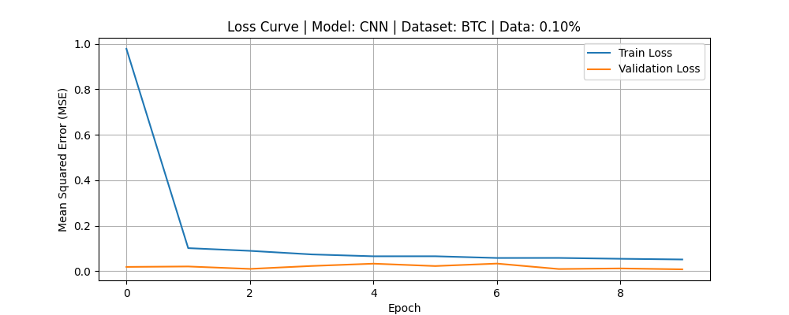
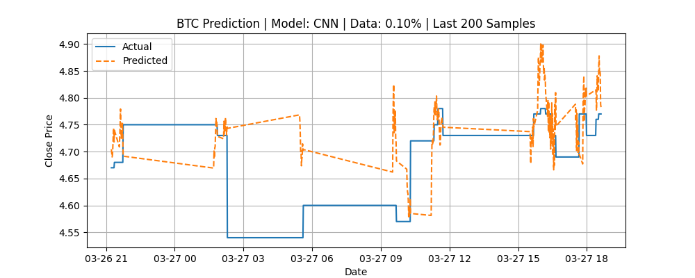
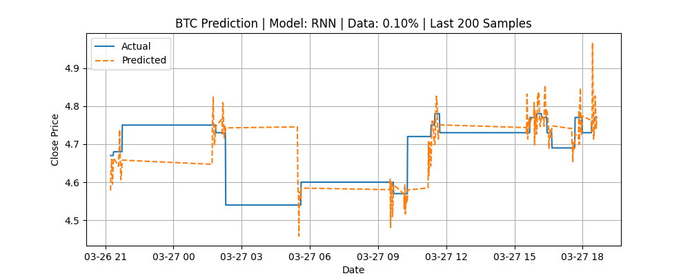
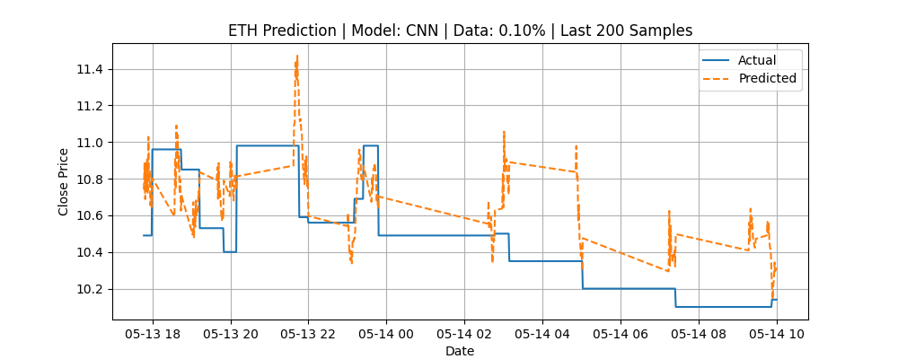
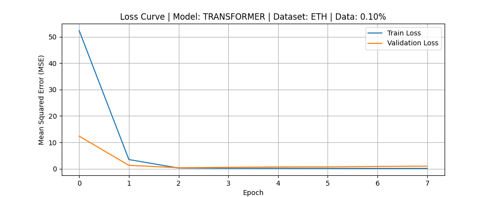
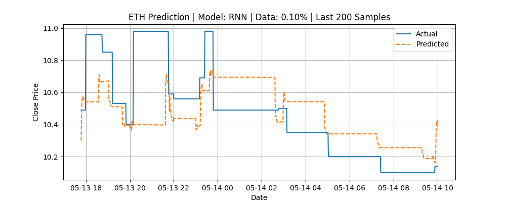

# Final Experiment Report

This document summarizes the results of all experiments performed during this run.  

**Timestamp:** 20250412_150611

**Assets Tested:** btc, eth

**Data Percentages Used:** 0.001

**Epochs per Experiment:** 10

**Stop Loss Setting:** 0.003

---

## Asset: BTC

### Model: GRU

#### Experiment: Data Used: 0.100%, Epochs: 10, Stop Loss: 0.300%

Loading data for asset: btc

Subsetting data...

Total data values in intersection: 6283462

Number of data points to use: 6283

Start of subset: 2012-01-31 10:45:00+00:00

End of subset: 2012-03-27 18:37:00+00:00

Data subset shape: (6283, 44), (6283,)

Normalizing features...

Creating sequences...

Total sequences: 6253

Splitting data into training and testing sets...

Train size: (5002, 30, 40), Test size: (1251, 30, 40)

Building model...

Training model...

Epoch 1/10


  1/157 [..............................] - ETA: 2:27 - loss: 33.3463
  6/157 [>.............................] - ETA: 1s - loss: 25.7079  
 12/157 [=>............................] - ETA: 1s - loss: 18.5404
 17/157 [==>...........................] - ETA: 1s - loss: 14.0325
 26/157 [===>..........................] - ETA: 1s - loss: 9.3886 
 33/157 [=====>........................] - ETA: 1s - loss: 7.6228
 40/157 [======>.......................] - ETA: 1s - loss: 6.3599
 49/157 [========>.....................] - ETA: 0s - loss: 5.2407
 63/157 [===========>..................] - ETA: 0s - loss: 4.1372
 74/157 [=============>................] - ETA: 0s - loss: 3.5550
 86/157 [===============>..............] - ETA: 0s - loss: 3.0908
 99/157 [=================>............] - ETA: 0s - loss: 2.7131
111/157 [====================>.........] - ETA: 0s - loss: 2.4396
125/157 [======================>.......] - ETA: 0s - loss: 2.1864
136/157 [========================>.....] - ETA: 0s - loss: 2.0264
147/157 [===========================>..] - ETA: 0s - loss: 1.8903

Epoch 1: val_loss improved from inf to 0.01860, saving model to models\gru_btc_model_0_1pct.h5


157/157 [==============================] - 2s 8ms/step - loss: 1.7894 - val_loss: 0.0186

Epoch 2/10


  1/157 [..............................] - ETA: 0s - loss: 0.2073
 15/157 [=>............................] - ETA: 0s - loss: 0.2023
 30/157 [====>.........................] - ETA: 0s - loss: 0.1945
 45/157 [=======>......................] - ETA: 0s - loss: 0.1978
 57/157 [=========>....................] - ETA: 0s - loss: 0.1897
 68/157 [===========>..................] - ETA: 0s - loss: 0.1898
 79/157 [==============>...............] - ETA: 0s - loss: 0.1864
 94/157 [================>.............] - ETA: 0s - loss: 0.1808
109/157 [===================>..........] - ETA: 0s - loss: 0.1775
120/157 [=====================>........] - ETA: 0s - loss: 0.1756
134/157 [========================>.....] - ETA: 0s - loss: 0.1750
146/157 [==========================>...] - ETA: 0s - loss: 0.1723
157/157 [==============================] - ETA: 0s - loss: 0.1711

Epoch 2: val_loss did not improve from 0.01860


157/157 [==============================] - 1s 5ms/step - loss: 0.1711 - val_loss: 0.0186

Epoch 3/10


  1/157 [..............................] - ETA: 1s - loss: 0.1268
 16/157 [==>...........................] - ETA: 0s - loss: 0.1599
 28/157 [====>.........................] - ETA: 0s - loss: 0.1637
 42/157 [=======>......................] - ETA: 0s - loss: 0.1612
 54/157 [=========>....................] - ETA: 0s - loss: 0.1598
 68/157 [===========>..................] - ETA: 0s - loss: 0.1613
 80/157 [==============>...............] - ETA: 0s - loss: 0.1617
 95/157 [=================>............] - ETA: 0s - loss: 0.1582
106/157 [===================>..........] - ETA: 0s - loss: 0.1566
117/157 [=====================>........] - ETA: 0s - loss: 0.1562
132/157 [========================>.....] - ETA: 0s - loss: 0.1550
144/157 [==========================>...] - ETA: 0s - loss: 0.1542
156/157 [============================>.] - ETA: 0s - loss: 0.1534

Epoch 3: val_loss improved from 0.01860 to 0.01272, saving model to models\gru_btc_model_0_1pct.h5


157/157 [==============================] - 1s 5ms/step - loss: 0.1534 - val_loss: 0.0127

Epoch 4/10


  1/157 [..............................] - ETA: 2s - loss: 0.1456
 16/157 [==>...........................] - ETA: 0s - loss: 0.1329
 30/157 [====>.........................] - ETA: 0s - loss: 0.1325
 41/157 [======>.......................] - ETA: 0s - loss: 0.1340
 53/157 [=========>....................] - ETA: 0s - loss: 0.1350
 64/157 [===========>..................] - ETA: 0s - loss: 0.1353
 78/157 [=============>................] - ETA: 0s - loss: 0.1339
 89/157 [================>.............] - ETA: 0s - loss: 0.1343
100/157 [==================>...........] - ETA: 0s - loss: 0.1373
111/157 [====================>.........] - ETA: 0s - loss: 0.1376
126/157 [=======================>......] - ETA: 0s - loss: 0.1374
138/157 [=========================>....] - ETA: 0s - loss: 0.1377
152/157 [============================>.] - ETA: 0s - loss: 0.1373

Epoch 4: val_loss improved from 0.01272 to 0.00614, saving model to models\gru_btc_model_0_1pct.h5


157/157 [==============================] - 1s 5ms/step - loss: 0.1372 - val_loss: 0.0061

Epoch 5/10


  1/157 [..............................] - ETA: 0s - loss: 0.1004
 12/157 [=>............................] - ETA: 0s - loss: 0.1597
 26/157 [===>..........................] - ETA: 0s - loss: 0.1518
 37/157 [======>.......................] - ETA: 0s - loss: 0.1410
 51/157 [========>.....................] - ETA: 0s - loss: 0.1400
 62/157 [==========>...................] - ETA: 0s - loss: 0.1367
 73/157 [============>.................] - ETA: 0s - loss: 0.1360
 88/157 [===============>..............] - ETA: 0s - loss: 0.1354
102/157 [==================>...........] - ETA: 0s - loss: 0.1353
114/157 [====================>.........] - ETA: 0s - loss: 0.1333
128/157 [=======================>......] - ETA: 0s - loss: 0.1336
139/157 [=========================>....] - ETA: 0s - loss: 0.1329
150/157 [===========================>..] - ETA: 0s - loss: 0.1314

Epoch 5: val_loss improved from 0.00614 to 0.00573, saving model to models\gru_btc_model_0_1pct.h5


157/157 [==============================] - 1s 5ms/step - loss: 0.1310 - val_loss: 0.0057

Epoch 6/10


  1/157 [..............................] - ETA: 0s - loss: 0.0904
 11/157 [=>............................] - ETA: 0s - loss: 0.1240
 25/157 [===>..........................] - ETA: 0s - loss: 0.1234
 39/157 [======>.......................] - ETA: 0s - loss: 0.1268
 49/157 [========>.....................] - ETA: 0s - loss: 0.1254
 63/157 [===========>..................] - ETA: 0s - loss: 0.1233
 74/157 [=============>................] - ETA: 0s - loss: 0.1247
 88/157 [===============>..............] - ETA: 0s - loss: 0.1267
 99/157 [=================>............] - ETA: 0s - loss: 0.1251
114/157 [====================>.........] - ETA: 0s - loss: 0.1246
125/157 [======================>.......] - ETA: 0s - loss: 0.1242
136/157 [========================>.....] - ETA: 0s - loss: 0.1243
151/157 [===========================>..] - ETA: 0s - loss: 0.1255

Epoch 6: val_loss improved from 0.00573 to 0.00542, saving model to models\gru_btc_model_0_1pct.h5


157/157 [==============================] - 1s 6ms/step - loss: 0.1259 - val_loss: 0.0054

Epoch 7/10


  1/157 [..............................] - ETA: 0s - loss: 0.0787
 10/157 [>.............................] - ETA: 0s - loss: 0.1356
 25/157 [===>..........................] - ETA: 0s - loss: 0.1338
 39/157 [======>.......................] - ETA: 0s - loss: 0.1292
 51/157 [========>.....................] - ETA: 0s - loss: 0.1300
 65/157 [===========>..................] - ETA: 0s - loss: 0.1299
 76/157 [=============>................] - ETA: 0s - loss: 0.1271
 88/157 [===============>..............] - ETA: 0s - loss: 0.1307
 99/157 [=================>............] - ETA: 0s - loss: 0.1284
113/157 [====================>.........] - ETA: 0s - loss: 0.1293
124/157 [======================>.......] - ETA: 0s - loss: 0.1301
138/157 [=========================>....] - ETA: 0s - loss: 0.1288
150/157 [===========================>..] - ETA: 0s - loss: 0.1298

Epoch 7: val_loss improved from 0.00542 to 0.00373, saving model to models\gru_btc_model_0_1pct.h5


157/157 [==============================] - 1s 5ms/step - loss: 0.1297 - val_loss: 0.0037

Epoch 8/10


  1/157 [..............................] - ETA: 0s - loss: 0.1766
 13/157 [=>............................] - ETA: 0s - loss: 0.1310
 28/157 [====>.........................] - ETA: 0s - loss: 0.1273
 42/157 [=======>......................] - ETA: 0s - loss: 0.1234
 54/157 [=========>....................] - ETA: 0s - loss: 0.1213
 69/157 [============>.................] - ETA: 0s - loss: 0.1194
 80/157 [==============>...............] - ETA: 0s - loss: 0.1195
 94/157 [================>.............] - ETA: 0s - loss: 0.1225
109/157 [===================>..........] - ETA: 0s - loss: 0.1208
120/157 [=====================>........] - ETA: 0s - loss: 0.1203
134/157 [========================>.....] - ETA: 0s - loss: 0.1198
145/157 [==========================>...] - ETA: 0s - loss: 0.1201

Epoch 8: val_loss did not improve from 0.00373


157/157 [==============================] - 1s 5ms/step - loss: 0.1205 - val_loss: 0.0102

Epoch 9/10


  1/157 [..............................] - ETA: 0s - loss: 0.1954
 12/157 [=>............................] - ETA: 0s - loss: 0.1208
 26/157 [===>..........................] - ETA: 0s - loss: 0.1176
 37/157 [======>.......................] - ETA: 0s - loss: 0.1208
 51/157 [========>.....................] - ETA: 0s - loss: 0.1230
 63/157 [===========>..................] - ETA: 0s - loss: 0.1223
 74/157 [=============>................] - ETA: 0s - loss: 0.1232
 88/157 [===============>..............] - ETA: 0s - loss: 0.1203
 99/157 [=================>............] - ETA: 0s - loss: 0.1200
110/157 [====================>.........] - ETA: 0s - loss: 0.1215
124/157 [======================>.......] - ETA: 0s - loss: 0.1215
139/157 [=========================>....] - ETA: 0s - loss: 0.1212
150/157 [===========================>..] - ETA: 0s - loss: 0.1218

Epoch 9: val_loss did not improve from 0.00373


157/157 [==============================] - 1s 6ms/step - loss: 0.1217 - val_loss: 0.0044

Epoch 10/10


  1/157 [..............................] - ETA: 1s - loss: 0.1100
 15/157 [=>............................] - ETA: 0s - loss: 0.1204
 27/157 [====>.........................] - ETA: 0s - loss: 0.1231
 41/157 [======>.......................] - ETA: 0s - loss: 0.1256
 52/157 [========>.....................] - ETA: 0s - loss: 0.1221
 67/157 [===========>..................] - ETA: 0s - loss: 0.1226
 78/157 [=============>................] - ETA: 0s - loss: 0.1215
 92/157 [================>.............] - ETA: 0s - loss: 0.1234
103/157 [==================>...........] - ETA: 0s - loss: 0.1230
115/157 [====================>.........] - ETA: 0s - loss: 0.1218
130/157 [=======================>......] - ETA: 0s - loss: 0.1198
145/157 [==========================>...] - ETA: 0s - loss: 0.1184
155/157 [============================>.] - ETA: 0s - loss: 0.1194

Epoch 10: val_loss did not improve from 0.00373


157/157 [==============================] - 1s 5ms/step - loss: 0.1192 - val_loss: 0.0238

Plotting training loss...

Loss curve saved to: plots\loss_curve_gru_btc_0_1pct.png

Generating predictions on test set...


 1/40 [..............................] - ETA: 7s
23/40 [================>.............] - ETA: 0s
40/40 [==============================] - 0s 2ms/step

Predictions shape: (1251, 1)

Plotting predictions and saving comparison CSV...

Prediction plot saved to: plots\prediction_plot_gru_btc_0_1pct.png

Comparison CSV saved to: model-result-data\gru_btc_comparison_0_1pct.csv

Printing evaluation metrics...

0.1% | acc 0.0608  prec 0.0398  rec 0.3858  f1 0.0722  mse 0.0238  rmse 0.1543  mae 0.1466

Saving model and scaler...

Model saved to: models\gru_btc_model_0_1pct.h5

Scaler saved to: models\gru_btc_scaler_0_1pct.pkl

Training and prediction complete.

Signal distribution:

Signal

-1    1238

 1      13

Name: count, dtype: int64

Setting up Backtest object...

Running backtest engine...

Found 13 +1 signals and 1238 -1 signals in the data.

Start                                     0.0

End                                    1250.0

Duration                               1250.0

Exposure Time [%]                    32.69384

Equity Final [$]                    113057.89

Equity Peak [$]                     116843.29

Return [%]                           13.05789

Buy & Hold Return [%]               -11.33829

Return (Ann.) [%]                         0.0

Volatility (Ann.) [%]                     NaN

Sharpe Ratio                              NaN

Sortino Ratio                             NaN

Calmar Ratio                              0.0

Alpha [%]                             12.1759

Beta                                 -0.07779

Max. Drawdown [%]                    -7.36052

Avg. Drawdown [%]                    -2.62863

Max. Drawdown Duration                  163.0

Avg. Drawdown Duration               92.14286

# Trades                                 15.0

Win Rate [%]                         53.33333

Best Trade [%]                        5.89391

Worst Trade [%]                      -3.54167

Avg. Trade [%]                        0.82158

Max. Trade Duration                     235.0

Avg. Trade Duration                      26.8

Profit Factor                         2.04194

Expectancy [%]                        0.86416

SQN                                   1.04458

Kelly Criterion                        0.2609

_strategy                 MLStrategy(stop_...

_equity_curve                      Equity ...

_trades                        Size  Entry...

dtype: object

Trade Details:

Number of trades:       15

Number of closed trades:15

Number of open trades:  0

Saving backtest plot to HTML...

Interactive chart saved to: results\gru_btc_0.10pct_sl0030\backtest_plot.html

Backtest stats saved to: results\gru_btc_0.10pct_sl0030\backtest_stats.csv

Full pipeline complete.

**Duration:** 11.97 seconds

**Training Loss Plot:**  

**Prediction Plot:**  

**Epoch CSV Log:** [View Log](../gru_btc_log_0_1pct.csv)  

**Backtest Interactive Chart:**  

<iframe src="../../results/gru_btc_0.10pct_sl0030/backtest_plot.html" width="100%" height="500px" frameborder="0"></iframe>

If the iframe does not display, please [click here to view the HTML](../../results/gru_btc_0.10pct_sl0030/backtest_plot.html).  

**Backtest Stats CSV:** [View CSV](../../results/gru_btc_0.10pct_sl0030/backtest_stats.csv)  

---

### Model: CNN

#### Experiment: Data Used: 0.100%, Epochs: 10, Stop Loss: 0.300%

Loading data for asset: btc

Subsetting data...

Total data values in intersection: 6283462

Number of data points to use: 6283

Start of subset: 2012-01-31 10:45:00+00:00

End of subset: 2012-03-27 18:37:00+00:00

Data subset shape: (6283, 44), (6283,)

Normalizing features...

Creating sequences...

Total sequences: 6253

Splitting data into training and testing sets...

Train size: (5002, 30, 40), Test size: (1251, 30, 40)

Building model...

Training model...

Epoch 1/10


  1/157 [..............................] - ETA: 39s - loss: 31.3343
 21/157 [===>..........................] - ETA: 0s - loss: 5.3735  
 51/157 [========>.....................] - ETA: 0s - loss: 2.4782
 76/157 [=============>................] - ETA: 0s - loss: 1.7248
106/157 [===================>..........] - ETA: 0s - loss: 1.2780
129/157 [=======================>......] - ETA: 0s - loss: 1.0754
154/157 [============================>.] - ETA: 0s - loss: 0.9203

Epoch 1: val_loss improved from inf to 0.01677, saving model to models\cnn_btc_model_0_1pct.h5


157/157 [==============================] - 1s 3ms/step - loss: 0.9084 - val_loss: 0.0168

Epoch 2/10


  1/157 [..............................] - ETA: 0s - loss: 0.0940
 24/157 [===>..........................] - ETA: 0s - loss: 0.1201
 52/157 [========>.....................] - ETA: 0s - loss: 0.1214
 84/157 [===============>..............] - ETA: 0s - loss: 0.1141
108/157 [===================>..........] - ETA: 0s - loss: 0.1118
132/157 [========================>.....] - ETA: 0s - loss: 0.1088
156/157 [============================>.] - ETA: 0s - loss: 0.1066

Epoch 2: val_loss did not improve from 0.01677


157/157 [==============================] - 0s 3ms/step - loss: 0.1066 - val_loss: 0.0173

Epoch 3/10


  1/157 [..............................] - ETA: 0s - loss: 0.0724
 22/157 [===>..........................] - ETA: 0s - loss: 0.0906
 52/157 [========>.....................] - ETA: 0s - loss: 0.0885
 76/157 [=============>................] - ETA: 0s - loss: 0.0854
100/157 [==================>...........] - ETA: 0s - loss: 0.0862
125/157 [======================>.......] - ETA: 0s - loss: 0.0839
149/157 [===========================>..] - ETA: 0s - loss: 0.0829

Epoch 3: val_loss improved from 0.01677 to 0.01156, saving model to models\cnn_btc_model_0_1pct.h5


157/157 [==============================] - 0s 3ms/step - loss: 0.0825 - val_loss: 0.0116

Epoch 4/10


  1/157 [..............................] - ETA: 0s - loss: 0.0829
 24/157 [===>..........................] - ETA: 0s - loss: 0.0755
 48/157 [========>.....................] - ETA: 0s - loss: 0.0696
 79/157 [==============>...............] - ETA: 0s - loss: 0.0650
103/157 [==================>...........] - ETA: 0s - loss: 0.0661
126/157 [=======================>......] - ETA: 0s - loss: 0.0677
150/157 [===========================>..] - ETA: 0s - loss: 0.0673

Epoch 4: val_loss did not improve from 0.01156


157/157 [==============================] - 0s 3ms/step - loss: 0.0675 - val_loss: 0.0116

Epoch 5/10


  1/157 [..............................] - ETA: 0s - loss: 0.0624
 30/157 [====>.........................] - ETA: 0s - loss: 0.0643
 54/157 [=========>....................] - ETA: 0s - loss: 0.0608
 78/157 [=============>................] - ETA: 0s - loss: 0.0625
102/157 [==================>...........] - ETA: 0s - loss: 0.0631
133/157 [========================>.....] - ETA: 0s - loss: 0.0610
156/157 [============================>.] - ETA: 0s - loss: 0.0605

Epoch 5: val_loss did not improve from 0.01156


157/157 [==============================] - 0s 3ms/step - loss: 0.0606 - val_loss: 0.0235

Epoch 6/10


  1/157 [..............................] - ETA: 0s - loss: 0.0288
 23/157 [===>..........................] - ETA: 0s - loss: 0.0598
 47/157 [=======>......................] - ETA: 0s - loss: 0.0638
 76/157 [=============>................] - ETA: 0s - loss: 0.0625
100/157 [==================>...........] - ETA: 0s - loss: 0.0606
125/157 [======================>.......] - ETA: 0s - loss: 0.0602
156/157 [============================>.] - ETA: 0s - loss: 0.0596

Epoch 6: val_loss did not improve from 0.01156


157/157 [==============================] - 0s 3ms/step - loss: 0.0596 - val_loss: 0.0488

Epoch 7/10


  1/157 [..............................] - ETA: 0s - loss: 0.0736
 21/157 [===>..........................] - ETA: 0s - loss: 0.0559
 46/157 [=======>......................] - ETA: 0s - loss: 0.0564
 69/157 [============>.................] - ETA: 0s - loss: 0.0554
 93/157 [================>.............] - ETA: 0s - loss: 0.0553
117/157 [=====================>........] - ETA: 0s - loss: 0.0544
141/157 [=========================>....] - ETA: 0s - loss: 0.0563

Epoch 7: val_loss improved from 0.01156 to 0.01051, saving model to models\cnn_btc_model_0_1pct.h5


157/157 [==============================] - 0s 3ms/step - loss: 0.0552 - val_loss: 0.0105

Epoch 8/10


  1/157 [..............................] - ETA: 0s - loss: 0.0466
 28/157 [====>.........................] - ETA: 0s - loss: 0.0573
 59/157 [==========>...................] - ETA: 0s - loss: 0.0553
 84/157 [===============>..............] - ETA: 0s - loss: 0.0553
108/157 [===================>..........] - ETA: 0s - loss: 0.0560
131/157 [========================>.....] - ETA: 0s - loss: 0.0535
154/157 [============================>.] - ETA: 0s - loss: 0.0529

Epoch 8: val_loss did not improve from 0.01051


157/157 [==============================] - 0s 3ms/step - loss: 0.0530 - val_loss: 0.0168

Epoch 9/10


  1/157 [..............................] - ETA: 1s - loss: 0.0359
 25/157 [===>..........................] - ETA: 0s - loss: 0.0484
 49/157 [========>.....................] - ETA: 0s - loss: 0.0487
 72/157 [============>.................] - ETA: 0s - loss: 0.0490
 96/157 [=================>............] - ETA: 0s - loss: 0.0504
126/157 [=======================>......] - ETA: 0s - loss: 0.0503
150/157 [===========================>..] - ETA: 0s - loss: 0.0494

Epoch 9: val_loss did not improve from 0.01051


157/157 [==============================] - 0s 3ms/step - loss: 0.0495 - val_loss: 0.0121

Epoch 10/10


  1/157 [..............................] - ETA: 0s - loss: 0.0443
 22/157 [===>..........................] - ETA: 0s - loss: 0.0524
 47/157 [=======>......................] - ETA: 0s - loss: 0.0513
 76/157 [=============>................] - ETA: 0s - loss: 0.0499
100/157 [==================>...........] - ETA: 0s - loss: 0.0494
124/157 [======================>.......] - ETA: 0s - loss: 0.0487
156/157 [============================>.] - ETA: 0s - loss: 0.0504

Epoch 10: val_loss did not improve from 0.01051


157/157 [==============================] - 0s 3ms/step - loss: 0.0503 - val_loss: 0.0136

Plotting training loss...

Loss curve saved to: plots\loss_curve_cnn_btc_0_1pct.png

Generating predictions on test set...


 1/40 [..............................] - ETA: 1s
40/40 [==============================] - 0s 884us/step

Predictions shape: (1251, 1)

Plotting predictions and saving comparison CSV...

Prediction plot saved to: plots\prediction_plot_cnn_btc_0_1pct.png

Comparison CSV saved to: model-result-data\cnn_btc_comparison_0_1pct.csv

Printing evaluation metrics...

0.1% | acc 0.0560  prec 0.0366  rec 0.3561  f1 0.0664  mse 0.0136  rmse 0.1168  mae 0.0962

Saving model and scaler...

Model saved to: models\cnn_btc_model_0_1pct.h5

Scaler saved to: models\cnn_btc_scaler_0_1pct.pkl

Training and prediction complete.

Signal distribution:

Signal

 1    1090

-1     161

Name: count, dtype: int64

Setting up Backtest object...

Running backtest engine...

Found 1090 +1 signals and 161 -1 signals in the data.

Start                                     0.0

End                                    1250.0

Duration                               1250.0

Exposure Time [%]                    97.92166

Equity Final [$]                  98477.90031

Equity Peak [$]                  106922.83624

Return [%]                            -1.5221

Buy & Hold Return [%]               -11.33829

Return (Ann.) [%]                         0.0

Volatility (Ann.) [%]                     NaN

Sharpe Ratio                              NaN

Sortino Ratio                             NaN

Calmar Ratio                              0.0

Alpha [%]                             9.26755

Beta                                  0.95161

Max. Drawdown [%]                   -12.33907

Avg. Drawdown [%]                    -3.10041

Max. Drawdown Duration                  833.0

Avg. Drawdown Duration              166.57143

# Trades                                100.0

Win Rate [%]                             30.0

Best Trade [%]                         6.3745

Worst Trade [%]                      -6.89013

Avg. Trade [%]                       -0.02376

Max. Trade Duration                      56.0

Avg. Trade Duration                      11.8

Profit Factor                         0.99823

Expectancy [%]                       -0.00124

SQN                                  -0.11136

Kelly Criterion                       -0.1829

_strategy                 MLStrategy(stop_...

_equity_curve                         Equi...

_trades                        Size  Entry...

dtype: object

Trade Details:

Number of trades:       100

Number of closed trades:100

Number of open trades:  0

Saving backtest plot to HTML...

Interactive chart saved to: results\cnn_btc_0.10pct_sl0030\backtest_plot.html

Backtest stats saved to: results\cnn_btc_0.10pct_sl0030\backtest_stats.csv

Full pipeline complete.

**Duration:** 6.35 seconds

**Training Loss Plot:**  

**Prediction Plot:**  

**Epoch CSV Log:** [View Log](../cnn_btc_log_0_1pct.csv)  

**Backtest Interactive Chart:**  

<iframe src="../../results/cnn_btc_0.10pct_sl0030/backtest_plot.html" width="100%" height="500px" frameborder="0"></iframe>

If the iframe does not display, please [click here to view the HTML](../../results/cnn_btc_0.10pct_sl0030/backtest_plot.html).  

**Backtest Stats CSV:** [View CSV](../../results/cnn_btc_0.10pct_sl0030/backtest_stats.csv)  

---

### Model: TRANSFORMER

#### Experiment: Data Used: 0.100%, Epochs: 10, Stop Loss: 0.300%

Loading data for asset: btc

Subsetting data...

Total data values in intersection: 6283462

Number of data points to use: 6283

Start of subset: 2012-01-31 10:45:00+00:00

End of subset: 2012-03-27 18:37:00+00:00

Data subset shape: (6283, 44), (6283,)

Normalizing features...

Creating sequences...

Total sequences: 6253

Splitting data into training and testing sets...

Train size: (5002, 30, 40), Test size: (1251, 30, 40)

Building model...

Building Transformer model with input shape: (30, 40)

Training model...

Epoch 1/10


  1/157 [..............................] - ETA: 1:15 - loss: 23.9846
  7/157 [>.............................] - ETA: 1s - loss: 15.8547  
 16/157 [==>...........................] - ETA: 1s - loss: 8.6268 
 26/157 [===>..........................] - ETA: 0s - loss: 5.4501
 37/157 [======>.......................] - ETA: 0s - loss: 3.9207
 48/157 [========>.....................] - ETA: 0s - loss: 3.0519
 61/157 [==========>...................] - ETA: 0s - loss: 2.4195
 75/157 [=============>................] - ETA: 0s - loss: 1.9783
 91/157 [================>.............] - ETA: 0s - loss: 1.6370
107/157 [===================>..........] - ETA: 0s - loss: 1.4006
119/157 [=====================>........] - ETA: 0s - loss: 1.2632
135/157 [========================>.....] - ETA: 0s - loss: 1.1174
151/157 [===========================>..] - ETA: 0s - loss: 1.0026

Epoch 1: val_loss improved from inf to 0.26743, saving model to models\transformer_btc_model_0_1pct.h5


157/157 [==============================] - 1s 6ms/step - loss: 0.9692 - val_loss: 0.2674

Epoch 2/10


  1/157 [..............................] - ETA: 0s - loss: 0.0422
 11/157 [=>............................] - ETA: 0s - loss: 0.0345
 26/157 [===>..........................] - ETA: 0s - loss: 0.0345
 39/157 [======>.......................] - ETA: 0s - loss: 0.0333
 50/157 [========>.....................] - ETA: 0s - loss: 0.0320
 62/157 [==========>...................] - ETA: 0s - loss: 0.0324
 78/157 [=============>................] - ETA: 0s - loss: 0.0345
 91/157 [================>.............] - ETA: 0s - loss: 0.0359
107/157 [===================>..........] - ETA: 0s - loss: 0.0365
119/157 [=====================>........] - ETA: 0s - loss: 0.0373
136/157 [========================>.....] - ETA: 0s - loss: 0.0365
148/157 [===========================>..] - ETA: 0s - loss: 0.0358

Epoch 2: val_loss improved from 0.26743 to 0.21369, saving model to models\transformer_btc_model_0_1pct.h5


157/157 [==============================] - 1s 5ms/step - loss: 0.0354 - val_loss: 0.2137

Epoch 3/10


  1/157 [..............................] - ETA: 2s - loss: 0.0259
 17/157 [==>...........................] - ETA: 0s - loss: 0.0312
 29/157 [====>.........................] - ETA: 0s - loss: 0.0301
 45/157 [=======>......................] - ETA: 0s - loss: 0.0290
 57/157 [=========>....................] - ETA: 0s - loss: 0.0282
 73/157 [============>.................] - ETA: 0s - loss: 0.0285
 89/157 [================>.............] - ETA: 0s - loss: 0.0286
106/157 [===================>..........] - ETA: 0s - loss: 0.0309
122/157 [======================>.......] - ETA: 0s - loss: 0.0305
134/157 [========================>.....] - ETA: 0s - loss: 0.0310
150/157 [===========================>..] - ETA: 0s - loss: 0.0304

Epoch 3: val_loss improved from 0.21369 to 0.13026, saving model to models\transformer_btc_model_0_1pct.h5


157/157 [==============================] - 1s 6ms/step - loss: 0.0312 - val_loss: 0.1303

Epoch 4/10


  1/157 [..............................] - ETA: 0s - loss: 0.0185
 15/157 [=>............................] - ETA: 0s - loss: 0.0329
 27/157 [====>.........................] - ETA: 0s - loss: 0.0351
 39/157 [======>.......................] - ETA: 0s - loss: 0.0316
 52/157 [========>.....................] - ETA: 0s - loss: 0.0307
 67/157 [===========>..................] - ETA: 0s - loss: 0.0323
 79/157 [==============>...............] - ETA: 0s - loss: 0.0308
 95/157 [=================>............] - ETA: 0s - loss: 0.0301
110/157 [====================>.........] - ETA: 0s - loss: 0.0295
122/157 [======================>.......] - ETA: 0s - loss: 0.0303
138/157 [=========================>....] - ETA: 0s - loss: 0.0299
151/157 [===========================>..] - ETA: 0s - loss: 0.0291

Epoch 4: val_loss did not improve from 0.13026


157/157 [==============================] - 1s 5ms/step - loss: 0.0289 - val_loss: 0.1656

Epoch 5/10


  1/157 [..............................] - ETA: 2s - loss: 0.0142
 13/157 [=>............................] - ETA: 0s - loss: 0.0341
 30/157 [====>.........................] - ETA: 0s - loss: 0.0277
 41/157 [======>.......................] - ETA: 0s - loss: 0.0292
 53/157 [=========>....................] - ETA: 0s - loss: 0.0282
 70/157 [============>.................] - ETA: 0s - loss: 0.0269
 86/157 [===============>..............] - ETA: 0s - loss: 0.0259
 99/157 [=================>............] - ETA: 0s - loss: 0.0260
115/157 [====================>.........] - ETA: 0s - loss: 0.0268
127/157 [=======================>......] - ETA: 0s - loss: 0.0264
144/157 [==========================>...] - ETA: 0s - loss: 0.0266
156/157 [============================>.] - ETA: 0s - loss: 0.0260

Epoch 5: val_loss did not improve from 0.13026


157/157 [==============================] - 1s 5ms/step - loss: 0.0260 - val_loss: 0.1820

Epoch 6/10


  1/157 [..............................] - ETA: 1s - loss: 0.0125
 18/157 [==>...........................] - ETA: 0s - loss: 0.0222
 33/157 [=====>........................] - ETA: 0s - loss: 0.0254
 46/157 [=======>......................] - ETA: 0s - loss: 0.0239
 62/157 [==========>...................] - ETA: 0s - loss: 0.0226
 75/157 [=============>................] - ETA: 0s - loss: 0.0225
 92/157 [================>.............] - ETA: 0s - loss: 0.0228
104/157 [==================>...........] - ETA: 0s - loss: 0.0244
120/157 [=====================>........] - ETA: 0s - loss: 0.0237
137/157 [=========================>....] - ETA: 0s - loss: 0.0231
149/157 [===========================>..] - ETA: 0s - loss: 0.0231

Epoch 6: val_loss improved from 0.13026 to 0.10180, saving model to models\transformer_btc_model_0_1pct.h5


157/157 [==============================] - 1s 5ms/step - loss: 0.0229 - val_loss: 0.1018

Epoch 7/10


  1/157 [..............................] - ETA: 0s - loss: 0.0259
 14/157 [=>............................] - ETA: 0s - loss: 0.0215
 27/157 [====>.........................] - ETA: 0s - loss: 0.0185
 39/157 [======>.......................] - ETA: 0s - loss: 0.0198
 55/157 [=========>....................] - ETA: 0s - loss: 0.0215
 72/157 [============>.................] - ETA: 0s - loss: 0.0230
 88/157 [===============>..............] - ETA: 0s - loss: 0.0240
100/157 [==================>...........] - ETA: 0s - loss: 0.0239
117/157 [=====================>........] - ETA: 0s - loss: 0.0229
134/157 [========================>.....] - ETA: 0s - loss: 0.0229
151/157 [===========================>..] - ETA: 0s - loss: 0.0222

Epoch 7: val_loss improved from 0.10180 to 0.09661, saving model to models\transformer_btc_model_0_1pct.h5


157/157 [==============================] - 1s 5ms/step - loss: 0.0219 - val_loss: 0.0966

Epoch 8/10


  1/157 [..............................] - ETA: 0s - loss: 0.0173
 16/157 [==>...........................] - ETA: 0s - loss: 0.0151
 32/157 [=====>........................] - ETA: 0s - loss: 0.0167
 45/157 [=======>......................] - ETA: 0s - loss: 0.0174
 57/157 [=========>....................] - ETA: 0s - loss: 0.0175
 74/157 [=============>................] - ETA: 0s - loss: 0.0196
 86/157 [===============>..............] - ETA: 0s - loss: 0.0211
101/157 [==================>...........] - ETA: 0s - loss: 0.0205
117/157 [=====================>........] - ETA: 0s - loss: 0.0207
129/157 [=======================>......] - ETA: 0s - loss: 0.0208
141/157 [=========================>....] - ETA: 0s - loss: 0.0203
153/157 [============================>.] - ETA: 0s - loss: 0.0201

Epoch 8: val_loss did not improve from 0.09661


157/157 [==============================] - 1s 5ms/step - loss: 0.0200 - val_loss: 0.1307

Epoch 9/10


  1/157 [..............................] - ETA: 0s - loss: 0.1232
 14/157 [=>............................] - ETA: 0s - loss: 0.0244
 31/157 [====>.........................] - ETA: 0s - loss: 0.0252
 43/157 [=======>......................] - ETA: 0s - loss: 0.0232
 55/157 [=========>....................] - ETA: 0s - loss: 0.0221
 68/157 [===========>..................] - ETA: 0s - loss: 0.0211
 84/157 [===============>..............] - ETA: 0s - loss: 0.0224
 97/157 [=================>............] - ETA: 0s - loss: 0.0218
113/157 [====================>.........] - ETA: 0s - loss: 0.0209
125/157 [======================>.......] - ETA: 0s - loss: 0.0204
138/157 [=========================>....] - ETA: 0s - loss: 0.0200
154/157 [============================>.] - ETA: 0s - loss: 0.0197

Epoch 9: val_loss improved from 0.09661 to 0.05830, saving model to models\transformer_btc_model_0_1pct.h5


157/157 [==============================] - 1s 5ms/step - loss: 0.0196 - val_loss: 0.0583

Epoch 10/10


  1/157 [..............................] - ETA: 2s - loss: 0.0413
 13/157 [=>............................] - ETA: 0s - loss: 0.0199
 26/157 [===>..........................] - ETA: 0s - loss: 0.0172
 39/157 [======>.......................] - ETA: 0s - loss: 0.0185
 55/157 [=========>....................] - ETA: 0s - loss: 0.0181
 67/157 [===========>..................] - ETA: 0s - loss: 0.0190
 80/157 [==============>...............] - ETA: 0s - loss: 0.0189
 92/157 [================>.............] - ETA: 0s - loss: 0.0186
109/157 [===================>..........] - ETA: 0s - loss: 0.0178
125/157 [======================>.......] - ETA: 0s - loss: 0.0185
141/157 [=========================>....] - ETA: 0s - loss: 0.0196
157/157 [==============================] - ETA: 0s - loss: 0.0198

Epoch 10: val_loss did not improve from 0.05830


157/157 [==============================] - 1s 5ms/step - loss: 0.0198 - val_loss: 0.0899

Plotting training loss...

Loss curve saved to: plots\loss_curve_transformer_btc_0_1pct.png

Generating predictions on test set...


 1/40 [..............................] - ETA: 2s
35/40 [=========================>....] - ETA: 0s
40/40 [==============================] - 0s 1ms/step

Predictions shape: (1251, 1)

Plotting predictions and saving comparison CSV...

Prediction plot saved to: plots\prediction_plot_transformer_btc_0_1pct.png

Comparison CSV saved to: model-result-data\transformer_btc_comparison_0_1pct.csv

Printing evaluation metrics...

0.1% | acc 0.0528  prec 0.0342  rec 0.3360  f1 0.0620  mse 0.0899  rmse 0.2999  mae 0.2791

Saving model and scaler...

Model saved to: models\transformer_btc_model_0_1pct.h5

Scaler saved to: models\transformer_btc_scaler_0_1pct.pkl

Training and prediction complete.

Signal distribution:

Signal

1    1251

Name: count, dtype: int64

Setting up Backtest object...

Running backtest engine...

Found 1251 +1 signals and 0 -1 signals in the data.

Start                                     0.0

End                                    1250.0

Duration                               1250.0

Exposure Time [%]                    78.25739

Equity Final [$]                  91002.94068

Equity Peak [$]                  101496.88368

Return [%]                           -8.99706

Buy & Hold Return [%]               -11.33829

Return (Ann.) [%]                         0.0

Volatility (Ann.) [%]                     NaN

Sharpe Ratio                              NaN

Sortino Ratio                             NaN

Calmar Ratio                              0.0

Alpha [%]                             2.23614

Beta                                  0.99073

Max. Drawdown [%]                    -14.6624

Avg. Drawdown [%]                    -4.55416

Max. Drawdown Duration                  825.0

Avg. Drawdown Duration              193.83333

# Trades                                 20.0

Win Rate [%]                              0.0

Best Trade [%]                           -0.3

Worst Trade [%]                      -2.54237

Avg. Trade [%]                       -0.71593

Max. Trade Duration                     147.0

Avg. Trade Duration                     47.95

Profit Factor                             0.0

Expectancy [%]                       -0.71449

SQN                                  -6.01225

Kelly Criterion                           NaN

_strategy                 MLStrategy(stop_...

_equity_curve                         Equi...

_trades                        Size  Entry...

dtype: object

Trade Details:

Number of trades:       20

Number of closed trades:20

Number of open trades:  0

Saving backtest plot to HTML...

Interactive chart saved to: results\transformer_btc_0.10pct_sl0030\backtest_plot.html

Backtest stats saved to: results\transformer_btc_0.10pct_sl0030\backtest_stats.csv

Full pipeline complete.

**Duration:** 10.27 seconds

**Training Loss Plot:**  

**Prediction Plot:**  

**Epoch CSV Log:** [View Log](../transformer_btc_log_0_1pct.csv)  

**Backtest Interactive Chart:**  

<iframe src="../../results/transformer_btc_0.10pct_sl0030/backtest_plot.html" width="100%" height="500px" frameborder="0"></iframe>

If the iframe does not display, please [click here to view the HTML](../../results/transformer_btc_0.10pct_sl0030/backtest_plot.html).  

**Backtest Stats CSV:** [View CSV](../../results/transformer_btc_0.10pct_sl0030/backtest_stats.csv)  

---

### Model: RNN

#### Experiment: Data Used: 0.100%, Epochs: 10, Stop Loss: 0.300%

Loading data for asset: btc

Subsetting data...

Total data values in intersection: 6283462

Number of data points to use: 6283

Start of subset: 2012-01-31 10:45:00+00:00

End of subset: 2012-03-27 18:37:00+00:00

Data subset shape: (6283, 44), (6283,)

Normalizing features...

Creating sequences...

Total sequences: 6253

Splitting data into training and testing sets...

Train size: (5002, 30, 40), Test size: (1251, 30, 40)

Building model...

Building RNN model with input shape: (30, 40)

Training model...

Epoch 1/10


  1/157 [..............................] - ETA: 1:11 - loss: 27.0814
  4/157 [..............................] - ETA: 3s - loss: 22.0201  
  6/157 [>.............................] - ETA: 3s - loss: 18.6798
  9/157 [>.............................] - ETA: 3s - loss: 14.7681
 12/157 [=>............................] - ETA: 3s - loss: 11.9963
 15/157 [=>............................] - ETA: 2s - loss: 9.9424 
 19/157 [==>...........................] - ETA: 2s - loss: 8.0089
 23/157 [===>..........................] - ETA: 2s - loss: 6.6952
 27/157 [====>.........................] - ETA: 2s - loss: 5.7850
 31/157 [====>.........................] - ETA: 2s - loss: 5.1109
 34/157 [=====>........................] - ETA: 2s - loss: 4.7236
 37/157 [======>.......................] - ETA: 2s - loss: 4.3937
 41/157 [======>.......................] - ETA: 2s - loss: 4.0269
 45/157 [=======>......................] - ETA: 1s - loss: 3.7038
 49/157 [========>.....................] - ETA: 1s - loss: 3.4375
 53/157 [=========>....................] - ETA: 1s - loss: 3.2052
 56/157 [=========>....................] - ETA: 1s - loss: 3.0534
 60/157 [==========>...................] - ETA: 1s - loss: 2.8779
 64/157 [===========>..................] - ETA: 1s - loss: 2.7209
 68/157 [===========>..................] - ETA: 1s - loss: 2.5837
 72/157 [============>.................] - ETA: 1s - loss: 2.4564
 75/157 [=============>................] - ETA: 1s - loss: 2.3757
 79/157 [==============>...............] - ETA: 1s - loss: 2.2739
 83/157 [==============>...............] - ETA: 1s - loss: 2.1789
 87/157 [===============>..............] - ETA: 1s - loss: 2.0898
 91/157 [================>.............] - ETA: 1s - loss: 2.0109
 94/157 [================>.............] - ETA: 1s - loss: 1.9555
 98/157 [=================>............] - ETA: 0s - loss: 1.8857
101/157 [==================>...........] - ETA: 0s - loss: 1.8358
105/157 [===================>..........] - ETA: 0s - loss: 1.7778
109/157 [===================>..........] - ETA: 0s - loss: 1.7232
112/157 [====================>.........] - ETA: 0s - loss: 1.6835
116/157 [=====================>........] - ETA: 0s - loss: 1.6351
120/157 [=====================>........] - ETA: 0s - loss: 1.5891
124/157 [======================>.......] - ETA: 0s - loss: 1.5481
127/157 [=======================>......] - ETA: 0s - loss: 1.5174
131/157 [========================>.....] - ETA: 0s - loss: 1.4789
135/157 [========================>.....] - ETA: 0s - loss: 1.4424
138/157 [=========================>....] - ETA: 0s - loss: 1.4160
142/157 [==========================>...] - ETA: 0s - loss: 1.3836
146/157 [==========================>...] - ETA: 0s - loss: 1.3537
150/157 [===========================>..] - ETA: 0s - loss: 1.3243
154/157 [============================>.] - ETA: 0s - loss: 1.2955

Epoch 1: val_loss improved from inf to 0.04413, saving model to models\rnn_btc_model_0_1pct.h5


157/157 [==============================] - 3s 19ms/step - loss: 1.2798 - val_loss: 0.0441

Epoch 2/10


  1/157 [..............................] - ETA: 1s - loss: 0.2108
  4/157 [..............................] - ETA: 2s - loss: 0.2524
  8/157 [>.............................] - ETA: 2s - loss: 0.2641
 12/157 [=>............................] - ETA: 2s - loss: 0.2826
 16/157 [==>...........................] - ETA: 2s - loss: 0.2854
 20/157 [==>...........................] - ETA: 2s - loss: 0.2855
 24/157 [===>..........................] - ETA: 2s - loss: 0.2728
 28/157 [====>.........................] - ETA: 2s - loss: 0.2732
 32/157 [=====>........................] - ETA: 1s - loss: 0.2642
 35/157 [=====>........................] - ETA: 1s - loss: 0.2595
 39/157 [======>.......................] - ETA: 1s - loss: 0.2521
 43/157 [=======>......................] - ETA: 1s - loss: 0.2507
 47/157 [=======>......................] - ETA: 1s - loss: 0.2504
 50/157 [========>.....................] - ETA: 1s - loss: 0.2498
 54/157 [=========>....................] - ETA: 1s - loss: 0.2459
 57/157 [=========>....................] - ETA: 1s - loss: 0.2437
 61/157 [==========>...................] - ETA: 1s - loss: 0.2427
 64/157 [===========>..................] - ETA: 1s - loss: 0.2388
 68/157 [===========>..................] - ETA: 1s - loss: 0.2393
 72/157 [============>.................] - ETA: 1s - loss: 0.2360
 76/157 [=============>................] - ETA: 1s - loss: 0.2332
 80/157 [==============>...............] - ETA: 1s - loss: 0.2328
 83/157 [==============>...............] - ETA: 1s - loss: 0.2330
 87/157 [===============>..............] - ETA: 1s - loss: 0.2328
 90/157 [================>.............] - ETA: 1s - loss: 0.2315
 95/157 [=================>............] - ETA: 0s - loss: 0.2314
 99/157 [=================>............] - ETA: 0s - loss: 0.2304
102/157 [==================>...........] - ETA: 0s - loss: 0.2302
106/157 [===================>..........] - ETA: 0s - loss: 0.2289
110/157 [====================>.........] - ETA: 0s - loss: 0.2288
114/157 [====================>.........] - ETA: 0s - loss: 0.2283
117/157 [=====================>........] - ETA: 0s - loss: 0.2271
120/157 [=====================>........] - ETA: 0s - loss: 0.2264
123/157 [======================>.......] - ETA: 0s - loss: 0.2281
127/157 [=======================>......] - ETA: 0s - loss: 0.2272
130/157 [=======================>......] - ETA: 0s - loss: 0.2268
134/157 [========================>.....] - ETA: 0s - loss: 0.2252
138/157 [=========================>....] - ETA: 0s - loss: 0.2248
141/157 [=========================>....] - ETA: 0s - loss: 0.2253
145/157 [==========================>...] - ETA: 0s - loss: 0.2246
148/157 [===========================>..] - ETA: 0s - loss: 0.2246
152/157 [============================>.] - ETA: 0s - loss: 0.2239
155/157 [============================>.] - ETA: 0s - loss: 0.2234

Epoch 2: val_loss improved from 0.04413 to 0.03083, saving model to models\rnn_btc_model_0_1pct.h5


157/157 [==============================] - 3s 18ms/step - loss: 0.2236 - val_loss: 0.0308

Epoch 3/10


  1/157 [..............................] - ETA: 3s - loss: 0.1683
  5/157 [..............................] - ETA: 2s - loss: 0.2369
  8/157 [>.............................] - ETA: 2s - loss: 0.2006
 11/157 [=>............................] - ETA: 2s - loss: 0.2040
 15/157 [=>............................] - ETA: 2s - loss: 0.2121
 19/157 [==>...........................] - ETA: 2s - loss: 0.2099
 23/157 [===>..........................] - ETA: 2s - loss: 0.2064
 26/157 [===>..........................] - ETA: 2s - loss: 0.2020
 30/157 [====>.........................] - ETA: 2s - loss: 0.2027
 34/157 [=====>........................] - ETA: 2s - loss: 0.2029
 38/157 [======>.......................] - ETA: 1s - loss: 0.2018
 41/157 [======>.......................] - ETA: 1s - loss: 0.2051
 45/157 [=======>......................] - ETA: 1s - loss: 0.2041
 49/157 [========>.....................] - ETA: 1s - loss: 0.2029
 53/157 [=========>....................] - ETA: 1s - loss: 0.2034
 57/157 [=========>....................] - ETA: 1s - loss: 0.2040
 61/157 [==========>...................] - ETA: 1s - loss: 0.2028
 64/157 [===========>..................] - ETA: 1s - loss: 0.2023
 67/157 [===========>..................] - ETA: 1s - loss: 0.2004
 71/157 [============>.................] - ETA: 1s - loss: 0.2026
 75/157 [=============>................] - ETA: 1s - loss: 0.2012
 78/157 [=============>................] - ETA: 1s - loss: 0.2012
 82/157 [==============>...............] - ETA: 1s - loss: 0.2012
 85/157 [===============>..............] - ETA: 1s - loss: 0.1997
 89/157 [================>.............] - ETA: 1s - loss: 0.1978
 93/157 [================>.............] - ETA: 1s - loss: 0.1951
 97/157 [=================>............] - ETA: 0s - loss: 0.1970
101/157 [==================>...........] - ETA: 0s - loss: 0.1963
105/157 [===================>..........] - ETA: 0s - loss: 0.1962
109/157 [===================>..........] - ETA: 0s - loss: 0.1962
112/157 [====================>.........] - ETA: 0s - loss: 0.1947
116/157 [=====================>........] - ETA: 0s - loss: 0.1936
121/157 [======================>.......] - ETA: 0s - loss: 0.1923
124/157 [======================>.......] - ETA: 0s - loss: 0.1943
128/157 [=======================>......] - ETA: 0s - loss: 0.1937
131/157 [========================>.....] - ETA: 0s - loss: 0.1937
135/157 [========================>.....] - ETA: 0s - loss: 0.1934
139/157 [=========================>....] - ETA: 0s - loss: 0.1928
143/157 [==========================>...] - ETA: 0s - loss: 0.1925
147/157 [===========================>..] - ETA: 0s - loss: 0.1922
150/157 [===========================>..] - ETA: 0s - loss: 0.1918
154/157 [============================>.] - ETA: 0s - loss: 0.1908
157/157 [==============================] - ETA: 0s - loss: 0.1900

Epoch 3: val_loss improved from 0.03083 to 0.00835, saving model to models\rnn_btc_model_0_1pct.h5


157/157 [==============================] - 3s 18ms/step - loss: 0.1900 - val_loss: 0.0084

Epoch 4/10


  1/157 [..............................] - ETA: 0s - loss: 0.1342
  4/157 [..............................] - ETA: 2s - loss: 0.1557
  8/157 [>.............................] - ETA: 2s - loss: 0.1601
 11/157 [=>............................] - ETA: 2s - loss: 0.1844
 14/157 [=>............................] - ETA: 2s - loss: 0.1991
 18/157 [==>...........................] - ETA: 2s - loss: 0.1929
 22/157 [===>..........................] - ETA: 2s - loss: 0.1848
 26/157 [===>..........................] - ETA: 2s - loss: 0.1890
 30/157 [====>.........................] - ETA: 2s - loss: 0.1912
 33/157 [=====>........................] - ETA: 2s - loss: 0.1907
 37/157 [======>.......................] - ETA: 2s - loss: 0.1899
 40/157 [======>.......................] - ETA: 2s - loss: 0.1872
 43/157 [=======>......................] - ETA: 1s - loss: 0.1858
 47/157 [=======>......................] - ETA: 1s - loss: 0.1870
 51/157 [========>.....................] - ETA: 1s - loss: 0.1873
 55/157 [=========>....................] - ETA: 1s - loss: 0.1841
 58/157 [==========>...................] - ETA: 1s - loss: 0.1811
 62/157 [==========>...................] - ETA: 1s - loss: 0.1795
 65/157 [===========>..................] - ETA: 1s - loss: 0.1797
 68/157 [===========>..................] - ETA: 1s - loss: 0.1805
 72/157 [============>.................] - ETA: 1s - loss: 0.1807
 75/157 [=============>................] - ETA: 1s - loss: 0.1780
 79/157 [==============>...............] - ETA: 1s - loss: 0.1791
 82/157 [==============>...............] - ETA: 1s - loss: 0.1791
 86/157 [===============>..............] - ETA: 1s - loss: 0.1784
 89/157 [================>.............] - ETA: 1s - loss: 0.1789
 93/157 [================>.............] - ETA: 1s - loss: 0.1776
 96/157 [=================>............] - ETA: 1s - loss: 0.1770
 99/157 [=================>............] - ETA: 0s - loss: 0.1754
103/157 [==================>...........] - ETA: 0s - loss: 0.1761
106/157 [===================>..........] - ETA: 0s - loss: 0.1746
110/157 [====================>.........] - ETA: 0s - loss: 0.1737
113/157 [====================>.........] - ETA: 0s - loss: 0.1725
117/157 [=====================>........] - ETA: 0s - loss: 0.1718
120/157 [=====================>........] - ETA: 0s - loss: 0.1717
124/157 [======================>.......] - ETA: 0s - loss: 0.1717
127/157 [=======================>......] - ETA: 0s - loss: 0.1727
131/157 [========================>.....] - ETA: 0s - loss: 0.1715
134/157 [========================>.....] - ETA: 0s - loss: 0.1706
138/157 [=========================>....] - ETA: 0s - loss: 0.1702
142/157 [==========================>...] - ETA: 0s - loss: 0.1703
146/157 [==========================>...] - ETA: 0s - loss: 0.1708
149/157 [===========================>..] - ETA: 0s - loss: 0.1704
153/157 [============================>.] - ETA: 0s - loss: 0.1703
156/157 [============================>.] - ETA: 0s - loss: 0.1692

Epoch 4: val_loss did not improve from 0.00835


157/157 [==============================] - 3s 18ms/step - loss: 0.1690 - val_loss: 0.0179

Epoch 5/10


  1/157 [..............................] - ETA: 2s - loss: 0.1981
  5/157 [..............................] - ETA: 2s - loss: 0.1662
  9/157 [>.............................] - ETA: 2s - loss: 0.1595
 13/157 [=>............................] - ETA: 2s - loss: 0.1566
 17/157 [==>...........................] - ETA: 2s - loss: 0.1573
 20/157 [==>...........................] - ETA: 2s - loss: 0.1559
 24/157 [===>..........................] - ETA: 2s - loss: 0.1555
 28/157 [====>.........................] - ETA: 2s - loss: 0.1593
 31/157 [====>.........................] - ETA: 2s - loss: 0.1606
 34/157 [=====>........................] - ETA: 2s - loss: 0.1599
 37/157 [======>.......................] - ETA: 1s - loss: 0.1594
 40/157 [======>.......................] - ETA: 1s - loss: 0.1578
 43/157 [=======>......................] - ETA: 1s - loss: 0.1581
 46/157 [=======>......................] - ETA: 1s - loss: 0.1604
 50/157 [========>.....................] - ETA: 1s - loss: 0.1603
 53/157 [=========>....................] - ETA: 1s - loss: 0.1592
 56/157 [=========>....................] - ETA: 1s - loss: 0.1568
 60/157 [==========>...................] - ETA: 1s - loss: 0.1586
 65/157 [===========>..................] - ETA: 1s - loss: 0.1579
 68/157 [===========>..................] - ETA: 1s - loss: 0.1596
 72/157 [============>.................] - ETA: 1s - loss: 0.1603
 76/157 [=============>................] - ETA: 1s - loss: 0.1587
 79/157 [==============>...............] - ETA: 1s - loss: 0.1609
 83/157 [==============>...............] - ETA: 1s - loss: 0.1597
 86/157 [===============>..............] - ETA: 1s - loss: 0.1575
 90/157 [================>.............] - ETA: 1s - loss: 0.1584
 93/157 [================>.............] - ETA: 1s - loss: 0.1592
 96/157 [=================>............] - ETA: 1s - loss: 0.1591
100/157 [==================>...........] - ETA: 0s - loss: 0.1587
104/157 [==================>...........] - ETA: 0s - loss: 0.1573
107/157 [===================>..........] - ETA: 0s - loss: 0.1577
110/157 [====================>.........] - ETA: 0s - loss: 0.1584
114/157 [====================>.........] - ETA: 0s - loss: 0.1584
118/157 [=====================>........] - ETA: 0s - loss: 0.1578
121/157 [======================>.......] - ETA: 0s - loss: 0.1576
125/157 [======================>.......] - ETA: 0s - loss: 0.1579
129/157 [=======================>......] - ETA: 0s - loss: 0.1578
133/157 [========================>.....] - ETA: 0s - loss: 0.1576
137/157 [=========================>....] - ETA: 0s - loss: 0.1571
140/157 [=========================>....] - ETA: 0s - loss: 0.1573
144/157 [==========================>...] - ETA: 0s - loss: 0.1559
147/157 [===========================>..] - ETA: 0s - loss: 0.1554
152/157 [============================>.] - ETA: 0s - loss: 0.1543
156/157 [============================>.] - ETA: 0s - loss: 0.1547

Epoch 5: val_loss did not improve from 0.00835


157/157 [==============================] - 3s 18ms/step - loss: 0.1546 - val_loss: 0.0122

Epoch 6/10


  1/157 [..............................] - ETA: 3s - loss: 0.1509
  4/157 [..............................] - ETA: 2s - loss: 0.1387
  7/157 [>.............................] - ETA: 2s - loss: 0.1317
 11/157 [=>............................] - ETA: 2s - loss: 0.1576
 15/157 [=>............................] - ETA: 2s - loss: 0.1543
 19/157 [==>...........................] - ETA: 2s - loss: 0.1498
 23/157 [===>..........................] - ETA: 2s - loss: 0.1542
 27/157 [====>.........................] - ETA: 2s - loss: 0.1578
 30/157 [====>.........................] - ETA: 2s - loss: 0.1581
 35/157 [=====>........................] - ETA: 1s - loss: 0.1557
 38/157 [======>.......................] - ETA: 1s - loss: 0.1536
 42/157 [=======>......................] - ETA: 1s - loss: 0.1503
 45/157 [=======>......................] - ETA: 1s - loss: 0.1503
 49/157 [========>.....................] - ETA: 1s - loss: 0.1490
 53/157 [=========>....................] - ETA: 1s - loss: 0.1497
 58/157 [==========>...................] - ETA: 1s - loss: 0.1478
 62/157 [==========>...................] - ETA: 1s - loss: 0.1503
 65/157 [===========>..................] - ETA: 1s - loss: 0.1486
 69/157 [============>.................] - ETA: 1s - loss: 0.1490
 73/157 [============>.................] - ETA: 1s - loss: 0.1482
 76/157 [=============>................] - ETA: 1s - loss: 0.1484
 81/157 [==============>...............] - ETA: 1s - loss: 0.1490
 85/157 [===============>..............] - ETA: 1s - loss: 0.1474
 88/157 [===============>..............] - ETA: 1s - loss: 0.1472
 92/157 [================>.............] - ETA: 1s - loss: 0.1464
 96/157 [=================>............] - ETA: 0s - loss: 0.1473
100/157 [==================>...........] - ETA: 0s - loss: 0.1483
104/157 [==================>...........] - ETA: 0s - loss: 0.1495
107/157 [===================>..........] - ETA: 0s - loss: 0.1489
110/157 [====================>.........] - ETA: 0s - loss: 0.1489
114/157 [====================>.........] - ETA: 0s - loss: 0.1485
117/157 [=====================>........] - ETA: 0s - loss: 0.1486
121/157 [======================>.......] - ETA: 0s - loss: 0.1483
125/157 [======================>.......] - ETA: 0s - loss: 0.1483
129/157 [=======================>......] - ETA: 0s - loss: 0.1484
132/157 [========================>.....] - ETA: 0s - loss: 0.1487
136/157 [========================>.....] - ETA: 0s - loss: 0.1488
141/157 [=========================>....] - ETA: 0s - loss: 0.1492
144/157 [==========================>...] - ETA: 0s - loss: 0.1491
147/157 [===========================>..] - ETA: 0s - loss: 0.1485
150/157 [===========================>..] - ETA: 0s - loss: 0.1496
154/157 [============================>.] - ETA: 0s - loss: 0.1487
157/157 [==============================] - ETA: 0s - loss: 0.1492

Epoch 6: val_loss improved from 0.00835 to 0.00510, saving model to models\rnn_btc_model_0_1pct.h5


157/157 [==============================] - 3s 17ms/step - loss: 0.1492 - val_loss: 0.0051

Epoch 7/10


  1/157 [..............................] - ETA: 2s - loss: 0.1558
  5/157 [..............................] - ETA: 2s - loss: 0.1336
  8/157 [>.............................] - ETA: 2s - loss: 0.1375
 11/157 [=>............................] - ETA: 2s - loss: 0.1388
 14/157 [=>............................] - ETA: 2s - loss: 0.1370
 17/157 [==>...........................] - ETA: 2s - loss: 0.1446
 20/157 [==>...........................] - ETA: 2s - loss: 0.1454
 24/157 [===>..........................] - ETA: 2s - loss: 0.1470
 28/157 [====>.........................] - ETA: 2s - loss: 0.1429
 31/157 [====>.........................] - ETA: 2s - loss: 0.1436
 35/157 [=====>........................] - ETA: 2s - loss: 0.1417
 39/157 [======>.......................] - ETA: 2s - loss: 0.1398
 42/157 [=======>......................] - ETA: 2s - loss: 0.1420
 46/157 [=======>......................] - ETA: 1s - loss: 0.1408
 49/157 [========>.....................] - ETA: 1s - loss: 0.1392
 53/157 [=========>....................] - ETA: 1s - loss: 0.1406
 55/157 [=========>....................] - ETA: 1s - loss: 0.1412
 59/157 [==========>...................] - ETA: 1s - loss: 0.1423
 62/157 [==========>...................] - ETA: 1s - loss: 0.1409
 66/157 [===========>..................] - ETA: 1s - loss: 0.1400
 70/157 [============>.................] - ETA: 1s - loss: 0.1384
 74/157 [=============>................] - ETA: 1s - loss: 0.1379
 77/157 [=============>................] - ETA: 1s - loss: 0.1359
 81/157 [==============>...............] - ETA: 1s - loss: 0.1358
 84/157 [===============>..............] - ETA: 1s - loss: 0.1355
 87/157 [===============>..............] - ETA: 1s - loss: 0.1355
 91/157 [================>.............] - ETA: 1s - loss: 0.1345
 95/157 [=================>............] - ETA: 1s - loss: 0.1348
100/157 [==================>...........] - ETA: 0s - loss: 0.1348
104/157 [==================>...........] - ETA: 0s - loss: 0.1351
108/157 [===================>..........] - ETA: 0s - loss: 0.1357
112/157 [====================>.........] - ETA: 0s - loss: 0.1362
116/157 [=====================>........] - ETA: 0s - loss: 0.1359
119/157 [=====================>........] - ETA: 0s - loss: 0.1359
122/157 [======================>.......] - ETA: 0s - loss: 0.1371
125/157 [======================>.......] - ETA: 0s - loss: 0.1369
128/157 [=======================>......] - ETA: 0s - loss: 0.1370
132/157 [========================>.....] - ETA: 0s - loss: 0.1363
135/157 [========================>.....] - ETA: 0s - loss: 0.1363
138/157 [=========================>....] - ETA: 0s - loss: 0.1360
141/157 [=========================>....] - ETA: 0s - loss: 0.1359
144/157 [==========================>...] - ETA: 0s - loss: 0.1358
147/157 [===========================>..] - ETA: 0s - loss: 0.1355
151/157 [===========================>..] - ETA: 0s - loss: 0.1355
154/157 [============================>.] - ETA: 0s - loss: 0.1360
157/157 [==============================] - ETA: 0s - loss: 0.1357

Epoch 7: val_loss improved from 0.00510 to 0.00439, saving model to models\rnn_btc_model_0_1pct.h5


157/157 [==============================] - 3s 19ms/step - loss: 0.1357 - val_loss: 0.0044

Epoch 8/10


  1/157 [..............................] - ETA: 2s - loss: 0.1468
  5/157 [..............................] - ETA: 2s - loss: 0.1599
  8/157 [>.............................] - ETA: 2s - loss: 0.1449
 11/157 [=>............................] - ETA: 2s - loss: 0.1395
 14/157 [=>............................] - ETA: 2s - loss: 0.1360
 18/157 [==>...........................] - ETA: 2s - loss: 0.1443
 22/157 [===>..........................] - ETA: 2s - loss: 0.1422
 25/157 [===>..........................] - ETA: 2s - loss: 0.1473
 28/157 [====>.........................] - ETA: 2s - loss: 0.1487
 32/157 [=====>........................] - ETA: 2s - loss: 0.1468
 35/157 [=====>........................] - ETA: 2s - loss: 0.1435
 39/157 [======>.......................] - ETA: 2s - loss: 0.1414
 42/157 [=======>......................] - ETA: 1s - loss: 0.1398
 45/157 [=======>......................] - ETA: 1s - loss: 0.1404
 48/157 [========>.....................] - ETA: 1s - loss: 0.1417
 51/157 [========>.....................] - ETA: 1s - loss: 0.1423
 55/157 [=========>....................] - ETA: 1s - loss: 0.1431
 58/157 [==========>...................] - ETA: 1s - loss: 0.1409
 61/157 [==========>...................] - ETA: 1s - loss: 0.1399
 64/157 [===========>..................] - ETA: 1s - loss: 0.1411
 67/157 [===========>..................] - ETA: 1s - loss: 0.1424
 70/157 [============>.................] - ETA: 1s - loss: 0.1425
 74/157 [=============>................] - ETA: 1s - loss: 0.1415
 77/157 [=============>................] - ETA: 1s - loss: 0.1422
 81/157 [==============>...............] - ETA: 1s - loss: 0.1409
 84/157 [===============>..............] - ETA: 1s - loss: 0.1399
 87/157 [===============>..............] - ETA: 1s - loss: 0.1393
 91/157 [================>.............] - ETA: 1s - loss: 0.1387
 94/157 [================>.............] - ETA: 1s - loss: 0.1394
 98/157 [=================>............] - ETA: 1s - loss: 0.1381
102/157 [==================>...........] - ETA: 0s - loss: 0.1392
105/157 [===================>..........] - ETA: 0s - loss: 0.1385
109/157 [===================>..........] - ETA: 0s - loss: 0.1381
112/157 [====================>.........] - ETA: 0s - loss: 0.1379
115/157 [====================>.........] - ETA: 0s - loss: 0.1378
119/157 [=====================>........] - ETA: 0s - loss: 0.1364
123/157 [======================>.......] - ETA: 0s - loss: 0.1373
126/157 [=======================>......] - ETA: 0s - loss: 0.1373
130/157 [=======================>......] - ETA: 0s - loss: 0.1359
134/157 [========================>.....] - ETA: 0s - loss: 0.1363
138/157 [=========================>....] - ETA: 0s - loss: 0.1363
142/157 [==========================>...] - ETA: 0s - loss: 0.1358
145/157 [==========================>...] - ETA: 0s - loss: 0.1360
149/157 [===========================>..] - ETA: 0s - loss: 0.1354
153/157 [============================>.] - ETA: 0s - loss: 0.1359
157/157 [==============================] - ETA: 0s - loss: 0.1356

Epoch 8: val_loss did not improve from 0.00439


157/157 [==============================] - 3s 19ms/step - loss: 0.1356 - val_loss: 0.0048

Epoch 9/10


  1/157 [..............................] - ETA: 0s - loss: 0.0992
  4/157 [..............................] - ETA: 2s - loss: 0.1231
  7/157 [>.............................] - ETA: 2s - loss: 0.1321
 10/157 [>.............................] - ETA: 2s - loss: 0.1376
 14/157 [=>............................] - ETA: 2s - loss: 0.1400
 17/157 [==>...........................] - ETA: 2s - loss: 0.1371
 21/157 [===>..........................] - ETA: 2s - loss: 0.1355
 24/157 [===>..........................] - ETA: 2s - loss: 0.1326
 28/157 [====>.........................] - ETA: 2s - loss: 0.1388
 32/157 [=====>........................] - ETA: 2s - loss: 0.1406
 36/157 [=====>........................] - ETA: 2s - loss: 0.1375
 39/157 [======>.......................] - ETA: 2s - loss: 0.1354
 42/157 [=======>......................] - ETA: 1s - loss: 0.1367
 46/157 [=======>......................] - ETA: 1s - loss: 0.1382
 50/157 [========>.....................] - ETA: 1s - loss: 0.1357
 53/157 [=========>....................] - ETA: 1s - loss: 0.1369
 57/157 [=========>....................] - ETA: 1s - loss: 0.1375
 60/157 [==========>...................] - ETA: 1s - loss: 0.1381
 63/157 [===========>..................] - ETA: 1s - loss: 0.1385
 66/157 [===========>..................] - ETA: 1s - loss: 0.1379
 69/157 [============>.................] - ETA: 1s - loss: 0.1365
 73/157 [============>.................] - ETA: 1s - loss: 0.1352
 76/157 [=============>................] - ETA: 1s - loss: 0.1338
 80/157 [==============>...............] - ETA: 1s - loss: 0.1359
 83/157 [==============>...............] - ETA: 1s - loss: 0.1360
 87/157 [===============>..............] - ETA: 1s - loss: 0.1360
 91/157 [================>.............] - ETA: 1s - loss: 0.1350
 95/157 [=================>............] - ETA: 1s - loss: 0.1347
 99/157 [=================>............] - ETA: 0s - loss: 0.1339
102/157 [==================>...........] - ETA: 0s - loss: 0.1342
106/157 [===================>..........] - ETA: 0s - loss: 0.1338
110/157 [====================>.........] - ETA: 0s - loss: 0.1336
114/157 [====================>.........] - ETA: 0s - loss: 0.1330
118/157 [=====================>........] - ETA: 0s - loss: 0.1324
122/157 [======================>.......] - ETA: 0s - loss: 0.1317
125/157 [======================>.......] - ETA: 0s - loss: 0.1310
128/157 [=======================>......] - ETA: 0s - loss: 0.1317
131/157 [========================>.....] - ETA: 0s - loss: 0.1316
134/157 [========================>.....] - ETA: 0s - loss: 0.1312
138/157 [=========================>....] - ETA: 0s - loss: 0.1308
141/157 [=========================>....] - ETA: 0s - loss: 0.1303
145/157 [==========================>...] - ETA: 0s - loss: 0.1289
148/157 [===========================>..] - ETA: 0s - loss: 0.1299
151/157 [===========================>..] - ETA: 0s - loss: 0.1294
155/157 [============================>.] - ETA: 0s - loss: 0.1298

Epoch 9: val_loss improved from 0.00439 to 0.00390, saving model to models\rnn_btc_model_0_1pct.h5


157/157 [==============================] - 3s 18ms/step - loss: 0.1298 - val_loss: 0.0039

Epoch 10/10


  1/157 [..............................] - ETA: 4s - loss: 0.0963
  4/157 [..............................] - ETA: 2s - loss: 0.0942
  7/157 [>.............................] - ETA: 2s - loss: 0.1244
 11/157 [=>............................] - ETA: 2s - loss: 0.1170
 15/157 [=>............................] - ETA: 2s - loss: 0.1167
 18/157 [==>...........................] - ETA: 2s - loss: 0.1217
 22/157 [===>..........................] - ETA: 2s - loss: 0.1181
 25/157 [===>..........................] - ETA: 2s - loss: 0.1199
 29/157 [====>.........................] - ETA: 2s - loss: 0.1191
 34/157 [=====>........................] - ETA: 2s - loss: 0.1167
 38/157 [======>.......................] - ETA: 1s - loss: 0.1189
 42/157 [=======>......................] - ETA: 1s - loss: 0.1196
 46/157 [=======>......................] - ETA: 1s - loss: 0.1198
 50/157 [========>.....................] - ETA: 1s - loss: 0.1205
 53/157 [=========>....................] - ETA: 1s - loss: 0.1207
 56/157 [=========>....................] - ETA: 1s - loss: 0.1217
 61/157 [==========>...................] - ETA: 1s - loss: 0.1233
 65/157 [===========>..................] - ETA: 1s - loss: 0.1231
 68/157 [===========>..................] - ETA: 1s - loss: 0.1248
 72/157 [============>.................] - ETA: 1s - loss: 0.1254
 76/157 [=============>................] - ETA: 1s - loss: 0.1248
 79/157 [==============>...............] - ETA: 1s - loss: 0.1252
 83/157 [==============>...............] - ETA: 1s - loss: 0.1250
 86/157 [===============>..............] - ETA: 1s - loss: 0.1253
 90/157 [================>.............] - ETA: 1s - loss: 0.1260
 93/157 [================>.............] - ETA: 1s - loss: 0.1255
 96/157 [=================>............] - ETA: 1s - loss: 0.1269
100/157 [==================>...........] - ETA: 0s - loss: 0.1266
104/157 [==================>...........] - ETA: 0s - loss: 0.1261
108/157 [===================>..........] - ETA: 0s - loss: 0.1282
111/157 [====================>.........] - ETA: 0s - loss: 0.1284
115/157 [====================>.........] - ETA: 0s - loss: 0.1284
118/157 [=====================>........] - ETA: 0s - loss: 0.1277
122/157 [======================>.......] - ETA: 0s - loss: 0.1279
126/157 [=======================>......] - ETA: 0s - loss: 0.1275
129/157 [=======================>......] - ETA: 0s - loss: 0.1267
132/157 [========================>.....] - ETA: 0s - loss: 0.1274
135/157 [========================>.....] - ETA: 0s - loss: 0.1276
139/157 [=========================>....] - ETA: 0s - loss: 0.1269
142/157 [==========================>...] - ETA: 0s - loss: 0.1272
145/157 [==========================>...] - ETA: 0s - loss: 0.1267
148/157 [===========================>..] - ETA: 0s - loss: 0.1270
151/157 [===========================>..] - ETA: 0s - loss: 0.1268
155/157 [============================>.] - ETA: 0s - loss: 0.1269

Epoch 10: val_loss did not improve from 0.00390


157/157 [==============================] - 3s 18ms/step - loss: 0.1271 - val_loss: 0.0092

Plotting training loss...

Loss curve saved to: plots\loss_curve_rnn_btc_0_1pct.png

Generating predictions on test set...


 1/40 [..............................] - ETA: 3s
16/40 [===========>..................] - ETA: 0s
31/40 [======================>.......] - ETA: 0s
40/40 [==============================] - 0s 4ms/step

Predictions shape: (1251, 1)

Plotting predictions and saving comparison CSV...

Prediction plot saved to: plots\prediction_plot_rnn_btc_0_1pct.png

Comparison CSV saved to: model-result-data\rnn_btc_comparison_0_1pct.csv

Printing evaluation metrics...

0.1% | acc 0.0528  prec 0.0350  rec 0.3436  f1 0.0635  mse 0.0092  rmse 0.0960  mae 0.0783

Saving model and scaler...

Model saved to: models\rnn_btc_model_0_1pct.h5

Scaler saved to: models\rnn_btc_scaler_0_1pct.pkl

Training and prediction complete.

Signal distribution:

Signal

-1    1177

 1      74

Name: count, dtype: int64

Setting up Backtest object...

Running backtest engine...

Found 74 +1 signals and 1177 -1 signals in the data.

Start                                     0.0

End                                    1250.0

Duration                               1250.0

Exposure Time [%]                    62.82974

Equity Final [$]                   142328.168

Equity Peak [$]                    144438.278

Return [%]                           42.32817

Buy & Hold Return [%]               -11.33829

Return (Ann.) [%]                         0.0

Volatility (Ann.) [%]                     NaN

Sharpe Ratio                              NaN

Sortino Ratio                             NaN

Calmar Ratio                              0.0

Alpha [%]                             44.8069

Beta                                  0.21862

Max. Drawdown [%]                    -6.70872

Avg. Drawdown [%]                    -1.80813

Max. Drawdown Duration                  210.0

Avg. Drawdown Duration               56.05882

# Trades                                 69.0

Win Rate [%]                         50.72464

Best Trade [%]                        4.98915

Worst Trade [%]                      -4.01691

Avg. Trade [%]                        0.51593

Max. Trade Duration                      60.0

Avg. Trade Duration                  11.01449

Profit Factor                         2.23279

Expectancy [%]                        0.53413

SQN                                    2.1855

Kelly Criterion                       0.20187

_strategy                 MLStrategy(stop_...

_equity_curve                       Equity...

_trades                        Size  Entry...

dtype: object

Trade Details:

Number of trades:       69

Number of closed trades:69

Number of open trades:  0

Saving backtest plot to HTML...

Interactive chart saved to: results\rnn_btc_0.10pct_sl0030\backtest_plot.html

Backtest stats saved to: results\rnn_btc_0.10pct_sl0030\backtest_stats.csv

Full pipeline complete.

**Duration:** 30.87 seconds

**Training Loss Plot:**  

**Prediction Plot:**  

**Epoch CSV Log:** [View Log](../rnn_btc_log_0_1pct.csv)  

**Backtest Interactive Chart:**  

<iframe src="../../results/rnn_btc_0.10pct_sl0030/backtest_plot.html" width="100%" height="500px" frameborder="0"></iframe>

If the iframe does not display, please [click here to view the HTML](../../results/rnn_btc_0.10pct_sl0030/backtest_plot.html).  

**Backtest Stats CSV:** [View CSV](../../results/rnn_btc_0.10pct_sl0030/backtest_stats.csv)  

---

## Asset: ETH

### Model: GRU

#### Experiment: Data Used: 0.100%, Epochs: 10, Stop Loss: 0.300%

Loading data for asset: eth

Subsetting data...

Total data values in intersection: 1394591

Number of data points to use: 1394

Start of subset: 2016-05-09 17:31:00+00:00

End of subset: 2016-05-14 10:00:00+00:00

Data subset shape: (1394, 44), (1394,)

Normalizing features...

Creating sequences...

Total sequences: 1364

Splitting data into training and testing sets...

Train size: (1091, 30, 40), Test size: (273, 30, 40)

Building model...

Training model...

Epoch 1/10


 1/35 [..............................] - ETA: 32s - loss: 105.3296
 9/35 [======>.......................] - ETA: 0s - loss: 89.6335  
18/35 [==============>...............] - ETA: 0s - loss: 71.4021
25/35 [====================>.........] - ETA: 0s - loss: 57.9512
28/35 [=======================>......] - ETA: 0s - loss: 52.6800
33/35 [===========================>..] - ETA: 0s - loss: 45.1642

Epoch 1: val_loss improved from inf to 0.56329, saving model to models\gru_eth_model_0_1pct.h5


35/35 [==============================] - 2s 18ms/step - loss: 43.7618 - val_loss: 0.5633

Epoch 2/10


 1/35 [..............................] - ETA: 0s - loss: 0.8746
13/35 [==========>...................] - ETA: 0s - loss: 0.7666
25/35 [====================>.........] - ETA: 0s - loss: 0.9011

Epoch 2: val_loss improved from 0.56329 to 0.06727, saving model to models\gru_eth_model_0_1pct.h5


35/35 [==============================] - 0s 7ms/step - loss: 0.8863 - val_loss: 0.0673

Epoch 3/10


 1/35 [..............................] - ETA: 0s - loss: 0.7728
12/35 [=========>....................] - ETA: 0s - loss: 0.7168
25/35 [====================>.........] - ETA: 0s - loss: 0.7288

Epoch 3: val_loss did not improve from 0.06727


35/35 [==============================] - 0s 6ms/step - loss: 0.7150 - val_loss: 0.1253

Epoch 4/10


 1/35 [..............................] - ETA: 0s - loss: 0.4448
13/35 [==========>...................] - ETA: 0s - loss: 0.6256
28/35 [=======================>......] - ETA: 0s - loss: 0.6722

Epoch 4: val_loss did not improve from 0.06727


35/35 [==============================] - 0s 6ms/step - loss: 0.6672 - val_loss: 0.1075

Epoch 5/10


 1/35 [..............................] - ETA: 0s - loss: 0.3216
12/35 [=========>....................] - ETA: 0s - loss: 0.7297
26/35 [=====================>........] - ETA: 0s - loss: 0.6767

Epoch 5: val_loss did not improve from 0.06727


35/35 [==============================] - 0s 7ms/step - loss: 0.6840 - val_loss: 0.1034

Epoch 6/10


 1/35 [..............................] - ETA: 0s - loss: 0.7189
13/35 [==========>...................] - ETA: 0s - loss: 0.5901
27/35 [======================>.......] - ETA: 0s - loss: 0.6222

Epoch 6: val_loss did not improve from 0.06727


35/35 [==============================] - 0s 6ms/step - loss: 0.6305 - val_loss: 0.0789

Epoch 7/10


 1/35 [..............................] - ETA: 0s - loss: 0.6587
13/35 [==========>...................] - ETA: 0s - loss: 0.7201
24/35 [===================>..........] - ETA: 0s - loss: 0.6868

Epoch 7: val_loss improved from 0.06727 to 0.05607, saving model to models\gru_eth_model_0_1pct.h5


35/35 [==============================] - 0s 6ms/step - loss: 0.6943 - val_loss: 0.0561

Epoch 8/10


 1/35 [..............................] - ETA: 0s - loss: 0.6385
12/35 [=========>....................] - ETA: 0s - loss: 0.6148
26/35 [=====================>........] - ETA: 0s - loss: 0.6108

Epoch 8: val_loss did not improve from 0.05607


35/35 [==============================] - 0s 6ms/step - loss: 0.5973 - val_loss: 0.0704

Epoch 9/10


 1/35 [..............................] - ETA: 0s - loss: 0.4845
12/35 [=========>....................] - ETA: 0s - loss: 0.6856
27/35 [======================>.......] - ETA: 0s - loss: 0.6375

Epoch 9: val_loss improved from 0.05607 to 0.04961, saving model to models\gru_eth_model_0_1pct.h5


35/35 [==============================] - 0s 6ms/step - loss: 0.6299 - val_loss: 0.0496

Epoch 10/10


 1/35 [..............................] - ETA: 0s - loss: 0.4187
12/35 [=========>....................] - ETA: 0s - loss: 0.5166
26/35 [=====================>........] - ETA: 0s - loss: 0.5714

Epoch 10: val_loss improved from 0.04961 to 0.03788, saving model to models\gru_eth_model_0_1pct.h5


35/35 [==============================] - 0s 7ms/step - loss: 0.5777 - val_loss: 0.0379

Plotting training loss...

Loss curve saved to: plots\loss_curve_gru_eth_0_1pct.png

Generating predictions on test set...


1/9 [==>...........................] - ETA: 1s
9/9 [==============================] - 0s 2ms/step

Predictions shape: (273, 1)

Plotting predictions and saving comparison CSV...

Prediction plot saved to: plots\prediction_plot_gru_eth_0_1pct.png

Comparison CSV saved to: model-result-data\gru_eth_comparison_0_1pct.csv

Printing evaluation metrics...

0.1% | acc 0.0515  prec 0.0315  rec 0.3869  f1 0.0582  mse 0.0379  rmse 0.1946  mae 0.1518

Saving model and scaler...

Model saved to: models\gru_eth_model_0_1pct.h5

Scaler saved to: models\gru_eth_scaler_0_1pct.pkl

Training and prediction complete.

Signal distribution:

Signal

-1    199

 1     74

Name: count, dtype: int64

Setting up Backtest object...

Running backtest engine...

Found 74 +1 signals and 199 -1 signals in the data.

Start                                     0.0

End                                     272.0

Duration                                272.0

Exposure Time [%]                    76.19048

Equity Final [$]                    111189.16

Equity Peak [$]                     118234.31

Return [%]                           11.18916

Buy & Hold Return [%]                 -8.0689

Return (Ann.) [%]                         0.0

Volatility (Ann.) [%]                     NaN

Sharpe Ratio                              NaN

Sortino Ratio                             NaN

Calmar Ratio                              0.0

Alpha [%]                            13.70616

Beta                                  0.31194

Max. Drawdown [%]                    -6.32959

Avg. Drawdown [%]                    -2.65226

Max. Drawdown Duration                   88.0

Avg. Drawdown Duration                   35.0

# Trades                                 17.0

Win Rate [%]                         47.05882

Best Trade [%]                        5.57692

Worst Trade [%]                       -2.7619

Avg. Trade [%]                         0.6259

Max. Trade Duration                      26.0

Avg. Trade Duration                  11.82353

Profit Factor                         2.05447

Expectancy [%]                        0.65548

SQN                                   1.00731

Kelly Criterion                       0.10986

_strategy                 MLStrategy(stop_...

_equity_curve                     Equity  ...

_trades                        Size  Entry...

dtype: object

Trade Details:

Number of trades:       17

Number of closed trades:17

Number of open trades:  0

Saving backtest plot to HTML...

Interactive chart saved to: results\gru_eth_0.10pct_sl0030\backtest_plot.html

Backtest stats saved to: results\gru_eth_0.10pct_sl0030\backtest_stats.csv

Full pipeline complete.

**Duration:** 4.87 seconds

**Training Loss Plot:**  

**Prediction Plot:**  

**Epoch CSV Log:** [View Log](../gru_eth_log_0_1pct.csv)  

**Backtest Interactive Chart:**  

<iframe src="../../results/gru_eth_0.10pct_sl0030/backtest_plot.html" width="100%" height="500px" frameborder="0"></iframe>

If the iframe does not display, please [click here to view the HTML](../../results/gru_eth_0.10pct_sl0030/backtest_plot.html).  

**Backtest Stats CSV:** [View CSV](../../results/gru_eth_0.10pct_sl0030/backtest_stats.csv)  

---

### Model: CNN

#### Experiment: Data Used: 0.100%, Epochs: 10, Stop Loss: 0.300%

Loading data for asset: eth

Subsetting data...

Total data values in intersection: 1394591

Number of data points to use: 1394

Start of subset: 2016-05-09 17:31:00+00:00

End of subset: 2016-05-14 10:00:00+00:00

Data subset shape: (1394, 44), (1394,)

Normalizing features...

Creating sequences...

Total sequences: 1364

Splitting data into training and testing sets...

Train size: (1091, 30, 40), Test size: (273, 30, 40)

Building model...

Training model...

Epoch 1/10


 1/35 [..............................] - ETA: 8s - loss: 111.0623
23/35 [==================>...........] - ETA: 0s - loss: 36.4311 

Epoch 1: val_loss improved from inf to 2.21965, saving model to models\cnn_eth_model_0_1pct.h5


35/35 [==============================] - 1s 25ms/step - loss: 25.4749 - val_loss: 2.2196

Epoch 2/10


 1/35 [..............................] - ETA: 0s - loss: 1.1266
19/35 [===============>..............] - ETA: 0s - loss: 0.7726

Epoch 2: val_loss improved from 2.21965 to 0.24020, saving model to models\cnn_eth_model_0_1pct.h5


35/35 [==============================] - 0s 5ms/step - loss: 0.6972 - val_loss: 0.2402

Epoch 3/10


 1/35 [..............................] - ETA: 0s - loss: 0.5851
27/35 [======================>.......] - ETA: 0s - loss: 0.4490

Epoch 3: val_loss did not improve from 0.24020


35/35 [==============================] - 0s 3ms/step - loss: 0.4516 - val_loss: 0.2665

Epoch 4/10


 1/35 [..............................] - ETA: 0s - loss: 0.4662
25/35 [====================>.........] - ETA: 0s - loss: 0.4380

Epoch 4: val_loss improved from 0.24020 to 0.10832, saving model to models\cnn_eth_model_0_1pct.h5


35/35 [==============================] - 0s 4ms/step - loss: 0.4219 - val_loss: 0.1083

Epoch 5/10


 1/35 [..............................] - ETA: 0s - loss: 0.3694
22/35 [=================>............] - ETA: 0s - loss: 0.4222

Epoch 5: val_loss did not improve from 0.10832


35/35 [==============================] - 0s 4ms/step - loss: 0.3978 - val_loss: 0.1634

Epoch 6/10


 1/35 [..............................] - ETA: 0s - loss: 0.3828
25/35 [====================>.........] - ETA: 0s - loss: 0.3602

Epoch 6: val_loss improved from 0.10832 to 0.10184, saving model to models\cnn_eth_model_0_1pct.h5


35/35 [==============================] - 0s 4ms/step - loss: 0.3702 - val_loss: 0.1018

Epoch 7/10


 1/35 [..............................] - ETA: 0s - loss: 0.3450
19/35 [===============>..............] - ETA: 0s - loss: 0.3278

Epoch 7: val_loss improved from 0.10184 to 0.08336, saving model to models\cnn_eth_model_0_1pct.h5


35/35 [==============================] - 0s 4ms/step - loss: 0.3379 - val_loss: 0.0834

Epoch 8/10


 1/35 [..............................] - ETA: 0s - loss: 0.2663
24/35 [===================>..........] - ETA: 0s - loss: 0.2905

Epoch 8: val_loss did not improve from 0.08336


35/35 [==============================] - 0s 3ms/step - loss: 0.3030 - val_loss: 0.0877

Epoch 9/10


 1/35 [..............................] - ETA: 0s - loss: 0.2579
28/35 [=======================>......] - ETA: 0s - loss: 0.2953

Epoch 9: val_loss did not improve from 0.08336


35/35 [==============================] - 0s 3ms/step - loss: 0.2977 - val_loss: 0.2303

Epoch 10/10


 1/35 [..............................] - ETA: 0s - loss: 0.3055
26/35 [=====================>........] - ETA: 0s - loss: 0.2961

Epoch 10: val_loss improved from 0.08336 to 0.05102, saving model to models\cnn_eth_model_0_1pct.h5


35/35 [==============================] - 0s 4ms/step - loss: 0.2967 - val_loss: 0.0510

Plotting training loss...

Loss curve saved to: plots\loss_curve_cnn_eth_0_1pct.png

Generating predictions on test set...


1/9 [==>...........................] - ETA: 0s
9/9 [==============================] - 0s 0s/step

Predictions shape: (273, 1)

Plotting predictions and saving comparison CSV...

Prediction plot saved to: plots\prediction_plot_cnn_eth_0_1pct.png

Comparison CSV saved to: model-result-data\cnn_eth_comparison_0_1pct.csv

Printing evaluation metrics...

0.1% | acc 0.0404  prec 0.0264  rec 0.2976  f1 0.0483  mse 0.0510  rmse 0.2259  mae 0.1776

Saving model and scaler...

Model saved to: models\cnn_eth_model_0_1pct.h5

Scaler saved to: models\cnn_eth_scaler_0_1pct.pkl

Training and prediction complete.

Signal distribution:

Signal

-1    147

 1    126

Name: count, dtype: int64

Setting up Backtest object...

Running backtest engine...

Found 126 +1 signals and 147 -1 signals in the data.

Start                                     0.0

End                                     272.0

Duration                                272.0

Exposure Time [%]                    87.91209

Equity Final [$]                 103245.33834

Equity Peak [$]                  106910.49834

Return [%]                            3.24534

Buy & Hold Return [%]                 -8.0689

Return (Ann.) [%]                         0.0

Volatility (Ann.) [%]                     NaN

Sharpe Ratio                              NaN

Sortino Ratio                             NaN

Calmar Ratio                              0.0

Alpha [%]                             4.57093

Beta                                  0.16428

Max. Drawdown [%]                    -6.31379

Avg. Drawdown [%]                    -5.06148

Max. Drawdown Duration                  174.0

Avg. Drawdown Duration                  113.0

# Trades                                 19.0

Win Rate [%]                         36.84211

Best Trade [%]                        5.57692

Worst Trade [%]                      -4.48046

Avg. Trade [%]                         0.1682

Max. Trade Duration                      40.0

Avg. Trade Duration                  12.10526

Profit Factor                          1.2792

Expectancy [%]                        0.19449

SQN                                   0.31975

Kelly Criterion                      -0.02665

_strategy                 MLStrategy(stop_...

_equity_curve                        Equit...

_trades                        Size  Entry...

dtype: object

Trade Details:

Number of trades:       19

Number of closed trades:19

Number of open trades:  0

Saving backtest plot to HTML...

Interactive chart saved to: results\cnn_eth_0.10pct_sl0030\backtest_plot.html

Backtest stats saved to: results\cnn_eth_0.10pct_sl0030\backtest_stats.csv

Full pipeline complete.

**Duration:** 3.43 seconds

**Training Loss Plot:**  

**Prediction Plot:**  

**Epoch CSV Log:** [View Log](../cnn_eth_log_0_1pct.csv)  

**Backtest Interactive Chart:**  

<iframe src="../../results/cnn_eth_0.10pct_sl0030/backtest_plot.html" width="100%" height="500px" frameborder="0"></iframe>

If the iframe does not display, please [click here to view the HTML](../../results/cnn_eth_0.10pct_sl0030/backtest_plot.html).  

**Backtest Stats CSV:** [View CSV](../../results/cnn_eth_0.10pct_sl0030/backtest_stats.csv)  

---

### Model: TRANSFORMER

#### Experiment: Data Used: 0.100%, Epochs: 10, Stop Loss: 0.300%

Loading data for asset: eth

Subsetting data...

Total data values in intersection: 1394591

Number of data points to use: 1394

Start of subset: 2016-05-09 17:31:00+00:00

End of subset: 2016-05-14 10:00:00+00:00

Data subset shape: (1394, 44), (1394,)

Normalizing features...

Creating sequences...

Total sequences: 1364

Splitting data into training and testing sets...

Train size: (1091, 30, 40), Test size: (273, 30, 40)

Building model...

Building Transformer model with input shape: (30, 40)

Training model...

Epoch 1/10


 1/35 [..............................] - ETA: 16s - loss: 94.7143
10/35 [=======>......................] - ETA: 0s - loss: 68.1605 
22/35 [=================>............] - ETA: 0s - loss: 45.6635
33/35 [===========================>..] - ETA: 0s - loss: 32.6528

Epoch 1: val_loss improved from inf to 0.38125, saving model to models\transformer_eth_model_0_1pct.h5


35/35 [==============================] - 1s 11ms/step - loss: 31.6655 - val_loss: 0.3812

Epoch 2/10


 1/35 [..............................] - ETA: 0s - loss: 1.2198
11/35 [========>.....................] - ETA: 0s - loss: 0.5162
23/35 [==================>...........] - ETA: 0s - loss: 0.4946
34/35 [============================>.] - ETA: 0s - loss: 0.4276

Epoch 2: val_loss did not improve from 0.38125


35/35 [==============================] - 0s 6ms/step - loss: 0.4269 - val_loss: 0.5580

Epoch 3/10


 1/35 [..............................] - ETA: 0s - loss: 0.2061
12/35 [=========>....................] - ETA: 0s - loss: 0.1716
23/35 [==================>...........] - ETA: 0s - loss: 0.1734

Epoch 3: val_loss did not improve from 0.38125


35/35 [==============================] - 0s 6ms/step - loss: 0.1969 - val_loss: 0.7510

Epoch 4/10


 1/35 [..............................] - ETA: 0s - loss: 0.2082
14/35 [===========>..................] - ETA: 0s - loss: 0.1725
26/35 [=====================>........] - ETA: 0s - loss: 0.1635

Epoch 4: val_loss did not improve from 0.38125


35/35 [==============================] - 0s 6ms/step - loss: 0.1540 - val_loss: 0.7702

Epoch 5/10


 1/35 [..............................] - ETA: 0s - loss: 0.2847
12/35 [=========>....................] - ETA: 0s - loss: 0.1313
24/35 [===================>..........] - ETA: 0s - loss: 0.1348
35/35 [==============================] - ETA: 0s - loss: 0.1349

Epoch 5: val_loss did not improve from 0.38125


35/35 [==============================] - 0s 5ms/step - loss: 0.1349 - val_loss: 1.0294

Epoch 6/10


 1/35 [..............................] - ETA: 0s - loss: 0.0788
16/35 [============>.................] - ETA: 0s - loss: 0.1282
28/35 [=======================>......] - ETA: 0s - loss: 0.1194

Epoch 6: val_loss did not improve from 0.38125

Restoring model weights from the end of the best epoch: 1.


35/35 [==============================] - 0s 6ms/step - loss: 0.1237 - val_loss: 1.2615

Epoch 6: early stopping

Plotting training loss...

Loss curve saved to: plots\loss_curve_transformer_eth_0_1pct.png

Generating predictions on test set...


1/9 [==>...........................] - ETA: 0s
9/9 [==============================] - 0s 0s/step

Predictions shape: (273, 1)

Plotting predictions and saving comparison CSV...

Prediction plot saved to: plots\prediction_plot_transformer_eth_0_1pct.png

Comparison CSV saved to: model-result-data\transformer_eth_comparison_0_1pct.csv

Printing evaluation metrics...

0.1% | acc 0.0368  prec 0.0244  rec 0.2917  f1 0.0449  mse 0.3812  rmse 0.6175  mae 0.5579

Saving model and scaler...

Model saved to: models\transformer_eth_model_0_1pct.h5

Scaler saved to: models\transformer_eth_scaler_0_1pct.pkl

Training and prediction complete.

Signal distribution:

Signal

-1    273

Name: count, dtype: int64

Setting up Backtest object...

Running backtest engine...

Found 0 +1 signals and 273 -1 signals in the data.

Start                                     0.0

End                                     272.0

Duration                                272.0

Exposure Time [%]                         0.0

Equity Final [$]                     100000.0

Equity Peak [$]                      100000.0

Return [%]                                0.0

Buy & Hold Return [%]                 -8.0689

Return (Ann.) [%]                         0.0

Volatility (Ann.) [%]                     NaN

Sharpe Ratio                              NaN

Sortino Ratio                             NaN

Calmar Ratio                              NaN

Alpha [%]                                 0.0

Beta                                      0.0

Max. Drawdown [%]                        -0.0

Avg. Drawdown [%]                         NaN

Max. Drawdown Duration                    NaN

Avg. Drawdown Duration                    NaN

# Trades                                  0.0

Win Rate [%]                              NaN

Best Trade [%]                            NaN

Worst Trade [%]                           NaN

Avg. Trade [%]                            NaN

Max. Trade Duration                       NaN

Avg. Trade Duration                       NaN

Profit Factor                             NaN

Expectancy [%]                            NaN

SQN                                       NaN

Kelly Criterion                           NaN

_strategy                 MLStrategy(stop_...

_equity_curve                    Equity  D...

_trades                   Empty DataFrame

...

dtype: object

Trade Details:

Number of trades:       0

Number of closed trades:0

Number of open trades:  0

Saving backtest plot to HTML...

Interactive chart saved to: results\transformer_eth_0.10pct_sl0030\backtest_plot.html

Backtest stats saved to: results\transformer_eth_0.10pct_sl0030\backtest_stats.csv

Full pipeline complete.

**Duration:** 2.79 seconds

**Training Loss Plot:**  

**Prediction Plot:**  

**Epoch CSV Log:** [View Log](../transformer_eth_log_0_1pct.csv)  

**Backtest Interactive Chart:**  

<iframe src="../../results/transformer_eth_0.10pct_sl0030/backtest_plot.html" width="100%" height="500px" frameborder="0"></iframe>

If the iframe does not display, please [click here to view the HTML](../../results/transformer_eth_0.10pct_sl0030/backtest_plot.html).  

**Backtest Stats CSV:** [View CSV](../../results/transformer_eth_0.10pct_sl0030/backtest_stats.csv)  

---

### Model: RNN

#### Experiment: Data Used: 0.100%, Epochs: 10, Stop Loss: 0.300%

Loading data for asset: eth

Subsetting data...

Total data values in intersection: 1394591

Number of data points to use: 1394

Start of subset: 2016-05-09 17:31:00+00:00

End of subset: 2016-05-14 10:00:00+00:00

Data subset shape: (1394, 44), (1394,)

Normalizing features...

Creating sequences...

Total sequences: 1364

Splitting data into training and testing sets...

Train size: (1091, 30, 40), Test size: (273, 30, 40)

Building model...

Building RNN model with input shape: (30, 40)

Training model...

Epoch 1/10


 1/35 [..............................] - ETA: 16s - loss: 123.9068
 4/35 [==>...........................] - ETA: 0s - loss: 107.6541 
 8/35 [=====>........................] - ETA: 0s - loss: 92.8995 
11/35 [========>.....................] - ETA: 0s - loss: 83.7504
15/35 [===========>..................] - ETA: 0s - loss: 73.8330
18/35 [==============>...............] - ETA: 0s - loss: 67.3334
21/35 [=================>............] - ETA: 0s - loss: 61.6221
24/35 [===================>..........] - ETA: 0s - loss: 56.5105
28/35 [=======================>......] - ETA: 0s - loss: 50.6527
31/35 [=========================>....] - ETA: 0s - loss: 46.7996
35/35 [==============================] - ETA: 0s - loss: 43.2781

Epoch 1: val_loss improved from inf to 6.46988, saving model to models\rnn_eth_model_0_1pct.h5


35/35 [==============================] - 1s 24ms/step - loss: 43.2781 - val_loss: 6.4699

Epoch 2/10


 1/35 [..............................] - ETA: 0s - loss: 6.5007
 4/35 [==>...........................] - ETA: 0s - loss: 5.0575
 7/35 [=====>........................] - ETA: 0s - loss: 4.5184
12/35 [=========>....................] - ETA: 0s - loss: 3.8521
15/35 [===========>..................] - ETA: 0s - loss: 3.4462
19/35 [===============>..............] - ETA: 0s - loss: 3.0016
22/35 [=================>............] - ETA: 0s - loss: 2.7429
25/35 [====================>.........] - ETA: 0s - loss: 2.5465
29/35 [=======================>......] - ETA: 0s - loss: 2.3066
33/35 [===========================>..] - ETA: 0s - loss: 2.1036

Epoch 2: val_loss improved from 6.46988 to 0.19218, saving model to models\rnn_eth_model_0_1pct.h5


35/35 [==============================] - 1s 19ms/step - loss: 2.0583 - val_loss: 0.1922

Epoch 3/10


 1/35 [..............................] - ETA: 0s - loss: 0.8456
 5/35 [===>..........................] - ETA: 0s - loss: 0.7223
 9/35 [======>.......................] - ETA: 0s - loss: 0.7628
13/35 [==========>...................] - ETA: 0s - loss: 0.6794
17/35 [=============>................] - ETA: 0s - loss: 0.6970
21/35 [=================>............] - ETA: 0s - loss: 0.7011
24/35 [===================>..........] - ETA: 0s - loss: 0.6967
28/35 [=======================>......] - ETA: 0s - loss: 0.7041
32/35 [==========================>...] - ETA: 0s - loss: 0.7094
35/35 [==============================] - ETA: 0s - loss: 0.6975

Epoch 3: val_loss improved from 0.19218 to 0.09898, saving model to models\rnn_eth_model_0_1pct.h5


35/35 [==============================] - 1s 19ms/step - loss: 0.6975 - val_loss: 0.0990

Epoch 4/10


 1/35 [..............................] - ETA: 0s - loss: 0.4567
 5/35 [===>..........................] - ETA: 0s - loss: 0.6099
 8/35 [=====>........................] - ETA: 0s - loss: 0.6061
12/35 [=========>....................] - ETA: 0s - loss: 0.6323
16/35 [============>.................] - ETA: 0s - loss: 0.6234
19/35 [===============>..............] - ETA: 0s - loss: 0.6098
23/35 [==================>...........] - ETA: 0s - loss: 0.6160
26/35 [=====================>........] - ETA: 0s - loss: 0.6325
29/35 [=======================>......] - ETA: 0s - loss: 0.6307
33/35 [===========================>..] - ETA: 0s - loss: 0.6554

Epoch 4: val_loss did not improve from 0.09898


35/35 [==============================] - 1s 19ms/step - loss: 0.6658 - val_loss: 0.1225

Epoch 5/10


 1/35 [..............................] - ETA: 0s - loss: 0.8259
 5/35 [===>..........................] - ETA: 0s - loss: 0.6613
 9/35 [======>.......................] - ETA: 0s - loss: 0.6988
12/35 [=========>....................] - ETA: 0s - loss: 0.6714
16/35 [============>.................] - ETA: 0s - loss: 0.6838
19/35 [===============>..............] - ETA: 0s - loss: 0.6969
23/35 [==================>...........] - ETA: 0s - loss: 0.6939
26/35 [=====================>........] - ETA: 0s - loss: 0.7261
30/35 [========================>.....] - ETA: 0s - loss: 0.7514
33/35 [===========================>..] - ETA: 0s - loss: 0.7501

Epoch 5: val_loss did not improve from 0.09898


35/35 [==============================] - 1s 19ms/step - loss: 0.7568 - val_loss: 0.0991

Epoch 6/10


 1/35 [..............................] - ETA: 0s - loss: 0.4039
 4/35 [==>...........................] - ETA: 0s - loss: 0.5451
 8/35 [=====>........................] - ETA: 0s - loss: 0.6626
12/35 [=========>....................] - ETA: 0s - loss: 0.6560
15/35 [===========>..................] - ETA: 0s - loss: 0.7427
19/35 [===============>..............] - ETA: 0s - loss: 0.7452
22/35 [=================>............] - ETA: 0s - loss: 0.7344
27/35 [======================>.......] - ETA: 0s - loss: 0.7491
31/35 [=========================>....] - ETA: 0s - loss: 0.7391
35/35 [==============================] - ETA: 0s - loss: 0.7392

Epoch 6: val_loss improved from 0.09898 to 0.08731, saving model to models\rnn_eth_model_0_1pct.h5


35/35 [==============================] - 1s 19ms/step - loss: 0.7392 - val_loss: 0.0873

Epoch 7/10


 1/35 [..............................] - ETA: 0s - loss: 0.5337
 5/35 [===>..........................] - ETA: 0s - loss: 0.6758
 9/35 [======>.......................] - ETA: 0s - loss: 0.6520
13/35 [==========>...................] - ETA: 0s - loss: 0.6840
17/35 [=============>................] - ETA: 0s - loss: 0.6605
20/35 [================>.............] - ETA: 0s - loss: 0.6931
25/35 [====================>.........] - ETA: 0s - loss: 0.6955
28/35 [=======================>......] - ETA: 0s - loss: 0.6853
31/35 [=========================>....] - ETA: 0s - loss: 0.6863
34/35 [============================>.] - ETA: 0s - loss: 0.6819

Epoch 7: val_loss improved from 0.08731 to 0.06338, saving model to models\rnn_eth_model_0_1pct.h5


35/35 [==============================] - 1s 19ms/step - loss: 0.6801 - val_loss: 0.0634

Epoch 8/10


 1/35 [..............................] - ETA: 0s - loss: 0.5519
 5/35 [===>..........................] - ETA: 0s - loss: 0.6125
 8/35 [=====>........................] - ETA: 0s - loss: 0.6096
12/35 [=========>....................] - ETA: 0s - loss: 0.6602
16/35 [============>.................] - ETA: 0s - loss: 0.6772
19/35 [===============>..............] - ETA: 0s - loss: 0.6642
23/35 [==================>...........] - ETA: 0s - loss: 0.6536
27/35 [======================>.......] - ETA: 0s - loss: 0.6327
31/35 [=========================>....] - ETA: 0s - loss: 0.6310
35/35 [==============================] - ETA: 0s - loss: 0.6209

Epoch 8: val_loss improved from 0.06338 to 0.04331, saving model to models\rnn_eth_model_0_1pct.h5


35/35 [==============================] - 1s 19ms/step - loss: 0.6209 - val_loss: 0.0433

Epoch 9/10


 1/35 [..............................] - ETA: 0s - loss: 0.4830
 4/35 [==>...........................] - ETA: 0s - loss: 0.6902
 8/35 [=====>........................] - ETA: 0s - loss: 0.6962
11/35 [========>.....................] - ETA: 0s - loss: 0.7038
15/35 [===========>..................] - ETA: 0s - loss: 0.6514
19/35 [===============>..............] - ETA: 0s - loss: 0.6410
23/35 [==================>...........] - ETA: 0s - loss: 0.6460
27/35 [======================>.......] - ETA: 0s - loss: 0.6484
31/35 [=========================>....] - ETA: 0s - loss: 0.6491
35/35 [==============================] - ETA: 0s - loss: 0.6574

Epoch 9: val_loss improved from 0.04331 to 0.03293, saving model to models\rnn_eth_model_0_1pct.h5


35/35 [==============================] - 1s 19ms/step - loss: 0.6574 - val_loss: 0.0329

Epoch 10/10


 1/35 [..............................] - ETA: 0s - loss: 0.4525
 5/35 [===>..........................] - ETA: 0s - loss: 0.5341
 9/35 [======>.......................] - ETA: 0s - loss: 0.5494
13/35 [==========>...................] - ETA: 0s - loss: 0.5976
17/35 [=============>................] - ETA: 0s - loss: 0.6053
20/35 [================>.............] - ETA: 0s - loss: 0.6104
23/35 [==================>...........] - ETA: 0s - loss: 0.6043
27/35 [======================>.......] - ETA: 0s - loss: 0.5971
31/35 [=========================>....] - ETA: 0s - loss: 0.6033
35/35 [==============================] - ETA: 0s - loss: 0.6035

Epoch 10: val_loss improved from 0.03293 to 0.03073, saving model to models\rnn_eth_model_0_1pct.h5


35/35 [==============================] - 1s 19ms/step - loss: 0.6035 - val_loss: 0.0307

Plotting training loss...

Loss curve saved to: plots\loss_curve_rnn_eth_0_1pct.png

Generating predictions on test set...


1/9 [==>...........................] - ETA: 0s
9/9 [==============================] - 0s 4ms/step

Predictions shape: (273, 1)

Plotting predictions and saving comparison CSV...

Prediction plot saved to: plots\prediction_plot_rnn_eth_0_1pct.png

Comparison CSV saved to: model-result-data\rnn_eth_comparison_0_1pct.csv

Printing evaluation metrics...

0.1% | acc 0.0404  prec 0.0255  rec 0.3155  f1 0.0472  mse 0.0307  rmse 0.1753  mae 0.1443

Saving model and scaler...

Model saved to: models\rnn_eth_model_0_1pct.h5

Scaler saved to: models\rnn_eth_scaler_0_1pct.pkl

Training and prediction complete.

Signal distribution:

Signal

 1    139

-1    134

Name: count, dtype: int64

Setting up Backtest object...

Running backtest engine...

Found 139 +1 signals and 134 -1 signals in the data.

Start                                     0.0

End                                     272.0

Duration                                272.0

Exposure Time [%]                    67.76557

Equity Final [$]                    111189.16

Equity Peak [$]                     118234.31

Return [%]                           11.18916

Buy & Hold Return [%]                 -8.0689

Return (Ann.) [%]                         0.0

Volatility (Ann.) [%]                     NaN

Sharpe Ratio                              NaN

Sortino Ratio                             NaN

Calmar Ratio                              0.0

Alpha [%]                            13.70616

Beta                                  0.31194

Max. Drawdown [%]                    -6.32959

Avg. Drawdown [%]                    -2.65226

Max. Drawdown Duration                   88.0

Avg. Drawdown Duration                   35.0

# Trades                                 15.0

Win Rate [%]                         46.66667

Best Trade [%]                        5.57692

Worst Trade [%]                       -2.7619

Avg. Trade [%]                        0.68312

Max. Trade Duration                      26.0

Avg. Trade Duration                  11.93333

Profit Factor                           2.017

Expectancy [%]                        0.71648

SQN                                     0.966

Kelly Criterion                       0.14248

_strategy                 MLStrategy(stop_...

_equity_curve                     Equity  ...

_trades                        Size  Entry...

dtype: object

Trade Details:

Number of trades:       15

Number of closed trades:15

Number of open trades:  0

Saving backtest plot to HTML...

Interactive chart saved to: results\rnn_eth_0.10pct_sl0030\backtest_plot.html

Backtest stats saved to: results\rnn_eth_0.10pct_sl0030\backtest_stats.csv

Full pipeline complete.

**Duration:** 8.44 seconds

**Training Loss Plot:**  

**Prediction Plot:**  

**Epoch CSV Log:** [View Log](../rnn_eth_log_0_1pct.csv)  

**Backtest Interactive Chart:**  

<iframe src="../../results/rnn_eth_0.10pct_sl0030/backtest_plot.html" width="100%" height="500px" frameborder="0"></iframe>

If the iframe does not display, please [click here to view the HTML](../../results/rnn_eth_0.10pct_sl0030/backtest_plot.html).  

**Backtest Stats CSV:** [View CSV](../../results/rnn_eth_0.10pct_sl0030/backtest_stats.csv)  

---

---

**Total Duration:** 79.00 seconds

